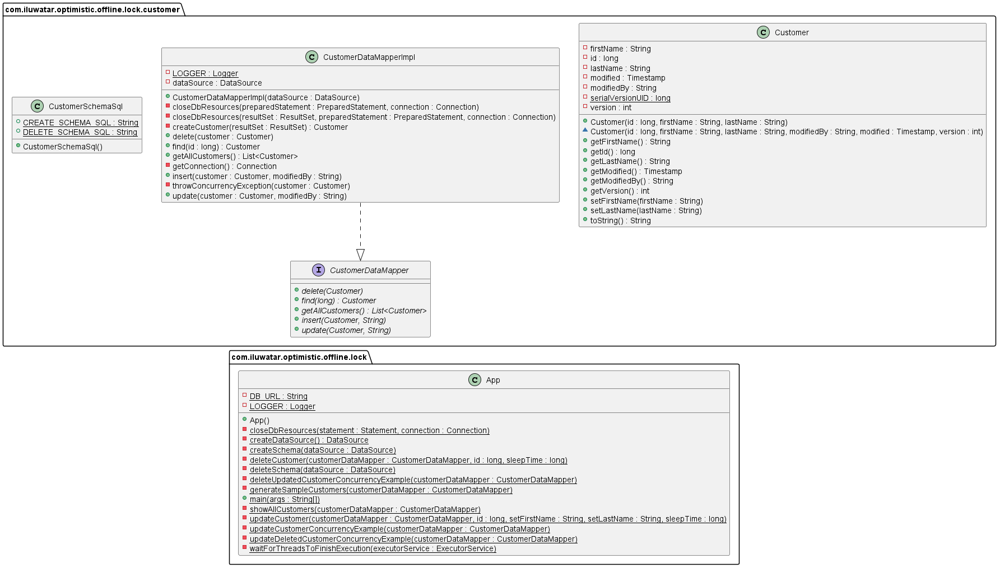

## Intent
Optimistic Offline Lock pattern helps with data integrity when there is risk of concurrent
actions on the same record of data.

## Explanation
Often a business transaction executes across a series of system transactions. Once outside the 
confines of a single system transaction, we can’t depend on our database manager alone to ensure 
that the business transaction will leave the record data in a consistent state. Data integrity is 
at risk once two sessions begin to work on the same records and lost updates are quite possible. 

Optimistic Offline Lock solves this problem by validating that the changes about to be committed 
by one session don’t conflict with the changes of another session. A successful pre-commit validation 
is, in a sense, obtaining a lock indicating it’s okay to go ahead with the changes to the record data. 
So long as the validation and the updates occur within a single system transaction the business
transaction will display consistency.

**Programmatic Example**

The code below shows example of delete operation which check if session's copy of version is the
same as the version in DB. The transaction is committed only when the versions match, an 
OptimisticLockException is thrown otherwise.

```java
@Override
public void delete(Customer customer) {
    Connection connection = null;
    PreparedStatement preparedStatement = null;
    try {
        connection = getConnection();
        preparedStatement = connection.prepareStatement("DELETE FROM CUSTOMERS WHERE id = ? AND version = ?");
        preparedStatement.setLong(1, customer.getId());
        preparedStatement.setInt(2, customer.getVersion());
        if (preparedStatement.executeUpdate() == 0) {
            throwOptimisticLockException(customer);
        }
    } catch (SQLException exception) {
        LOGGER.error(exception.getMessage(), exception);
    } finally {
        closeDbResources(preparedStatement, connection);
    }
}
```

## Class diagram


## Applicability
Use the Optimistic Offline Lock pattern when the chance of conflict between any two business transactions is low.

## Known uses
* source code management (SCM)

## Credits
* [Optimistic Offline Lock](https://books.google.fi/books?id=vqTfNFDzzdIC&pg=PA416#v=onepage&q&f=false)
