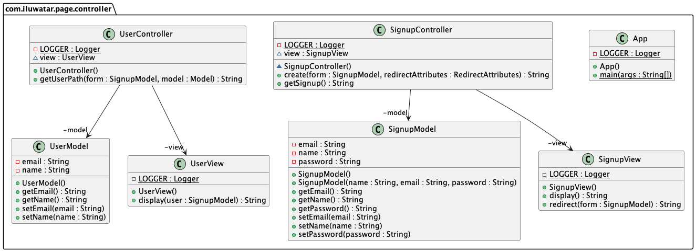

## Name / classification

Page Controller

## Intent

It is an approach of one page leading to one logical file that handles actions or requests on a website.

## Explanation

Real-world example

> In a shopping website, there is a signup page to register a user profile.
> After finishing to signup, the signup page will be redirected to a user page to show the user's registered information.

In plain words

> Page controller manages HTTP requests and data in a specific page using MVC idea. 
> The idea is that one page contains one Controller that handles Model and View. 

**Programmatic Example**

Here's Signup controller when a user signup their information for a website.

```java
@Slf4j
@Controller
@Component
public class SignupController {
  SignupView view = new SignupView();
  /**
   * Signup Controller can handle http request and decide which model and view use.
   */
  SignupController() {
  }

  /**
   * Handle http GET request.
   */
  @GetMapping("/signup")
  public String getSignup() {
    return view.display();
  }

  /**
   * Handle http POST request and access model and view.
   */
  @PostMapping("/signup")
  public String create(SignupModel form, RedirectAttributes redirectAttributes) {
    LOGGER.info(form.getName());
    LOGGER.info(form.getEmail());
    redirectAttributes.addAttribute("name", form.getName());
    redirectAttributes.addAttribute("email", form.getEmail());
    redirectAttributes.addFlashAttribute("userInfo", form);
    return view.redirect(form);
  }
}
```
Here's Signup model and view that are handled by Signup controller.

```java
@Component
@Getter
@Setter
public class SignupModel {
  private String name;
  private String email;
  private String password;
  
  public SignupModel() {
  }
}
```

```java
@Slf4j
public class SignupView {
  public SignupView() {
  }

  public String display() {
    LOGGER.info("display signup front page");
    return "/signup";
  }

  /**
   * redirect to user page.
   */
  public String redirect(SignupModel form) {
    LOGGER.info("Redirect to user page with " + "name " + form.getName() + " email " + form.getEmail());
    return "redirect:/user";
  }
}
```

Here's User Controller to handle Get request in a user page.

```java
@Slf4j
@Controller
public class UserController {
  UserView view = new UserView();

  public UserController() {}

  /**
   * Handle http GET request and access view and model.
   */
  @GetMapping("/user")
  public String getUserPath(SignupModel form, Model model) {
    model.addAttribute("name", form.getName());
    model.addAttribute("email", form.getEmail());
    return view.display(form);
  }
}
```

Here's User Model and View that are handled by User controller.
```java
@Getter
@Setter
public class UserModel {
  private String name;
  private String email;

  public UserModel() {}
}
```

```java
@Slf4j
public class UserView {
  /**
   * displaying command to generate html.
   * @param user model content.
   */
  public String display(SignupModel user) {
    LOGGER.info("display user html" + " name " + user.getName() + " email " + user.getEmail());
    return "/user";
  }
}
```

## Class diagram


## Applicability
Use the Page Controller pattern when
- you implement a site where most controller logic is simple
- you implement a site where particular actions are handled with a particular server page

## Credits
- [Page Controller](https://www.martinfowler.com/eaaCatalog/pageController.html)
- [Pattern of Enterprise Application Architecture](https://www.martinfowler.com/books/eaa.html)