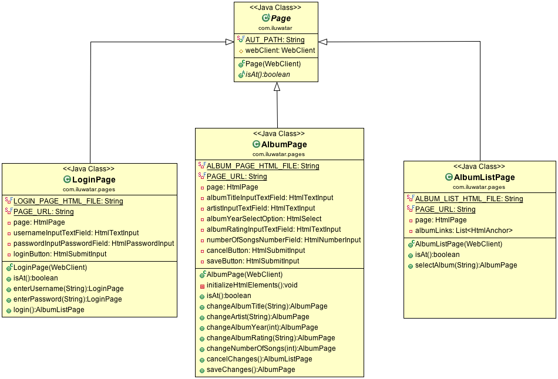

## Intent

Page Object encapsulates the UI, hiding the underlying UI widgetry of an application (commonly a web application) and providing an application-specific API to allow the manipulation of UI components required for tests. In doing so, it allows the test class itself to focus on the test logic instead. 

## Applicability

Use the Page Object pattern when

* You are writing automated tests for your web application and you want to separate the UI manipulation required for the tests from the actual test logic. 
* Make your tests less brittle, and more readable and robust

## Credits

* [Martin Fowler - PageObject](http://martinfowler.com/bliki/PageObject.html)
* [Selenium - Page Objects](https://github.com/SeleniumHQ/selenium/wiki/PageObjects)

