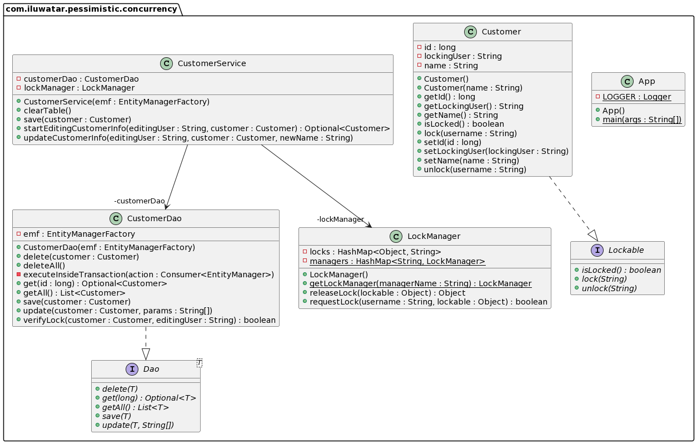
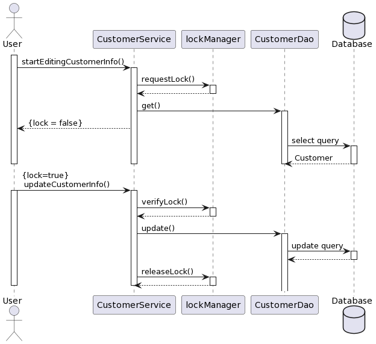

## Intent

 Pessimisitc Concurrency pattern provides a solution to maintain transactional integrity of objects that are concurrently accessed by multiple clients.

 ## Explanation

 An update operation consists of 3 steps:
 1. Fetch data from database
 2. Make changes to local data
 3. Persist changes to the database

 These steps are not instantaneous.

 It is possible for multiple clients/processes to attempt update on the same entity in the database simultaneously. 
 This results in ***Race Condition***. Depending on delays, these steps may or may not overlap. 

 If they don't overlap, the execution appear to be normal.
 However, when they overlap, the bug will be discovered. This violates the transactional integrity.

 #### Pessimistic Concurrency

 To handle race condition, Pessimistic Concurrency pattern locks an object from other users. While the locking user is making changes, 
 other users cannot access the object. Only when the locking user releases the lock, can other users start accessing the object.

 ## Class diagram

 

 ## Sequence diagram

 

 ## Programmatic Example

 Construct instance of EntityManagerFactory, customerDao, customerService to access the database
 ```java
    EntityManagerFactory emf =
        Persistence.createEntityManagerFactory("AdvancedMapping");

    CustomerService customerService = new CustomerService(emf);
    CustomerDao customerDao = new CustomerDao(emf);

 ```
 Create three instances of Customer and insert into database
 ```java
    Customer obj1 = new Customer("John");
    Customer obj2 = new Customer("Abby");
    Customer obj3 = new Customer("Bob");
    customerService.save(obj1);
    customerService.save(obj2);
    customerService.save(obj3);
 ```
 Create two threads which performs the buy method with useLock=true
 ```java
 Thread t1 =
        new Thread(
            () -> {
              try {
                Optional<Customer> customer1 =
                    customerService.startEditingCustomerInfo("user1", obj1);
                Thread.sleep(100);
                if (customer1.isPresent()) {
                  try {
                    customerService.updateCustomerInfo("user1", obj1, "Ben");
                  } catch (LockingException e) {
                    LOGGER.info(e.getMessage());
                  }
                }
                Optional<Customer> customer3 =
                    customerService.startEditingCustomerInfo("user1", obj3);
                if (customer3.isPresent()) {
                  try {
                    customerService.updateCustomerInfo("user1", obj3, "Eric");
                  } catch (LockingException e) {
                    LOGGER.info(e.getMessage());
                  }
                }
              } catch (Exception e) {
                throw new RuntimeException(e);
              }
            });
    Thread t2 =
        new Thread(
            () -> {
              try {
                Optional<Customer> customer1 =
                    customerService.startEditingCustomerInfo("user1", obj1);
                System.out.println(customer1);
                if (customer1.isPresent()) {

                  customerService.updateCustomerInfo("user1", obj1, "Eren");
                }
              } catch (LockingException e) {
                LOGGER.info(e.getMessage());
              }
              try {
                Optional<Customer> customer2 =
                    customerService.startEditingCustomerInfo("user1", obj2);
                if (customer2.isPresent()) {
                  try {
                    customerService.updateCustomerInfo("user1", obj2, "Mikasa");
                  } catch (LockingException e) {
                    LOGGER.info(e.getMessage());
                  }
                }
              } catch (LockingException e) {
                LOGGER.info(e.getMessage());
              }
              try {
                Thread.sleep(1000);
                Optional<Customer> customer1 =
                    customerService.startEditingCustomerInfo("user1", obj1);
                System.out.println(customer1);
                if (customer1.isPresent()) {

                  customerService.updateCustomerInfo("user1", obj1, "Eren");
                }
              } catch (LockingException e) {
                LOGGER.info(e.getMessage());
              } catch (Exception e) {
                throw new RuntimeException(e);
              }
            });
 });
 ```
 Start the two threads
 ```java
 t1.start();
 t2.start();
 ```
 Wait for them to finish, and query changes from database again.
 ```java
      t1.join();
      t2.join();
      long id1 = obj1.getId();
      Optional<Customer> result1 = customerDao.get(id1);
      result1.ifPresent(customer -> LOGGER.info(customer.getName()));
      long id2 = obj1.getId();
      Optional<Customer> result2 = customerDao.get(id2);
      result2.ifPresent(customer -> LOGGER.info(customer.getName()));
      long id3 = obj1.getId();
      Optional<Customer> result3 = customerDao.get(id3);
      result3.ifPresent(customer -> LOGGER.info(customer.getName()));
      emf.close();
 ```

 ## Reference
 https://www.javacodegeeks.com/2012/11/jpahibernate-version-based-optimistic-concurrency-control.html
