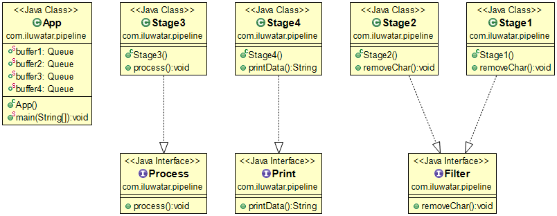

## Also known as
Pipeline Processing Pattern

## Intent
The basic idea of this pattern is much like the idea of an assembly line: To perform a sequence of essentially identical calculations, each of which can be broken down into the same sequence of steps, we set up a "pipeline", one stage for each step, with all stages potentially executing concurrently. Each of the sequence of calculations is performed by having the first stage of the pipeline perform the first step, and then the second stage the second step, and so on. As each stage completes a step of a calculation, it passes the calculation-in-progress to the next stage and begins work on the next calculation.

## Applicability
Use Pipeline pattern when

* The problem consists of performing a sequence of calculations, each of which can be broken down into distinct stages, on a sequence of inputs, such that for each input the calculations must be done in order, but it is possible to overlap computation of different stages for different inputs.

The pattern is particularly effective when:
* The number of calculations is large compared to the number of stages.
* It is possible to dedicate a processor to each element, or at least each stage, of the pipeline.

## Real world examples

* [Pipeline phase rotation](http://www.cs.cmu.edu/afs/cs.cmu.edu/project/iwarp/member/fx/public/www/phase1.html)
* [Blocking Collection](https://msdn.microsoft.com/en-us/library/dd267312(v=vs.110).aspx)

## Credits

* [PipelineProcessing Design Pattern](https://www.cise.ufl.edu/research/ParallelPatterns/PatternLanguage/AlgorithmStructure/Pipeline.htm)
