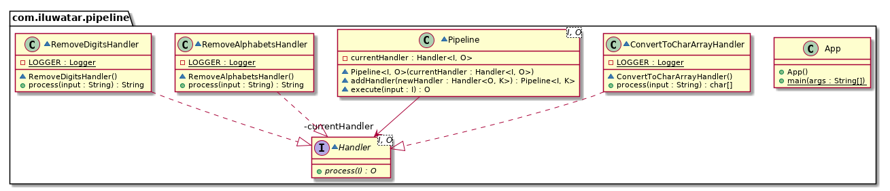

## Intent

Allows processing of data in a series of stages by giving in an initial input and passing the 
processed output to be used by the next stages.

## Explanation

The Pipeline pattern uses ordered stages to process a sequence of input values. Each implemented 
task is represented by a stage of the pipeline. You can think of pipelines as similar to assembly 
lines in a factory, where each item in the assembly line is constructed in stages. The partially 
assembled item is passed from one assembly stage to another. The outputs of the assembly line occur 
in the same order as that of the inputs.
 
Real world example

> Suppose we wanted to pass through a string to a series of filtering stages and convert it as a 
> char array on the last stage.           

In plain words

> Pipeline pattern is an assembly line where partial results are passed from one stage to another.   

Wikipedia says

> In software engineering, a pipeline consists of a chain of processing elements (processes, 
> threads, coroutines, functions, etc.), arranged so that the output of each element is the input 
> of the next; the name is by analogy to a physical pipeline.

**Programmatic Example**

The stages of our pipeline are called `Handler`s.

```java
interface Handler<I, O> {
  O process(I input);
}
```

In our string processing example we have 3 different concrete `Handler`s.

```java
class RemoveAlphabetsHandler implements Handler<String, String> {
  ...
}

class RemoveDigitsHandler implements Handler<String, String> {
  ...
}

class ConvertToCharArrayHandler implements Handler<String, char[]> {
  ...
}
```

Here is the `Pipeline` that will gather and execute the handlers one by one.

```java
class Pipeline<I, O> {

  private final Handler<I, O> currentHandler;

  Pipeline(Handler<I, O> currentHandler) {
    this.currentHandler = currentHandler;
  }

  <K> Pipeline<I, K> addHandler(Handler<O, K> newHandler) {
    return new Pipeline<>(input -> newHandler.process(currentHandler.process(input)));
  }

  O execute(I input) {
    return currentHandler.process(input);
  }
}
```

And here's the `Pipeline` in action processing the string.

```java
    var filters = new Pipeline<>(new RemoveAlphabetsHandler())
        .addHandler(new RemoveDigitsHandler())
        .addHandler(new ConvertToCharArrayHandler());
    filters.execute("GoYankees123!");
```

## Class diagram



## Applicability

Use the Pipeline pattern when you want to

* Execute individual stages that yields a final value.
* Add readability to complex sequence of operations by providing a fluent builder as an interface.
* Improve testability of code since stages will most likely be doing a single thing, complying to 
the [Single Responsibility Principle (SRP)](https://java-design-patterns.com/principles/#single-responsibility-principle)

## Known uses

* [java.util.Stream](https://docs.oracle.com/javase/8/docs/api/java/util/stream/package-summary.html)
* [Maven Build Lifecycle](http://maven.apache.org/guides/introduction/introduction-to-the-lifecycle.html)
* [Functional Java](https://github.com/functionaljava/functionaljava)

## Related patterns

* [Chain of Responsibility](https://java-design-patterns.com/patterns/chain/)

## Credits

* [The Pipeline Pattern — for fun and profit](https://medium.com/@aaronweatherall/the-pipeline-pattern-for-fun-and-profit-9b5f43a98130)
* [The Pipeline design pattern (in Java)](https://medium.com/@deepakbapat/the-pipeline-design-pattern-in-java-831d9ce2fe21)
* [Pipelines | Microsoft Docs](https://docs.microsoft.com/en-us/previous-versions/msp-n-p/ff963548(v=pandp.10))
