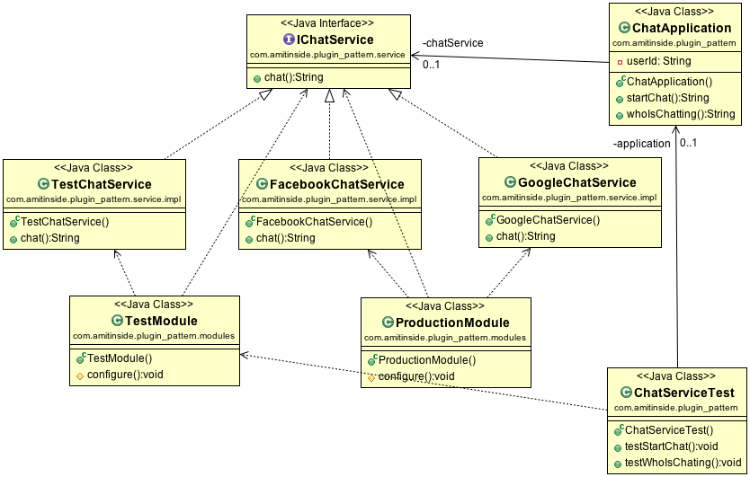

## Intent
Ensure configuration update in a dynamic way and provide different configurations for different environments

## Applicability

* Configuration shouldn't be scattered throughout your application, nor should it require a rebuild or redeployment. Plugin solves both problems by providing centralized, runtime configuration.
