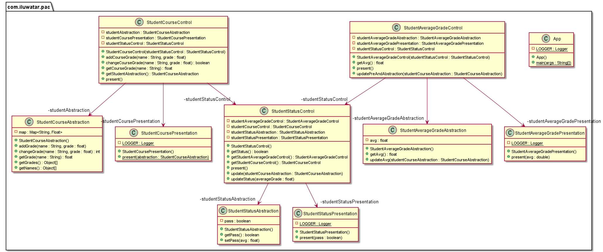

## Intent

**Presentation–abstraction–control** (**PAC**) is a software [architectural pattern](https://en.wikipedia.org/wiki/Architectural_pattern_(computer_science)). It is an interaction-oriented software architecture, and is somewhat similar to [model–view–controller](https://en.wikipedia.org/wiki/Model–view–controller) (MVC) in that it separates an interactive system into three types of components responsible for specific aspects of the application's functionality. The **abstraction** component retrieves and processes the data, the **presentation** component formats the visual and audio presentation of data, and the **control** component handles things such as the flow of control and communication between the other two components.

## Class diagram

## Applicability

Use the Presentation-Abstraction-Control pattern when

* You are trying to build a new GUI framework.
* You are trying to learn GUI architecture.

## Credits

* [Wikipedia - Presentation-abstraction-control](https://en.wikipedia.org/wiki/Presentation%E2%80%93abstraction%E2%80%93control)
* [Garfixia Software Architecture - Presentation-Abstraction-Control](http://www.dossier-andreas.net/software_architecture/pac.html)
