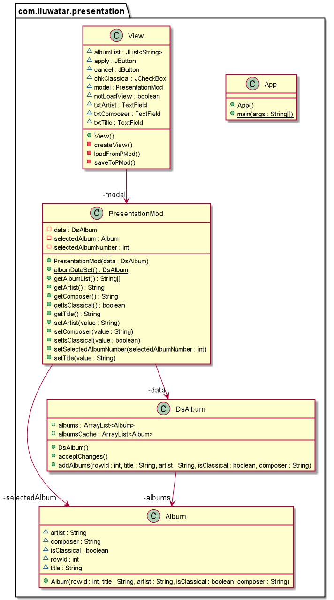

## Also known as
Application Model

## Intent
Presentation Model pulls the state and behavior of the view out into a model class that is part of the presentation.  

## Explanation

Real world example

> When we need to write a program with GUI, there is no need for us to put all presentation behavior in the view class. Because it will test become harder. So we can use Presentation Model Pattern to separate the behavior and view. The view only need to load the data and states from other class and show these data on the screen according to the states.  

In plain words

> a pattern that used to divide the presentation and controlling.

Code Example

Class `view` is the GUI of albums. Methods `saveToPMod` and `loadFromPMod` are used to achieve synchronization.

```java
public class View {
  /**
   * the model that controls this view.
   */
  private final PresentationModel model;

  private TextField txtTitle;
  private TextField txtArtist;
  private JCheckBox chkClassical;
  private TextField txtComposer;
  private JList<String> albumList;
  private JButton apply;
  private JButton cancel;

  public View() {
    model = new PresentationModel(PresentationModel.albumDataSet());
  }

  /**
   * save the data to PresentationModel.
   */
  public void saveToPMod() {
    LOGGER.info("Save data to PresentationModel");
    model.setArtist(txtArtist.getText());
    model.setTitle(txtTitle.getText());
    model.setIsClassical(chkClassical.isSelected());
    model.setComposer(txtComposer.getText());
  }

  /**
   * load the data from PresentationModel.
   */
  public void loadFromPMod() {
    LOGGER.info("Load data from PresentationModel");
    txtArtist.setText(model.getArtist());
    txtTitle.setText(model.getTitle());
    chkClassical.setSelected(model.getIsClassical());
    txtComposer.setEditable(model.getIsClassical());
    txtComposer.setText(model.getComposer());
  }

  public void createView() {
    // the detail of GUI information like size, listenser and so on.
  }
}
```

Class `Album` is to store information of a album.

```java
public class Album {
    
  private String title;
  private String artist;
  private boolean isClassical;
  /**
   * only when the album is classical,
   * composer can have content.
   */
  private String composer;
}

```

Class `DisplatedAlbums` is store the information of all the albums that will be displayed on GUI.

```java
public class DisplayedAlbums {
  private final List<Album> albums;

  public DisplayedAlbums() {
    this.albums = new ArrayList<>();
  }

  public void addAlbums(final String title,
                        final String artist, final boolean isClassical,
                        final String composer) {
    if (isClassical) {
      this.albums.add(new Album(title, artist, true, composer));
    } else {
      this.albums.add(new Album(title, artist, false, ""));
    }
  }
}
```

 Class `PresentationMod` is used to control all the action of GUI.

```java
public class PresentationModel {
  private final DisplayedAlbums data;
  
  private int selectedAlbumNumber;
  private Album selectedAlbum;

  public PresentationModel(final DisplayedAlbums dataOfAlbums) {
    this.data = dataOfAlbums;
    this.selectedAlbumNumber = 1;
    this.selectedAlbum = this.data.getAlbums().get(0);
  }

  /**
   * Changes the value of selectedAlbumNumber.
   *
   * @param albumNumber the number of album which is shown on the view.
   */
  public void setSelectedAlbumNumber(final int albumNumber) {
    LOGGER.info("Change select number from {} to {}",
            this.selectedAlbumNumber, albumNumber);
    this.selectedAlbumNumber = albumNumber;
    this.selectedAlbum = data.getAlbums().get(this.selectedAlbumNumber - 1);
  }

  public String getTitle() {
    return selectedAlbum.getTitle();
  }
  // other get methods are like this, which are used to get information of selected album.

  public void setTitle(final String value) {
    LOGGER.info("Change album title from {} to {}",
            selectedAlbum.getTitle(), value);
    selectedAlbum.setTitle(value);
  }
  // other set methods are like this, which are used to get information of selected album.

  /**
   * Gets a list of albums.
   *
   * @return the names of all the albums.
   */
  public String[] getAlbumList() {
    var result = new String[data.getAlbums().size()];
    for (var i = 0; i < result.length; i++) {
      result[i] = data.getAlbums().get(i).getTitle();
    }
    return result;
  }
}
```

We can run class `App` to start this demo. the checkbox is the album classical; the first text field is the name of album artist; the second is the name of album title; the last one is the name of the composer:


## Class diagram


## Applicability
Use the Presentation Model Pattern when

* Testing a presentation through a GUI window is often awkward, and in some cases impossible.
* Do not determine which GUI will be used.

## Related patterns

- [Supervising Controller](https://martinfowler.com/eaaDev/SupervisingPresenter.html) 
- [Passive View](https://martinfowler.com/eaaDev/PassiveScreen.html)

## Credits

* [Presentation Model Patterns](https://martinfowler.com/eaaDev/PresentationModel.html)

