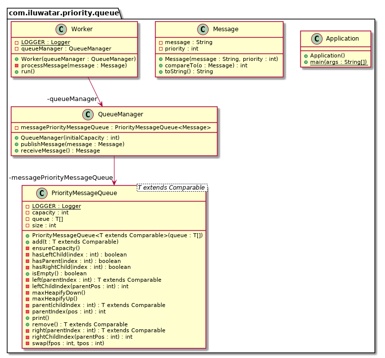

## Intent

Prioritize requests sent to services so that requests with a higher priority are received and 
processed more quickly than those of a lower priority. This pattern is useful in applications that 
offer different service level guarantees to individual clients.

## Explanation

Applications may delegate specific tasks to other services; for example, to perform background 
processing or to integrate with other applications or services. In the cloud, a message queue is 
typically used to delegate tasks to background processing. In many cases the order in which requests 
are received by a service is not important. However, in some cases it may be necessary to prioritize 
specific requests. These requests should be processed earlier than others of a lower priority that 
may have been sent previously by the application.

Real world example

> Imagine a video processing service with free and premium customers. The requests coming from the
> paying premium customers should be prioritized over the others. 

In plain words

> Priority Queue enables processing of high priority messages first, regardless of queue size or
> message age. 

Wikipedia says

> In computer science, a priority queue is an abstract data type similar to regular queue or stack 
> data structure in which each element additionally has a "priority" associated with it. In a 
> priority queue, an element with high priority is served before an element with low priority. 

**Programmatic Example**

Looking at the video processing example from above, let's first see the `Message` structure.

```java
public class Message implements Comparable<Message> {

  private final String message;
  private final int priority; // define message priority in queue

  public Message(String message, int priority) {
    this.message = message;
    this.priority = priority;
  }

  @Override
  public int compareTo(Message o) {
    return priority - o.priority;
  }
  ...
}
```

Here's `PriorityMessageQueue` that handles storing the messages and serving them in priority
order.

```java
public class PriorityMessageQueue<T extends Comparable> {

  ...

  public T remove() {
    if (isEmpty()) {
      return null;
    }

    final var root = queue[0];
    queue[0] = queue[size - 1];
    size--;
    maxHeapifyDown();
    return root;
  }

  public void add(T t) {
    ensureCapacity();
    queue[size] = t;
    size++;
    maxHeapifyUp();
  }

  ...
}
```

`QueueManager` has a `PriorityMessageQueue` and makes it easy to `publishMessage` and
`receiveMessage`.

```java
public class QueueManager {

  private final PriorityMessageQueue<Message> messagePriorityMessageQueue;

  public QueueManager(int initialCapacity) {
    messagePriorityMessageQueue = new PriorityMessageQueue<>(new Message[initialCapacity]);
  }

  public void publishMessage(Message message) {
    messagePriorityMessageQueue.add(message);
  }

  public Message receiveMessage() {
    if (messagePriorityMessageQueue.isEmpty()) {
      return null;
    }
    return messagePriorityMessageQueue.remove();
  }
}
```

`Worker` constantly polls `QueueManager` for highest priority message and processes it.

```java
@Slf4j
public class Worker {

  private final QueueManager queueManager;

  public Worker(QueueManager queueManager) {
    this.queueManager = queueManager;
  }

  public void run() throws Exception {
    while (true) {
      var message = queueManager.receiveMessage();
      if (message == null) {
        LOGGER.info("No Message ... waiting");
        Thread.sleep(200);
      } else {
        processMessage(message);
      }
    }
  }

  private void processMessage(Message message) {
    LOGGER.info(message.toString());
  }
}
```

Here's the full example how we create an instance of `QueueManager` and process messages using
`Worker`.

```java
    var queueManager = new QueueManager(100);

    for (var i = 0; i < 100; i++) {
      queueManager.publishMessage(new Message("Low Message Priority", 0));
    }

    for (var i = 0; i < 100; i++) {
      queueManager.publishMessage(new Message("High Message Priority", 1));
    }

    var worker = new Worker(queueManager);
    worker.run();
```

Program output:

```
Message{message='High Message Priority', priority=1}
Message{message='High Message Priority', priority=1}
Message{message='High Message Priority', priority=1}
Message{message='High Message Priority', priority=1}
Message{message='High Message Priority', priority=1}
Message{message='High Message Priority', priority=1}
Message{message='High Message Priority', priority=1}
Message{message='High Message Priority', priority=1}
Message{message='High Message Priority', priority=1}
Message{message='High Message Priority', priority=1}
Message{message='Low Message Priority', priority=0}
Message{message='Low Message Priority', priority=0}
Message{message='Low Message Priority', priority=0}
Message{message='Low Message Priority', priority=0}
Message{message='Low Message Priority', priority=0}
Message{message='Low Message Priority', priority=0}
Message{message='Low Message Priority', priority=0}
Message{message='Low Message Priority', priority=0}
Message{message='Low Message Priority', priority=0}
Message{message='Low Message Priority', priority=0}
No Message ... waiting
No Message ... waiting
No Message ... waiting
```


## Class diagram



## Applicability

Use the Priority Queue pattern when:

* The system must handle multiple tasks that might have different priorities.
* Different users or tenants should be served with different priority.

## Credits

* [Priority Queue pattern](https://docs.microsoft.com/en-us/azure/architecture/patterns/priority-queue)
