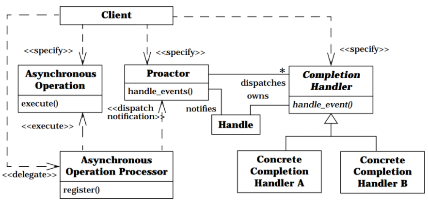

## Intent

Proactor pattern supports the demultiplexing and dispatching of multiple event handlers, which are triggered by the
completion of asynchronous events. This pattern simplifies asynchronous application development by integrating the
demultiplexing of completion events and the dispatching of their corresponding event handlers.

## Class diagram

## Applicability

Use this pattern when

* an application needs to perform one or more asynchronous operations without blocking the calling thread
* The application must be notified when asynchronous operations complete
* The application needs to vary its concurrency strategy independent of its I/O model
* The application will benefit by decoupling the application-dependent logic from the application independent
  infrastructure

## Real world examples

* [Boost.Asio](https://www.boost.org/doc/libs/1_76_0/doc/html/boost_asio.html)

## Credits

* [Proactor pattern](https://en.wikipedia.org/wiki/Proactor_pattern)
