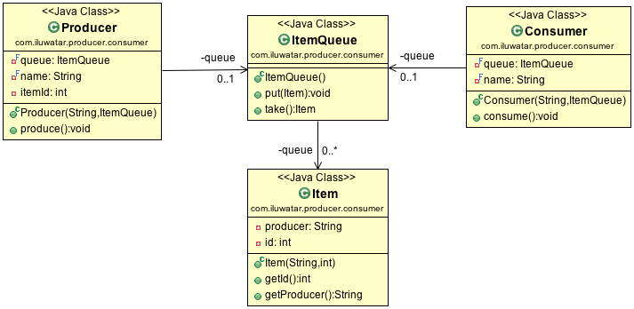

## Also known as

* Bounded Buffer
* Consumer-Producer

## Intent of Producer-Consumer Design Pattern

The Producer-Consumer design pattern, a critical component for concurrent Java applications, is used to decouple the tasks of producing and consuming data, enabling a producer to generate data and a consumer to process that data concurrently without direct dependency on each other.

## Detailed Explanation of Producer-Consumer Pattern with Real-World Examples

Real-world example

> In a typical car manufacturing setup, the Producer-Consumer pattern facilitates synchronous operations, ensuring efficient assembly and installation processes. Imagine a car manufacturing plant where different stages of production occur. The "producer" could be the station that assembles car engines, while the "consumer" could be the station that installs the engines into car bodies. The engines are placed onto a conveyor belt (acting as a buffer) once they are assembled. The installation station takes engines off the conveyor belt to install them into cars. This allows the engine assembly and engine installation processes to operate independently, with the conveyor belt managing the synchronization between these two stages. If the assembly station produces engines faster than the installation station can install them, the excess engines are temporarily stored on the conveyor belt. Conversely, if the installation station needs engines but the assembly station is temporarily halted, it can still work on the engines available on the belt.

In plain words

> It provides a way to share data between multiple loops running at different rates.

Wikipedia says

> Dijkstra wrote about the case: "We consider two processes, which are called the 'producer' and the 'consumer' respectively. The producer is a cyclic process that produces a certain portion of information, that has to be processed by the consumer. The consumer is also a cyclic process that needs to process the next portion of information, as has been produced by the producer. We assume the two processes to be connected for this purpose via a buffer with unbounded capacity."

## Programmatic Example of Producer-Consumer Pattern in Java

Consider a manufacturing process of item, the producer will need to pause the production when manufacturing pipeline is full and the consumer will need to pause the consumption of item when the manufacturing pipeline is empty. We can separate the process of production and consumption which work together and pause at separate times.

In this Java example, `Producers` generate items stored in `ItemQueue`, demonstrating efficient thread management and data synchronization essential for high-performance Java applications.

We have a simple `Item` record. They are stored in `ItemQueue`.

```java
public record Item(String producer, int id) {}
```

```java
public class ItemQueue {

    private final BlockingQueue<Item> queue;

    public ItemQueue() {
        queue = new LinkedBlockingQueue<>(5);
    }

    public void put(Item item) throws InterruptedException {
        queue.put(item);
    }

    public Item take() throws InterruptedException {
        return queue.take();
    }
}
```

`Producer` produces items to the `ItemQueue`.

```java
public class Producer {

  private static final SecureRandom RANDOM = new SecureRandom();
  private final ItemQueue queue;
  private final String name;
  private int itemId;

  public Producer(String name, ItemQueue queue) {
    this.name = name;
    this.queue = queue;
  }

  public void produce() throws InterruptedException {

    var item = new Item(name, itemId++);
    queue.put(item);
    Thread.sleep(RANDOM.nextInt(2000));
  }
}
```

Then, we have the `Consumer` class that takes items from the `ItemQueue`.

```java
@Slf4j
public class Consumer {

  private final ItemQueue queue;
  private final String name;

  public Consumer(String name, ItemQueue queue) {
    this.name = name;
    this.queue = queue;
  }

  public void consume() throws InterruptedException {
    var item = queue.take();
    LOGGER.info("Consumer [{}] consume item [{}] produced by [{}]", name,
        item.getId(), item.getProducer());

  }
}
``` 

Now, during the manufacturing pipeline, we can instantiate objects from both the `Producer` and `Consumer` classes as they produce and consume items from the queue.

```java
  public static void main(String[] args) {

    var queue = new ItemQueue();

    var executorService = Executors.newFixedThreadPool(5);
    for (var i = 0; i < 2; i++) {

        final var producer = new Producer("Producer_" + i, queue);
        executorService.submit(() -> {
            while (true) {
                producer.produce();
            }
        });
    }

    for (var i = 0; i < 3; i++) {
        final var consumer = new Consumer("Consumer_" + i, queue);
        executorService.submit(() -> {
            while (true) {
                consumer.consume();
            }
        });
    }

    executorService.shutdown();
    try {
        executorService.awaitTermination(10, TimeUnit.SECONDS);
        executorService.shutdownNow();
    } catch (InterruptedException e) {
        LOGGER.error("Error waiting for ExecutorService shutdown");
    }
}
```

Program output:

```
08:10:08.008 [pool-1-thread-3] INFO com.iluwatar.producer.consumer.Consumer -- Consumer [Consumer_0] consume item [0] produced by [Producer_1]
08:10:08.008 [pool-1-thread-4] INFO com.iluwatar.producer.consumer.Consumer -- Consumer [Consumer_1] consume item [0] produced by [Producer_0]
08:10:08.517 [pool-1-thread-5] INFO com.iluwatar.producer.consumer.Consumer -- Consumer [Consumer_2] consume item [1] produced by [Producer_0]
08:10:08.952 [pool-1-thread-3] INFO com.iluwatar.producer.consumer.Consumer -- Consumer [Consumer_0] consume item [1] produced by [Producer_1]
08:10:09.208 [pool-1-thread-4] INFO com.iluwatar.producer.consumer.Consumer -- Consumer [Consumer_1] consume item [2] produced by [Producer_0]
08:10:09.354 [pool-1-thread-5] INFO com.iluwatar.producer.consumer.Consumer -- Consumer [Consumer_2] consume item [2] produced by [Producer_1]
08:10:10.214 [pool-1-thread-3] INFO com.iluwatar.producer.consumer.Consumer -- Consumer [Consumer_0] consume item [3] produced by [Producer_1]
08:10:10.585 [pool-1-thread-4] INFO com.iluwatar.producer.consumer.Consumer -- Consumer [Consumer_1] consume item [3] produced by [Producer_0]
08:10:11.530 [pool-1-thread-5] INFO com.iluwatar.producer.consumer.Consumer -- Consumer [Consumer_2] consume item [4] produced by [Producer_1]
08:10:11.682 [pool-1-thread-3] INFO com.iluwatar.producer.consumer.Consumer -- Consumer [Consumer_0] consume item [4] produced by [Producer_0]
08:10:11.781 [pool-1-thread-4] INFO com.iluwatar.producer.consumer.Consumer -- Consumer [Consumer_1] consume item [5] produced by [Producer_0]
08:10:12.209 [pool-1-thread-5] INFO com.iluwatar.producer.consumer.Consumer -- Consumer [Consumer_2] consume item [5] produced by [Producer_1]
08:10:13.045 [pool-1-thread-3] INFO com.iluwatar.producer.consumer.Consumer -- Consumer [Consumer_0] consume item [6] produced by [Producer_0]
08:10:13.861 [pool-1-thread-4] INFO com.iluwatar.producer.consumer.Consumer -- Consumer [Consumer_1] consume item [6] produced by [Producer_1]
08:10:14.739 [pool-1-thread-5] INFO com.iluwatar.producer.consumer.Consumer -- Consumer [Consumer_2] consume item [7] produced by [Producer_1]
08:10:14.842 [pool-1-thread-3] INFO com.iluwatar.producer.consumer.Consumer -- Consumer [Consumer_0] consume item [7] produced by [Producer_0]
08:10:15.975 [pool-1-thread-4] INFO com.iluwatar.producer.consumer.Consumer -- Consumer [Consumer_1] consume item [8] produced by [Producer_0]
08:10:16.378 [pool-1-thread-5] INFO com.iluwatar.producer.consumer.Consumer -- Consumer [Consumer_2] consume item [8] produced by [Producer_1]
08:10:16.967 [pool-1-thread-3] INFO com.iluwatar.producer.consumer.Consumer -- Consumer [Consumer_0] consume item [9] produced by [Producer_0]
08:10:17.417 [pool-1-thread-4] INFO com.iluwatar.producer.consumer.Consumer -- Consumer [Consumer_1] consume item [9] produced by [Producer_1]
08:10:17.483 [pool-1-thread-5] INFO com.iluwatar.producer.consumer.Consumer -- Consumer [Consumer_2] consume item [10] produced by [Producer_1]
```

## Detailed Explanation of Producer-Consumer Pattern with Real-World Examples



## When to Use the Producer-Consumer Pattern in Java

* When you need to manage a buffer or queue where producers add data and consumers take data, often in a multithreaded environment.
* When decoupling the production and consumption of data is beneficial for the application's design, performance, or maintainability.
* Suitable for scenarios requiring synchronized access to a shared resource or data structure.

## Real-World Applications of Producer-Consumer Pattern in Java

* Thread pools where worker threads act as consumers processing tasks produced by another thread.
* Logging frameworks where log messages are produced by various parts of an application and consumed by a logging service.
* Message queues in distributed systems for asynchronous communication between services.

## Benefits and Trade-offs of Producer-Consumer Pattern

Benefits:

* Decoupling: Producers and consumers can operate independently, simplifying the system design.
* Improved Performance: Allows multiple producer and consumer threads to work concurrently, improving throughput.
* Flexibility: Easily extendable to add more producers or consumers without significant changes to the existing system.

Trade-offs:

* Complexity: Requires careful handling of synchronization and potential deadlocks.
* Resource Management: Properly managing the buffer size to avoid overflow or underflow conditions.

## Related Java Design Patterns

* [Observer](https://java-design-patterns.com/patterns/observer/): While both deal with notifying or handling events, the Observer pattern is more about event subscription and notification, whereas Producer-Consumer focuses on decoupled data production and consumption.
* [Thread Pool](https://java-design-patterns.com/patterns/thread-pool/): Uses a similar decoupling approach where tasks are produced and consumed by a pool of worker threads.

## References and Credits

* [Design Patterns: Elements of Reusable Object-Oriented Software](https://amzn.to/3w0pvKI)
* [Effective Java](https://amzn.to/4cGk2Jz)
* [Java Concurrency in Practice](https://amzn.to/4aRMruW)
