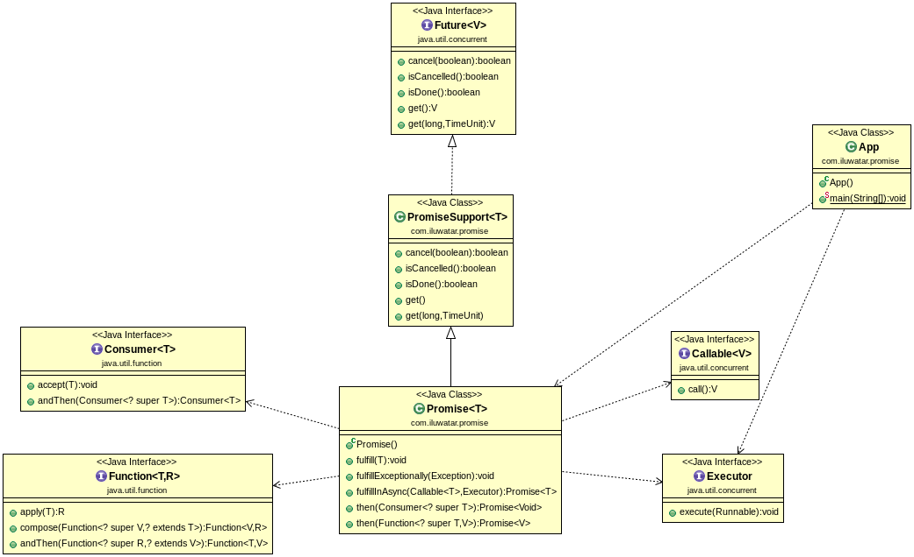

## Also known as

CompletableFuture

## Intent

A Promise represents a proxy for a value not necessarily known when the promise is created. It 
allows you to associate dependent promises to an asynchronous action's eventual success value or 
failure reason. Promises are a way to write async code that still appears as though it is executing 
in a synchronous way.

## Explanation

The Promise object is used for asynchronous computations. A Promise represents an operation that 
hasn't completed yet, but is expected in the future.

Promises provide a few advantages over callback objects:
 * Functional composition and error handling.
 * Prevents callback hell and provides callback aggregation.

Real world example

> We are developing a software solution that downloads files and calculates the number of lines and 
> character frequencies in those files. Promise is an ideal solution to make the code concise and 
> easy to understand.

In plain words

> Promise is a placeholder for an asynchronous operation that is ongoing.

Wikipedia says

> In computer science, future, promise, delay, and deferred refer to constructs used for 
> synchronizing program execution in some concurrent programming languages. They describe an object 
> that acts as a proxy for a result that is initially unknown, usually because the computation of 
> its value is not yet complete.

**Programmatic Example**

In the example a file is downloaded and its line count is calculated. The calculated line count is 
then consumed and printed on console.

Let's first introduce a support class we need for implementation. Here's `PromiseSupport`.

```java
class PromiseSupport<T> implements Future<T> {

  private static final Logger LOGGER = LoggerFactory.getLogger(PromiseSupport.class);

  private static final int RUNNING = 1;
  private static final int FAILED = 2;
  private static final int COMPLETED = 3;

  private final Object lock;

  private volatile int state = RUNNING;
  private T value;
  private Exception exception;

  PromiseSupport() {
    this.lock = new Object();
  }

  void fulfill(T value) {
    this.value = value;
    this.state = COMPLETED;
    synchronized (lock) {
      lock.notifyAll();
    }
  }

  void fulfillExceptionally(Exception exception) {
    this.exception = exception;
    this.state = FAILED;
    synchronized (lock) {
      lock.notifyAll();
    }
  }

  @Override
  public boolean cancel(boolean mayInterruptIfRunning) {
    return false;
  }

  @Override
  public boolean isCancelled() {
    return false;
  }

  @Override
  public boolean isDone() {
    return state > RUNNING;
  }

  @Override
  public T get() throws InterruptedException, ExecutionException {
    synchronized (lock) {
      while (state == RUNNING) {
        lock.wait();
      }
    }
    if (state == COMPLETED) {
      return value;
    }
    throw new ExecutionException(exception);
  }

  @Override
  public T get(long timeout, TimeUnit unit) throws ExecutionException {
    synchronized (lock) {
      while (state == RUNNING) {
        try {
          lock.wait(unit.toMillis(timeout));
        } catch (InterruptedException e) {
          LOGGER.warn("Interrupted!", e);
          Thread.currentThread().interrupt();
        }
      }
    }

    if (state == COMPLETED) {
      return value;
    }
    throw new ExecutionException(exception);
  }
}
```

With `PromiseSupport` in place we can implement the actual `Promise`.

```java
public class Promise<T> extends PromiseSupport<T> {

  private Runnable fulfillmentAction;
  private Consumer<? super Throwable> exceptionHandler;

  public Promise() {
  }

  @Override
  public void fulfill(T value) {
    super.fulfill(value);
    postFulfillment();
  }

  @Override
  public void fulfillExceptionally(Exception exception) {
    super.fulfillExceptionally(exception);
    handleException(exception);
    postFulfillment();
  }

  private void handleException(Exception exception) {
    if (exceptionHandler == null) {
      return;
    }
    exceptionHandler.accept(exception);
  }

  private void postFulfillment() {
    if (fulfillmentAction == null) {
      return;
    }
    fulfillmentAction.run();
  }

  public Promise<T> fulfillInAsync(final Callable<T> task, Executor executor) {
    executor.execute(() -> {
      try {
        fulfill(task.call());
      } catch (Exception ex) {
        fulfillExceptionally(ex);
      }
    });
    return this;
  }

  public Promise<Void> thenAccept(Consumer<? super T> action) {
    var dest = new Promise<Void>();
    fulfillmentAction = new ConsumeAction(this, dest, action);
    return dest;
  }

  public Promise<T> onError(Consumer<? super Throwable> exceptionHandler) {
    this.exceptionHandler = exceptionHandler;
    return this;
  }

  public <V> Promise<V> thenApply(Function<? super T, V> func) {
    Promise<V> dest = new Promise<>();
    fulfillmentAction = new TransformAction<>(this, dest, func);
    return dest;
  }

  private class ConsumeAction implements Runnable {

    private final Promise<T> src;
    private final Promise<Void> dest;
    private final Consumer<? super T> action;

    private ConsumeAction(Promise<T> src, Promise<Void> dest, Consumer<? super T> action) {
      this.src = src;
      this.dest = dest;
      this.action = action;
    }

    @Override
    public void run() {
      try {
        action.accept(src.get());
        dest.fulfill(null);
      } catch (Throwable throwable) {
        dest.fulfillExceptionally((Exception) throwable.getCause());
      }
    }
  }

  private class TransformAction<V> implements Runnable {

    private final Promise<T> src;
    private final Promise<V> dest;
    private final Function<? super T, V> func;

    private TransformAction(Promise<T> src, Promise<V> dest, Function<? super T, V> func) {
      this.src = src;
      this.dest = dest;
      this.func = func;
    }

    @Override
    public void run() {
      try {
        dest.fulfill(func.apply(src.get()));
      } catch (Throwable throwable) {
        dest.fulfillExceptionally((Exception) throwable.getCause());
      }
    }
  }
}
```

Now we can show the full example in action. Here's how to download and count the number of lines in 
a file using `Promise`.

```java
  countLines().thenAccept(
      count -> {
        LOGGER.info("Line count is: {}", count);
        taskCompleted();
      }
  );

  private Promise<Integer> countLines() {
    return download(DEFAULT_URL).thenApply(Utility::countLines);
  }

  private Promise<String> download(String urlString) {
    return new Promise<String>()
        .fulfillInAsync(
            () -> Utility.downloadFile(urlString), executor)
        .onError(
            throwable -> {
              throwable.printStackTrace();
              taskCompleted();
            }
        );
  }
```

## Class diagram



## Applicability

Promise pattern is applicable in concurrent programming when some work needs to be done 
asynchronously and:

* Code maintainability and readability suffers due to callback hell.
* You need to compose promises and need better error handling for asynchronous tasks.
* You want to use functional style of programming.


## Real world examples

* [java.util.concurrent.CompletableFuture](https://docs.oracle.com/javase/8/docs/api/java/util/concurrent/CompletableFuture.html)
* [Guava ListenableFuture](https://github.com/google/guava/wiki/ListenableFutureExplained)

## Related Patterns

 * [Async Method Invocation](https://java-design-patterns.com/patterns/async-method-invocation/)
 * [Callback](https://java-design-patterns.com/patterns/callback/)

## Tutorials

* [Guide To CompletableFuture](https://www.baeldung.com/java-completablefuture)

## Credits

* [You are missing the point to Promises](https://gist.github.com/domenic/3889970)
* [Functional style callbacks using CompletableFuture](https://www.infoq.com/articles/Functional-Style-Callbacks-Using-CompletableFuture)
* [Java 8 in Action: Lambdas, Streams, and functional-style programming](https://www.amazon.com/gp/product/1617291994/ref=as_li_qf_asin_il_tl?ie=UTF8&tag=javadesignpat-20&creative=9325&linkCode=as2&creativeASIN=1617291994&linkId=995af46887bb7b65e6c788a23eaf7146)
* [Modern Java in Action: Lambdas, streams, functional and reactive programming](https://www.amazon.com/gp/product/1617293563/ref=as_li_qf_asin_il_tl?ie=UTF8&tag=javadesignpat-20&creative=9325&linkCode=as2&creativeASIN=1617293563&linkId=f70fe0d3e1efaff89554a6479c53759c)
