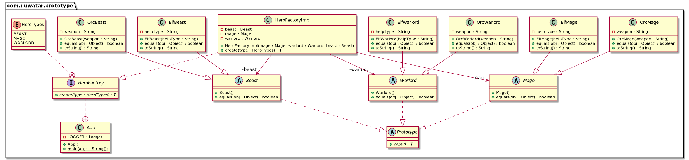

## Intent
Specify the kinds of objects to create using a prototypical
instance, and create new objects by copying this prototype.

## Explanation
Real world example

> Remember Dolly? The sheep that was cloned! Lets not get into the details but the key point here is that it is all about cloning.

In plain words

> Create object based on an existing object through cloning.

Wikipedia says

> The prototype pattern is a creational design pattern in software development. It is used when the type of objects to create is determined by a prototypical instance, which is cloned to produce new objects.

In short, it allows you to create a copy of an existing object and modify it to your needs, instead of going through the trouble of creating an object from scratch and setting it up.

**Programmatic Example**

In Java, it can be easily done by implementing `Cloneable` and overriding `clone` from `Object`

```java
class Sheep implements Cloneable {
  private String name;
  public Sheep(String name) { this.name = name; }
  public void setName(String name) { this.name = name; }
  public String getName() { return name; }
  @Override
  public Sheep clone() {
    try {
      return (Sheep)super.clone();
    } catch(CloneNotSuportedException) {
      throw new InternalError();
    }
  }
}
```

Then it can be cloned like below

```java
var original = new Sheep("Jolly");
System.out.println(original.getName()); // Jolly

// Clone and modify what is required
var cloned = original.clone();
cloned.setName("Dolly");
System.out.println(cloned.getName()); // Dolly
```

## Class diagram


## Applicability
Use the Prototype pattern when a system should be independent of how its products are created, composed and represented; and

* When the classes to instantiate are specified at run-time, for example, by dynamic loading
* To avoid building a class hierarchy of factories that parallels the class hierarchy of products
* When instances of a class can have one of only a few different combinations of state. It may be more convenient to install a corresponding number of prototypes and clone them rather than instantiating the class manually, each time with the appropriate state
* When object creation is expensive compared to cloning

## Real world examples

* [java.lang.Object#clone()](http://docs.oracle.com/javase/8/docs/api/java/lang/Object.html#clone%28%29)

## Credits

* [Design Patterns: Elements of Reusable Object-Oriented Software](http://www.amazon.com/Design-Patterns-Elements-Reusable-Object-Oriented/dp/0201633612)
