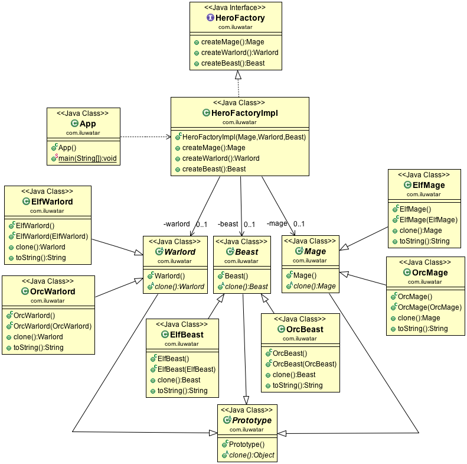

**Intent:** Specify the kinds of objects to create using a prototypical
instance, and create new objects by copying this prototype.

**Applicability:** Use the Prototype pattern when a system should be independent of how its products are created, composed and represented; and

* when the classes to instantiate are specified at run-time, for example, by dynamic loading; or
* to avoid building a class hierarchy of factories that parallels the class hierarchy of products; or
* when instances of a class can have one of only a few different combinations of state. It may be more convenient to install a corresponding number of prototypes and clone them rather than instantiating the class manually, each time with the appropriate state

**Real world examples:**

* [java.lang.Object#clone()](http://docs.oracle.com/javase/8/docs/api/java/lang/Object.html#clone%28%29)
