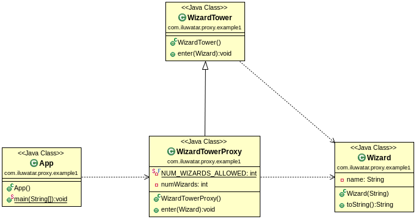

## Also known as
Surrogate

## Intent
Provide a surrogate or placeholder for another object to control
access to it.

## Applicability
Proxy is applicable whenever there is a need for a more
versatile or sophisticated reference to an object than a simple pointer. Here
are several common situations in which the Proxy pattern is applicable

* Remote proxy provides a local representative for an object in a different address space.
* Virtual proxy creates expensive objects on demand.
* Protection proxy controls access to the original object. Protection proxies are useful when objects should have different access rights.

## Typical Use Case

* Control access to another object
* Lazy initialization
* Implement logging
* Facilitate network connection
* Count references to an object

## Tutorials
* [Controlling Access With Proxy Pattern](http://java-design-patterns.com/blog/controlling-access-with-proxy-pattern/)

## Presentations
* [Proxy](https://github.com/iluwatar/java-design-patterns/tree/master/proxy/etc/presentation.html)

## Real world examples

* [java.lang.reflect.Proxy](http://docs.oracle.com/javase/8/docs/api/java/lang/reflect/Proxy.html)
* [Apache Commons Proxy](https://commons.apache.org/proper/commons-proxy/)
* Mocking frameworks Mockito, Powermock, EasyMock

## Credits

* [Design Patterns: Elements of Reusable Object-Oriented Software](http://www.amazon.com/Design-Patterns-Elements-Reusable-Object-Oriented/dp/0201633612)
