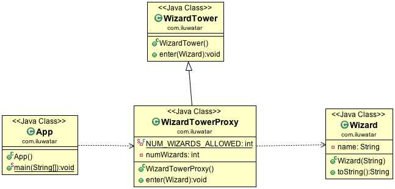

**Intent:** Provide a surrogate or placeholder for another object to control
access to it.

**Applicability:** Proxy is applicable whenever there is a need for a more
versatile or sophisticated reference to an object than a simple pointer. Here
are several common situations in which the Proxy pattern is applicable

* a remote proxy provides a local representative for an object in a different address space.
* a virtual proxy creates expensive objects on demand.
* a protection proxy controls access to the original object. Protection proxies are useful when objects should have different access rights.

**Typical Use Case:**

* control access to another object
* lazy initialization
* implement logging
* facilitate network connection
* to count references to an object

**Real world examples:**

* [java.lang.reflect.Proxy](http://docs.oracle.com/javase/8/docs/api/java/lang/reflect/Proxy.html)
* [Apache Commons Proxy](https://commons.apache.org/proper/commons-proxy/)
