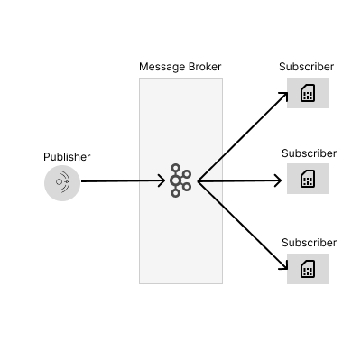

## Intent of the Publish-Subscribe Design Pattern

The Publish-Subscribe design pattern is widely used in software architecture to transmit data between various components in a system.
It is a behavioral design pattern aimed at achieving loosely coupled communication between objects.
The primary intent is to allow a one-to-many dependency relationship where one object (the Publisher) notifies multiple other objects (the Subscribers)
about changes or events, without needing to know who or what the subscribers are.

## Detailed Explanation of Publish-Subscribe Pattern with Real-World Examples

### Real-world example

- Messaging systems like Kafka, RabbitMQ, AWS SNS, JMS
    - **Kafka** : publishes messages to topics and subscribers consumes them in real time for analytics, logs or other purposes.
    - **RabbitMQ** : Uses exchanges as publisher and queues as subscribers to route messages
    - **AWS SNS** : Simple Notification Service (SNS) received the messages from publishers with topic and the subscribers on that topic will receive the messages. (SQS, Lambda functions, emails, SMS)


- Event driven microservices
    - **Publisher** : Point of Sale(PoS) system records the sale of an item and publish the event
    - **Subscribers** : Inventory management service updates stock, Billing service sends e-bill to customer


- Newsletter subscriptions
    - **Publisher** : Writes a new blog post and publish to subscribers
    - **Subscribers** : All the subscribers to the newsletter receive the email

### In plain words

The Publish-Subscribe design pattern allows senders (publishers) to broadcast messages to multiple receivers (subscribers) without knowing who they are,
enabling loose coupling and asynchronous communication in a system

### Wikipedia says

In software architecture, publish–subscribe or pub/sub is a messaging pattern where publishers categorize messages into classes that are received by subscribers.
This is contrasted to the typical messaging pattern model where publishers send messages directly to subscribers.

Similarly, subscribers express interest in one or more classes and only receive messages that are of interest, without knowledge of which publishers, if any, there are.

Publish–subscribe is a sibling of the message queue paradigm, and is typically one part of a larger message-oriented middleware system.
Most messaging systems support both the pub/sub and message queue models in their API; e.g., Java Message Service (JMS).

### Architectural Diagram


## Programmatic Example of Publish-Subscribe Pattern in Java

First we need to identify the Event on which we need the pub-sub methods to trigger.
For example:

- Sending alerts based on the weather events such as earthquakes, floods and tornadoes
- Sending alerts based on the temperature
- Sending an email to different customer support emails when a support ticket is created.

The Message class below will hold the content of the message we need to pass between the publisher and the subscribers.

```java
public record Message(Object content) {
}

```

The Topic class will have the topic **name** based on the event

- Weather events TopicName WEATHER
- Weather events TopicName TEMPERATURE
- Support ticket created TopicName CUSTOMER_SUPPORT
- Any other custom topic depending on use case
- Also, the Topic contains a list of subscribers that will listen to that topic

We can add or remove subscribers from the subscription to the topic

```java
public class Topic {

    private final TopicName name;
    private final Set<Subscriber> subscribers = new CopyOnWriteArraySet<>();
    //...//
}
```

Then we can create the publisher. The publisher class has a set of topics.

- Each new topic has to be registered in the publisher.
- Publish method will publish the _Message_ to the corresponding _Topic_.

```java
public class PublisherImpl implements Publisher {

    private static final Logger logger = LoggerFactory.getLogger(PublisherImpl.class);
    private final Set<Topic> topics = new HashSet<>();

    @Override
    public void registerTopic(Topic topic) {
        topics.add(topic);
    }

    @Override
    public void publish(Topic topic, Message message) {
        if (!topics.contains(topic)) {
            logger.error("This topic is not registered: {}", topic.getName());
            return;
        }
        topic.publish(message);
    }
}
```

Finally, we can Subscribers to the Topics we want to listen to.

- For WEATHER topic we will create _WeatherSubscriber_
- _WeatherSubscriber_ can also subscribe to TEMPERATURE topic
- For CUSTOMER_SUPPORT topic we will create _CustomerSupportSubscribe_
- Also to demonstrate the async behavior we will create a _DelayedWeatherSubscriber_ who has a 0.2 sec processing deplay

All classes will have a _onMessage_ method which will take a Message input.

- On message method will verify the content of the message is as expected
- After content is verified it will perform the operation based on the message
    - _WeatherSubscriber_ will send a weather or temperature alert based on the _Message_
    - _CustomerSupportSubscribe_will send an email based on the _Message_
    - _DelayedWeatherSubscriber_ will send a weather alert based on the _Message_ after a delay

```java
public interface Subscriber {
    void onMessage(Message message);
}
```

And here is the invocation of the publisher and subscribers.

```java
  public static void main(String[] args) throws InterruptedException {

    final String topicWeather = "WEATHER";
    final String topicTemperature = "TEMPERATURE";
    final String topicCustomerSupport = "CUSTOMER_SUPPORT";

    // 1. create the publisher.
    Publisher publisher = new PublisherImpl();

    // 2. define the topics and register on publisher
    Topic weatherTopic = new Topic(topicWeather);
    publisher.registerTopic(weatherTopic);

    Topic temperatureTopic = new Topic(topicTemperature);
    publisher.registerTopic(temperatureTopic);

    Topic supportTopic = new Topic(topicCustomerSupport);
    publisher.registerTopic(supportTopic);

    // 3. Create the subscribers and subscribe to the relevant topics
    // weatherSub1 will subscribe to two topics WEATHER and TEMPERATURE.
    Subscriber weatherSub1 = new WeatherSubscriber();
    weatherTopic.addSubscriber(weatherSub1);
    temperatureTopic.addSubscriber(weatherSub1);

    // weatherSub2 will subscribe to WEATHER topic
    Subscriber weatherSub2 = new WeatherSubscriber();
    weatherTopic.addSubscriber(weatherSub2);

    // delayedWeatherSub will subscribe to WEATHER topic
    // NOTE :: DelayedWeatherSubscriber has a 0.2 sec delay of processing message.
    Subscriber delayedWeatherSub = new DelayedWeatherSubscriber();
    weatherTopic.addSubscriber(delayedWeatherSub);

    // subscribe the customer support subscribers to the CUSTOMER_SUPPORT topic.
    Subscriber supportSub1 = new CustomerSupportSubscriber();
    supportTopic.addSubscriber(supportSub1);
    Subscriber supportSub2 = new CustomerSupportSubscriber();
    supportTopic.addSubscriber(supportSub2);

    // 4. publish message from each topic
    publisher.publish(weatherTopic, new Message("earthquake"));
    publisher.publish(temperatureTopic, new Message("23C"));
    publisher.publish(supportTopic, new Message("support@test.de"));
    
}
```

Program output:

Note that the order of output could change everytime you run the program.
The subscribers could take different time to consume the message.

```
14:01:45.599 [ForkJoinPool.commonPool-worker-6] INFO com.iluwatar.publish.subscribe.subscriber.CustomerSupportSubscriber -- Customer Support Subscriber: 1416331388 sent the email to: support@test.de
14:01:45.599 [ForkJoinPool.commonPool-worker-4] INFO com.iluwatar.publish.subscribe.subscriber.WeatherSubscriber -- Weather Subscriber: 1949521124 issued message: 23C
14:01:45.599 [ForkJoinPool.commonPool-worker-2] INFO com.iluwatar.publish.subscribe.subscriber.WeatherSubscriber -- Weather Subscriber: 60629172 issued message: earthquake
14:01:45.599 [ForkJoinPool.commonPool-worker-5] INFO com.iluwatar.publish.subscribe.subscriber.CustomerSupportSubscriber -- Customer Support Subscriber: 1807508804 sent the email to: support@test.de
14:01:45.599 [ForkJoinPool.commonPool-worker-1] INFO com.iluwatar.publish.subscribe.subscriber.WeatherSubscriber -- Weather Subscriber: 1949521124 issued message: earthquake
14:01:47.600 [ForkJoinPool.commonPool-worker-3] INFO com.iluwatar.publish.subscribe.subscriber.DelayedWeatherSubscriber -- Delayed Weather Subscriber: 2085808749 issued message: earthquake
```

## When to Use the Publish-Subscribe Pattern

- Event-Driven Systems
    - Use Pub/Sub when your system relies on events (e.g., user registration, payment completion).
    - Example: After a user registers, send a welcome email and log the action simultaneously.

- Asynchronous Communication
    - When tasks can be performed without waiting for immediate responses.
    - Example: In an e-commerce app, notify the warehouse and the user after a successful order.

- Decoupling Components
    - Ideal for systems where producers and consumers should not depend on each other.
    - Example: A logging service listens for logs from multiple microservices.

- Scaling Systems
    - Useful when you need to scale services without changing the core application logic.
    - Example: Broadcasting messages to thousands of clients (chat applications, IoT).

- Broadcasting Notifications
    - When a message should be delivered to multiple receivers.
    - Example: Sending promotional offers to multiple user devices.

- Microservices Communication
    - Allow independent services to communicate without direct coupling.
    - Example: An order service publishes an event, and both the billing and shipping services process it.

## When to avoid the Publish-Subscribe Pattern

- Simple applications where direct calls suffice.
- Strong consistency requirements (e.g., banking transactions).
- Low-latency synchronous communication needed.

## Benefits and Trade-offs of Publish-Subscribe Pattern

### Benefits:

- Decoupling
    - Publishers and subscribers are independent of each other.
    - Publishers don’t need to know who the subscribers are, and vice versa.
    - Changes in one component don’t affect the other.
- Scalability
    - New subscribers can be added without modifying publishers.
    - Supports distributed systems where multiple services consume the same events.
- Dynamic Subscription
    - Subscribers can subscribe/unsubscribe at runtime.
    - Enables flexible event-driven architectures.
- Asynchronous Communication
    - Publishers and subscribers operate independently, improving performance.
    - Useful for background processing (e.g., notifications, logging).
- Broadcast Communication
    - A single event can be consumed by multiple subscribers.
    - Useful for fan-out scenarios (e.g., notifications, analytics).
- Resilience & Fault Tolerance
    - If a subscriber fails, others can still process messages.
    - Message brokers (e.g., Kafka, RabbitMQ) can retry or persist undelivered messages.

### Trade-offs:

- Complexity in Debugging
    - Since publishers and subscribers are decoupled, tracing event flow can be difficult.
    - Requires proper logging and monitoring tools.
- Message Ordering & Consistency
    - Ensuring message order across subscribers can be challenging (e.g., Kafka vs. RabbitMQ).
    - Some systems may process events out of order.
- Potential Latency
    - Asynchronous processing introduces delays compared to direct calls.
    - Not ideal for real-time synchronous requirements.

## Related Java Design Patterns

* [Observer Pattern](https://github.com/sanurah/java-design-patterns/blob/master/observer/): Both involve a producer (subject/publisher) notifying consumers (observers/subscribers). Observer is synchronous & tightly coupled (observers know the subject). Pub-Sub is asynchronous & decoupled (via a message broker).
* [Mediator Pattern](https://github.com/sanurah/java-design-patterns/blob/master/mediator/): A mediator centralizes communication between components (like a message broker in Pub-Sub). Mediator focuses on reducing direct dependencies between objects. Pub-Sub focuses on broadcasting events to unknown subscribers.

## References and Credits

* [Apache Kafka – Pub-Sub Model](https://kafka.apache.org/documentation/#design_pubsub)
* [Microsoft – Publish-Subscribe Pattern](https://learn.microsoft.com/en-us/azure/architecture/patterns/publisher-subscriber)
* [Martin Fowler – Event-Driven Architecture](https://martinfowler.com/articles/201701-event-driven.html)
