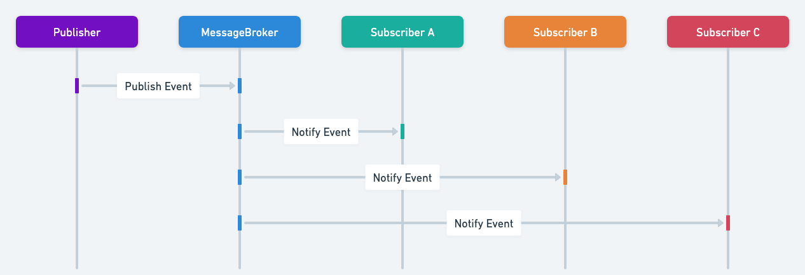

## Intent of the Publish-Subscribe Design Pattern

Defines a one-to-many dependency between objects, enabling automatic notification of multiple subscribers when a publisher's state changes or an event occurs.

## Detailed Explanation of Publish-Subscribe Pattern with Real-World Examples

Real-world example

> An analogous real-world example of the Publish-Subscribe pattern is a news broadcasting system. A news agency (publisher) broadcasts breaking news stories without knowing who specifically receives them. Subscribers, such as television stations, news websites, or mobile news apps, independently decide which types of news they want to receive (e.g., sports, politics, weather) and are automatically notified whenever relevant events occur. This approach keeps the news agency unaware of subscribers' specifics, allowing flexible and scalable distribution of information.

In plain words

> The Publish-Subscribe design pattern allows senders (publishers) to broadcast messages to multiple receivers (subscribers) without knowing who they are, enabling loose coupling and asynchronous communication in a system.

Wikipedia says

> In software architecture, publish–subscribe or pub/sub is a messaging pattern where publishers categorize messages into classes that are received by subscribers.
This is contrasted to the typical messaging pattern model where publishers send messages directly to subscribers. Similarly, subscribers express interest in one or more classes and only receive messages that are of interest, without knowledge of which publishers, if any, there are. Publish–subscribe is a sibling of the message queue paradigm, and is typically one part of a larger message-oriented middleware system.
Most messaging systems support both the pub/sub and message queue models in their API; e.g., Java Message Service (JMS).

Sequence diagram



## Programmatic Example of Publish-Subscribe Pattern in Java

First, we identify events that trigger the publisher-subscriber interactions. Common examples include:

* Sending alerts based on weather events, like earthquakes, floods, and tornadoes.
* Sending notifications based on temperature changes.
* Sending emails to customer support when support tickets are created.

### Defining the Message

We start with a simple message class encapsulating the information sent from publishers to subscribers.

```java
public record Message(Object content) {
}
```

### Defining Topics

A Topic represents an event category that subscribers can register to and publishers can publish messages to. Each topic has:

* A unique identifier or name (e.g., WEATHER, TEMPERATURE, CUSTOMER_SUPPORT).
* A collection of subscribers listening to this topic.

Subscribers can dynamically subscribe or unsubscribe.

```java
@Getter
@Setter
@RequiredArgsConstructor
public class Topic {

  private final String topicName;
  private final Set<Subscriber> subscribers = new CopyOnWriteArraySet<>();

  public void addSubscriber(Subscriber subscriber) {
    subscribers.add(subscriber);
  }

  public void removeSubscriber(Subscriber subscriber) {
    subscribers.remove(subscriber);
  }

  public void publish(Message message) {
    for (Subscriber subscriber : subscribers) {
      CompletableFuture.runAsync(() -> subscriber.onMessage(message));
    }
  }
}
```

### Publisher Implementation

The Publisher maintains a collection of topics it can publish to.

* Before publishing, a topic must be registered.
* Upon publishing, it forwards messages to subscribers of the corresponding topic.

```java
public class PublisherImpl implements Publisher {

    private static final Logger logger = LoggerFactory.getLogger(PublisherImpl.class);
    private final Set<Topic> topics = new HashSet<>();

    @Override
    public void registerTopic(Topic topic) {
        topics.add(topic);
    }

    @Override
    public void publish(Topic topic, Message message) {
        if (!topics.contains(topic)) {
            logger.error("This topic is not registered: {}", topic.getName());
            return;
        }
        topic.publish(message);
    }
}
```

### Defining Subscribers

Subscribers implement an interface that handles incoming messages.

* Each subscriber processes messages according to specific logic.
* Subscribers can be registered to multiple topics.

```java
public interface Subscriber {
    void onMessage(Message message);
}
```

Subscriber examples:

* WeatherSubscriber: handles alerts for weather events or temperature changes.
* CustomerSupportSubscriber: handles support tickets by sending emails.
* DelayedWeatherSubscriber: simulates delayed processing for demonstrating asynchronous behavior.

### Example Usage (Invocation)

Here's how all components connect:

1. Create Publisher
2. Register Topics with Publisher
3. Create Subscribers and Subscribe to Relevant Topics
4. Publish Messages
5. Manage Subscriptions Dynamically

```java
public static void main(String[] args) throws InterruptedException {

    final String topicWeather = "WEATHER";
    final String topicTemperature = "TEMPERATURE";
    final String topicCustomerSupport = "CUSTOMER_SUPPORT";

    // 1. create the publisher.
    Publisher publisher = new PublisherImpl();

    // 2. define the topics and register on publisher
    Topic weatherTopic = new Topic(topicWeather);
    publisher.registerTopic(weatherTopic);

    Topic temperatureTopic = new Topic(topicTemperature);
    publisher.registerTopic(temperatureTopic);

    Topic supportTopic = new Topic(topicCustomerSupport);
    publisher.registerTopic(supportTopic);

    // 3. Create the subscribers and subscribe to the relevant topics
    // weatherSub1 will subscribe to two topics WEATHER and TEMPERATURE.
    Subscriber weatherSub1 = new WeatherSubscriber();
    weatherTopic.addSubscriber(weatherSub1);
    temperatureTopic.addSubscriber(weatherSub1);

    // weatherSub2 will subscribe to WEATHER topic
    Subscriber weatherSub2 = new WeatherSubscriber();
    weatherTopic.addSubscriber(weatherSub2);

    // delayedWeatherSub will subscribe to WEATHER topic
    // NOTE :: DelayedWeatherSubscriber has a 0.2 sec delay of processing message.
    Subscriber delayedWeatherSub = new DelayedWeatherSubscriber();
    weatherTopic.addSubscriber(delayedWeatherSub);

    // subscribe the customer support subscribers to the CUSTOMER_SUPPORT topic.
    Subscriber supportSub1 = new CustomerSupportSubscriber();
    supportTopic.addSubscriber(supportSub1);
    Subscriber supportSub2 = new CustomerSupportSubscriber();
    supportTopic.addSubscriber(supportSub2);

    // 4. publish message from each topic
    publisher.publish(weatherTopic, new Message("earthquake"));
    publisher.publish(temperatureTopic, new Message("23C"));
    publisher.publish(supportTopic, new Message("support@test.de"));

    // 5. unregister subscriber from TEMPERATURE topic
    temperatureTopic.removeSubscriber(weatherSub1);

    // 6. publish message under TEMPERATURE topic
    publisher.publish(temperatureTopic, new Message("0C"));

    /*
     * Finally, we wait for the subscribers to consume messages to check the output.
     * The output can change on each run, depending on how long the execution on each
     * subscriber would take
     * Expected behavior:
     * - weatherSub1 will consume earthquake and 23C
     * - weatherSub2 will consume earthquake
     * - delayedWeatherSub will take longer and consume earthquake
     * - supportSub1, supportSub2 will consume support@test.de
     * - the message 0C will not be consumed because weatherSub1 unsubscribed from TEMPERATURE topic
     */
    TimeUnit.SECONDS.sleep(2);
}
```

### Program output

Output may vary due to asynchronous subscriber processing:

```
14:01:45.599 [ForkJoinPool.commonPool-worker-6] INFO com.iluwatar.publish.subscribe.subscriber.CustomerSupportSubscriber -- Customer Support Subscriber: 1416331388 sent the email to: support@test.de
14:01:45.599 [ForkJoinPool.commonPool-worker-4] INFO com.iluwatar.publish.subscribe.subscriber.WeatherSubscriber -- Weather Subscriber: 1949521124 issued message: 23C
14:01:45.599 [ForkJoinPool.commonPool-worker-2] INFO com.iluwatar.publish.subscribe.subscriber.WeatherSubscriber -- Weather Subscriber: 60629172 issued message: earthquake
14:01:45.599 [ForkJoinPool.commonPool-worker-5] INFO com.iluwatar.publish.subscribe.subscriber.CustomerSupportSubscriber -- Customer Support Subscriber: 1807508804 sent the email to: support@test.de
14:01:45.599 [ForkJoinPool.commonPool-worker-1] INFO com.iluwatar.publish.subscribe.subscriber.WeatherSubscriber -- Weather Subscriber: 1949521124 issued message: earthquake
14:01:47.600 [ForkJoinPool.commonPool-worker-3] INFO com.iluwatar.publish.subscribe.subscriber.DelayedWeatherSubscriber -- Delayed Weather Subscriber: 2085808749 issued message: earthquake
```

This demonstrates:

* Subscribers reacting independently to messages published to subscribed topics.
* Dynamic subscription management allows changing which subscribers listen to specific topics.
* The asynchronous and loosely coupled nature of the publish-subscribe pattern in Java applications.

## When to Use the Publish-Subscribe Pattern

* When an application requires loose coupling between event producers and consumers.
* In scenarios where multiple subscribers independently react to the same event.
* When developing scalable, asynchronous messaging systems, particularly within microservices architectures.

## Real-World Applications of Publish-Subscribe Pattern in Java

* Java Message Service (JMS) implementations (ActiveMQ, RabbitMQ)
* Apache Kafka (used extensively in Java-based microservices)
* Spring Framework's event publishing and listening mechanisms
* Google Cloud Pub/Sub in Java applications
* AWS Simple Notification Service (SNS) with Java SDK

## Benefits and Trade-offs of Publish-Subscribe Pattern

Benefits:

* Loose coupling between publishers and subscribers promotes flexibility.
* Improved scalability and maintainability as new subscribers can be easily added.
* Supports asynchronous communication, enhancing system responsiveness.

Trade-offs:

* Increased complexity due to asynchronous message handling and debugging difficulties.
* Potential message delivery delays and inconsistency if the infrastructure isn't reliable.
* Risk of message flooding, requiring proper infrastructure and consumer management.

## Related Java Design Patterns

* [Observer Pattern](https://java-design-patterns.com/patterns/observer/): Both patterns establish a publisher-subscriber relationship; however, Observer typically works within a single application boundary synchronously, whereas Publish-Subscribe is often distributed and asynchronous.
* [Mediator Pattern](https://java-design-patterns.com/patterns/mediator/): Mediator encapsulates interactions between objects in a centralized manner, whereas Publish-Subscribe provides decentralized, loosely-coupled interactions.

## References and Credits

* [Enterprise Integration Patterns: Designing, Building, and Deploying Messaging Solutions](https://amzn.to/3WcFVui)
* [Head First Design Patterns: Building Extensible and Maintainable Object-Oriented Software](https://amzn.to/49NGldq)
* [Pattern-Oriented Software Architecture Volume 2: Patterns for Concurrent and Networked Objects](https://amzn.to/3UgC24V)
* [Publisher-Subscriber Pattern (Microsoft)](https://learn.microsoft.com/en-us/azure/architecture/patterns/publisher-subscriber)
