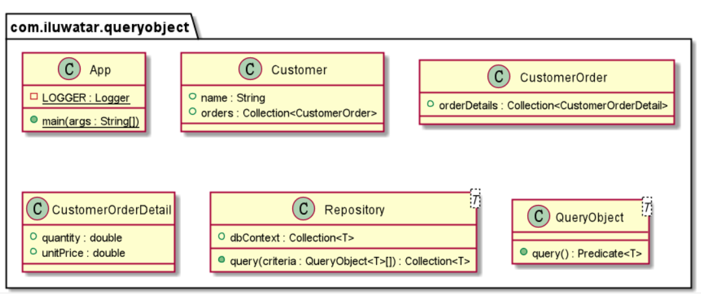

## Intent
Query Object Pattern allows data sources to handle various types of customized query by instantiating objects containing different query conditions instead of implementing each types of queries by adding a fixed method in data accessing middleware (In reality, it can be data repositories provided by ORM or a raw database interface like connection through JDBC) without revealing the schema of it to users. 

## Class diagram


## Explanation
**Programmatic Example**
Now you are holding a dataset of customers, each of them has name and orders he has made, each of the order has many deals with its own quantity and unit price. You then mapped them into java objects, the schema in java may be look like this:</br>
```java
public class Customer {
  public final String name;
  public final Collection<CustomerOrder> orders;
}
public class CustomerOrder {
  public final Collection<CustomerOrderDetail> orderDetails;
}
public class CustomerOrderDetail {
  public final int quantity;
  public final double unitPrice;
}
```
You then built a repository for your dataset to provide it to others:</br>
```java
public class Repository {
  public final Collection<Customer> dbContext;
}
```
Others will need to fetch customer data that satisfies certain conditions from your dataset. Now they want to get all the customers who spent money more than a specific amount, thus you create a method inside your repository to handle it:
```java
public Collection<Customer> CustomersWhoSpendMoneyMoreThan(double money);
```
Sounds good, but what if they still want to use other conditions or conjunctions of those conditions?
```java
public Collection<Customer> CustomersWhoHasOrderMoreThan(int amount);
public Collection<Customer> CustomersWhoseNameStartsWith(String Prefix);
public Collection<Customer> CustomersWhoseNameStartsWithAndHasOrderMoreThan(String Prefix, int amount);
//...
```
Instead of filling your repository with enormous amount of query methods, you refactored your code. This time your repository receives **Query Object**. Any of the query condition can be packed inside these objects. After received query objects, your repository shall return a collection of data that satisifies the conditions revealed by those query objects</br>

Query objects are defined by users. After your repository receives any amounts of query objects, you should have some schema to convert them into real queries. In real world example you might have a parser to build SQL statements, but this time the built in stream API of collections combined with predicate lambda expression is OK.
```java
public interface QueryObject<T> {
  Predicate<T> query();
}

public class Repository {
  public final Collection<Customer> dbContext;
  public final Collection<Customer> query(QueryObject<Customer>... criteria) {
    var initStream = dbContext.stream();
    for (var criterion : criteria) {
      initStream = initStream.filter(criterion.query());
    }
    return initStream.collect(Collectors.toList());
  }
}
```
Now, users of your repository can build query objects by themselves, pass the objects to your repository and then ask you to convert them into real queries
```java
public class CustomersWhoSpendMoneyMoreThan implements QueryObject<Customer> {
  private final double amount;
  public CustomersWhoSpendMoneyMoreThan(final double amount) {
    this.amount = amount;
  }
  
  public Predicate<Customer> query() {
    return customer -> customer.orders.stream().mapToDouble(
        customerOrder -> customerOrder.orderDetails.stream().mapToDouble(
            orderDetail -> orderDetail.unitPrice * orderDetail.quantity
        ).sum()
    ).sum() > amount;
  }
}
```

## Applicability
Use this design pattern when

* Your data access middleware might encounter various types of queries.
* You need to allow users to perform queries without knowing the database schema through your middleware.
