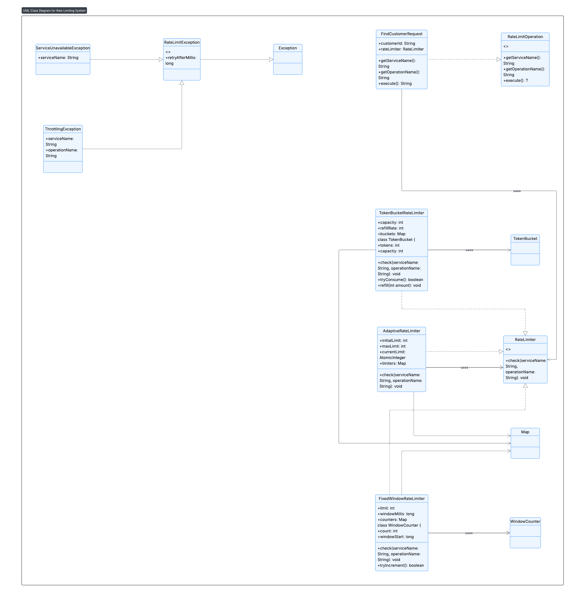
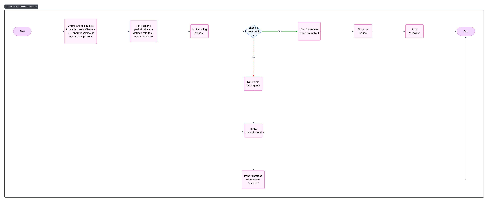
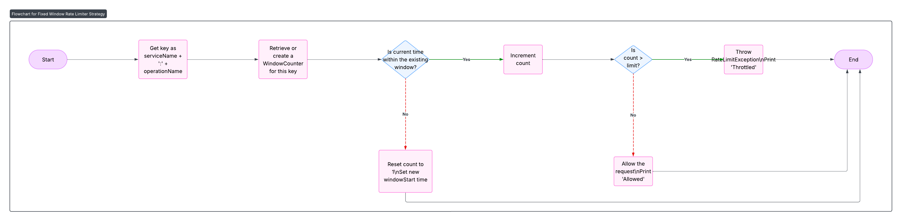
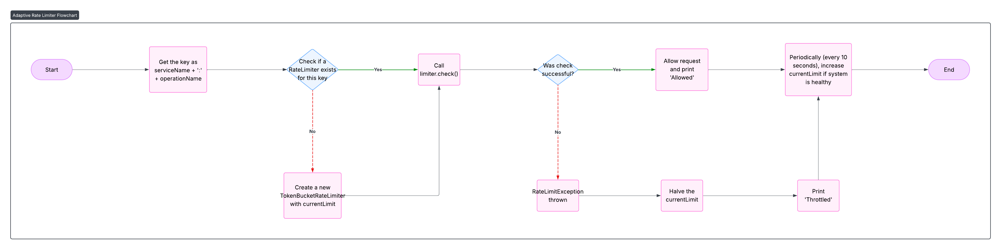

## Also known as

- Throttling
- Request Limiting
- API Rate Limiting

---

## Intent of Rate Limiting Design Pattern

To regulate the number of requests sent to a service in a specific time window, avoiding resource exhaustion and ensuring system stability. This is especially useful in distributed and cloud-native architectures.

---

## Detailed Explanation of Rate Limiting with Real-World Examples

### Real-world example

Imagine you're entering a concert hall that only allows 50 people per minute. If too many fans arrive at once, the gate staff slows down entry, allowing only a few at a time. This prevents overcrowding and ensures safety. Similarly, the rate limiter controls how many requests are processed to avoid overloading a server.

### In plain words

Regulate the number of requests a system handles within a time frame to protect availability and performance.


### AWS says

> "API Gateway limits the steady-state rate and burst rate of requests that it allows for each method in your REST APIs. When request rates exceed these limits, API Gateway begins to throttle requests."

— [API Gateway quotas and important notes - AWS Documentation](https://docs.aws.amazon.com/apigateway/latest/developerguide/api-gateway-request-throttling.html)

---

## Architecture Diagram



This UML shows the key components:
- `RateLimiter` interface
- `TokenBucketRateLimiter`, `FixedWindowRateLimiter`, `AdaptiveRateLimiter`
- Supporting exception classes
- `FindCustomerRequest` as a rate-limited operation

---

## Flowcharts

### 1. Token Bucket Strategy



### 2. Fixed Window Strategy



### 3. Adaptive Rate Limiting Strategy



---

### Programmatic Example of Rate Limiter Pattern in Java

The **Rate Limiter** design pattern helps protect systems from overload by restricting the number of operations that can be performed in a given time window. It is especially useful when accessing shared resources, APIs, or services that are sensitive to spikes in traffic.

This implementation demonstrates three strategies for rate limiting:

- **Token Bucket Rate Limiter**
- **Fixed Window Rate Limiter**
- **Adaptive Rate Limiter**

Let’s walk through the key components.

---

#### 1. Token Bucket Rate Limiter

The token bucket allows short bursts followed by a steady rate. Tokens are added periodically and requests are only allowed if a token is available.

```java
public class TokenBucketRateLimiter implements RateLimiter {
  private final int capacity;
  private final int refillRate;
  private final ConcurrentHashMap<String, TokenBucket> buckets = new ConcurrentHashMap<>();
  private final ScheduledExecutorService scheduler = Executors.newScheduledThreadPool(1);

  public TokenBucketRateLimiter(int capacity, int refillRate) {
    this.capacity = capacity;
    this.refillRate = refillRate;
    scheduler.scheduleAtFixedRate(this::refillBuckets, 1, 1, TimeUnit.SECONDS);
  }

  @Override
  public void check(String serviceName, String operationName) throws RateLimitException {
    String key = serviceName + ":" + operationName;
    TokenBucket bucket = buckets.computeIfAbsent(key, k -> new TokenBucket(capacity));
    if (!bucket.tryConsume()) {
      throw new ThrottlingException(serviceName, operationName, 1000);
    }
  }

  private void refillBuckets() {
    buckets.forEach((k, b) -> b.refill(refillRate));
  }

  private static class TokenBucket {
    private final int capacity;
    private final AtomicInteger tokens;

    TokenBucket(int capacity) {
      this.capacity = capacity;
      this.tokens = new AtomicInteger(capacity);
    }

    boolean tryConsume() {
      while (true) {
        int current = tokens.get();
        if (current <= 0) return false;
        if (tokens.compareAndSet(current, current - 1)) return true;
      }
    }

    void refill(int amount) {
      tokens.getAndUpdate(current -> Math.min(current + amount, capacity));
    }
  }
}
```

---

#### 2. Fixed Window Rate Limiter

This strategy uses a simple counter within a fixed time window.

```java
public class FixedWindowRateLimiter implements RateLimiter {
  private final int limit;
  private final long windowMillis;
  private final ConcurrentHashMap<String, WindowCounter> counters = new ConcurrentHashMap<>();

  public FixedWindowRateLimiter(int limit, long windowSeconds) {
    this.limit = limit;
    this.windowMillis = TimeUnit.SECONDS.toMillis(windowSeconds);
  }

  @Override
  public synchronized void check(String serviceName, String operationName) throws RateLimitException {
    String key = serviceName + ":" + operationName;
    WindowCounter counter = counters.computeIfAbsent(key, k -> new WindowCounter());

    if (!counter.tryIncrement()) {
      throw new RateLimitException("Rate limit exceeded for " + key, windowMillis);
    }
  }

  private class WindowCounter {
    private AtomicInteger count = new AtomicInteger(0);
    private volatile long windowStart = System.currentTimeMillis();

    synchronized boolean tryIncrement() {
      long now = System.currentTimeMillis();
      if (now - windowStart > windowMillis) {
        count.set(0);
        windowStart = now;
      }
      return count.incrementAndGet() <= limit;
    }
  }
}
```

---

#### 3. Adaptive Rate Limiter

This version adjusts the rate based on system health, reducing the rate when throttling occurs and recovering periodically.

```java
public class AdaptiveRateLimiter implements RateLimiter {
  private final int initialLimit;
  private final int maxLimit;
  private final AtomicInteger currentLimit;
  private final ConcurrentHashMap<String, RateLimiter> limiters = new ConcurrentHashMap<>();
  private final ScheduledExecutorService healthChecker = Executors.newScheduledThreadPool(1);

  public AdaptiveRateLimiter(int initialLimit, int maxLimit) {
    this.initialLimit = initialLimit;
    this.maxLimit = maxLimit;
    this.currentLimit = new AtomicInteger(initialLimit);
    healthChecker.scheduleAtFixedRate(this::adjustLimits, 10, 10, TimeUnit.SECONDS);
  }

  @Override
  public void check(String serviceName, String operationName) throws RateLimitException {
    String key = serviceName + ":" + operationName;
    int current = currentLimit.get();
    RateLimiter limiter = limiters.computeIfAbsent(key, k -> new TokenBucketRateLimiter(current, current));

    try {
      limiter.check(serviceName, operationName);
    } catch (RateLimitException e) {
      currentLimit.updateAndGet(curr -> Math.max(initialLimit, curr / 2));
      throw e;
    }
  }

  private void adjustLimits() {
    currentLimit.updateAndGet(curr -> Math.min(maxLimit, curr + (initialLimit / 2)));
  }
}
```

---

#### 4. Simulated Demo Using All Limiters

```java
public final class App {
  public static void main(String[] args) {
    TokenBucketRateLimiter tb = new TokenBucketRateLimiter(2, 1);
    FixedWindowRateLimiter fw = new FixedWindowRateLimiter(3, 1);
    AdaptiveRateLimiter ar = new AdaptiveRateLimiter(2, 6);

    ExecutorService executor = Executors.newFixedThreadPool(3);
    for (int i = 1; i <= 3; i++) {
      executor.submit(createClientTask(i, tb, fw, ar));
    }
  }

  private static Runnable createClientTask(int clientId, RateLimiter tb, RateLimiter fw, RateLimiter ar) {
    return () -> {
      String[] services = {"s3", "dynamodb", "lambda"};
      String[] operations = {"GetObject", "PutObject", "Query", "Scan", "PutItem", "Invoke", "ListFunctions"};
      Random random = new Random();

      while (true) {
        String service = services[random.nextInt(services.length)];
        String operation = operations[random.nextInt(operations.length)];
        try {
          switch (service) {
            case "s3" -> tb.check(service, operation);
            case "dynamodb" -> fw.check(service, operation);
            case "lambda" -> ar.check(service, operation);
          }
          System.out.printf("Client %d: %s.%s - ALLOWED%n", clientId, service, operation);
        } catch (RateLimitException e) {
          System.out.printf("Client %d: %s.%s - THROTTLED%n", clientId, service, operation);
        }

        try {
          Thread.sleep(30 + random.nextInt(50));
        } catch (InterruptedException e) {
          Thread.currentThread().interrupt();
        }
      }
    };
  }
}
```

---

This example highlights how the Rate Limiter pattern supports various throttling techniques and how they respond under simulated traffic pressure, making it invaluable for building scalable, resilient systems.

## When to Use Rate Limiting

- APIs receiving unpredictable traffic
- Shared cloud resources (e.g., DB, compute)
- Services requiring fair client usage
- Preventing DoS or abuse

---

## Real-World Applications

- **AWS API Gateway**
- **Google Cloud Functions**
- **Netflix Zuul API Gateway**
- **Stripe API Throttling**

---

## Benefits and Trade-offs

### Benefits

- Protects backend from overload
- Fair distribution of resources
- Better user experience under load

### Trade-offs

- May delay valid requests
- Requires tuning of limits
- Could create bottlenecks if misused

---

## Related Java Design Patterns

- [Circuit Breaker](https://java-design-patterns.com/patterns/circuit-breaker/)
- [Retry](https://java-design-patterns.com/patterns/retry/)
- [Throttling Queue](https://java-design-patterns.com/patterns/throttling/)

---

## References and Credits

- [Microsoft Cloud Design Patterns](https://learn.microsoft.com/en-us/azure/architecture/patterns/throttling)
- [AWS API Gateway Throttling](https://docs.aws.amazon.com/apigateway/latest/developerguide/api-gateway-request-throttling.html)
- *Designing Data-Intensive Applications* by Martin Kleppmann
- [Resilience4j](https://resilience4j.readme.io/)
- Java Design Patterns Project: [java-design-patterns](https://github.com/iluwatar/java-design-patterns)
