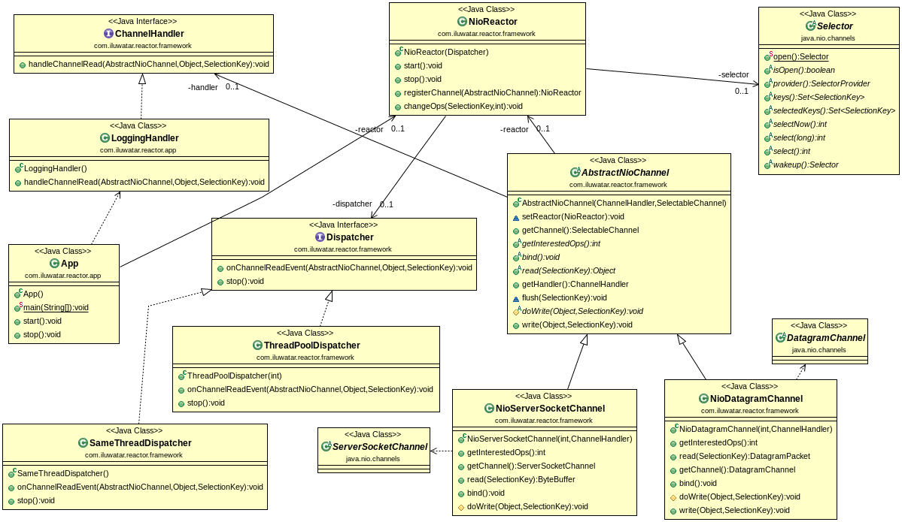

## Intent
The Reactor design pattern handles service requests that are delivered concurrently to an application by one or more clients. The application can register specific handlers for processing which are called by reactor on specific events. Dispatching of event handlers is performed by an initiation dispatcher, which manages the registered event handlers. Demultiplexing of service requests is performed by a synchronous event demultiplexer.

## Applicability
Use Reactor pattern when

* a server application needs to handle concurrent service requests from multiple clients.
* a server application needs to be available for receiving requests from new clients even when handling older client requests.
* a server must maximize throughput, minimize latency and use CPU efficiently without blocking.

## Real world examples

* [Spring Reactor](http://projectreactor.io/)

## Credits

* [Douglas C. Schmidt - Reactor](https://www.dre.vanderbilt.edu/~schmidt/PDF/Reactor.pdf)
* [Pattern Oriented Software Architecture Vol I-V](http://www.amazon.com/Pattern-Oriented-Software-Architecture-Volume-Patterns/dp/0471958697)
* [Doug Lea - Scalable IO in Java](http://gee.cs.oswego.edu/dl/cpjslides/nio.pdf)
* [Netty](http://netty.io/)
