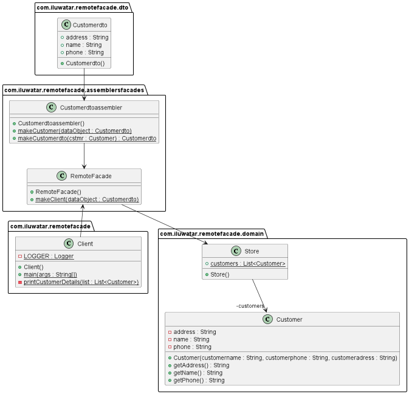

## Name / classification

Remote Facade

## Intent

Provide an interface that combines multiple specific, fine-grained methods into one or more general, coarse-grained methods. Remote Facade minimizes inter-process communication.

## Explanation

  * Real-world example
> Meals are ordered at a fast food restaurant. Meals consist of a drink, entree, and side. A single order is placed, which includes all three parts of the meal, and all three parts of the meal are retrieved at the same time. This is opposed to ordering the three parts of the meal separately and retrieving each part separately.
  * In plain words
> Remote Facade pattern allows multiple pieces of information to be communicated together, lessening the cost of the communication.
  * Wikipedia says
> [Remote facade] pattern hides the complexities of the larger system and provides a simpler interface to the client.
  * Programmatic example
We have a class `Order` which provides fine-grained methods for placing and retrieving an order one item at a time:
```java
public class Order {
  private Socket socket;

  public Order() {
    try {
      InetAddress host = InetAddress.getLocalHost();
      this.socket = new Socket(host.getHostAddress(), 8000);
    } catch (IOException e) {
      e.printStackTrace();
    } 
  }

  public void setDrink(String drink) {
    try {
      ObjectOutputStream outStream = new ObjectOutputStream(this.socket.getOutputStream());
      outStream.writeObject(drink);
    } catch (IOException e) {
      e.printStackTrace();
    }
  }

  public void setEntree(String entree) {
    try {
      ObjectOutputStream outStream = new ObjectOutputStream(this.socket.getOutputStream());
      outStream.writeObject(entree);
    } catch (IOException e) {
      e.printStackTrace();
    }
  }

  public void setSide(String side) {
    try {
      ObjectOutputStream outStream = new ObjectOutputStream(this.socket.getOutputStream());
      outStream.writeObject(side);
    } catch (IOException e) {
      e.printStackTrace();
    }
  }

  public String getDrink() {
    try {
      ObjectInputStream inStream = new ObjectInputStream(this.socket.getInputStream());
      String order = (String) inStream.readObject();
      System.out.println("Retrieved order: \n" + order);
      return order;
    } catch (IOException | ClassNotFoundException e) {
      e.printStackTrace();
      return null;
    }
  }

  public String getEntree() {
    try {
      ObjectInputStream inStream = new ObjectInputStream(this.socket.getInputStream());
      String order = (String) inStream.readObject();
      System.out.println("Retrieved order: \n" + order);
      return order;
    } catch (IOException | ClassNotFoundException e) {
      e.printStackTrace();
      return null;
    }
  }

  public String getSide() {
    try {
      ObjectInputStream inStream = new ObjectInputStream(this.socket.getInputStream());
      String order = (String) inStream.readObject();
      System.out.println("Retrieved order: \n" + order);
      return order;
    } catch (IOException | ClassNotFoundException e) {
      e.printStackTrace();
      return null;
    }
  }
}
```

We can create a more general class `OrderFacade` which provides coarse-grained methods for placing and retrieving whole orders:
```java
public class OrderFacade {
  private Socket socket;

  public OrderFacade() {
    try {
      InetAddress host = InetAddress.getLocalHost();
      this.socket = new Socket(host.getHostAddress(), 8000);
    } catch (IOException e) {
      e.printStackTrace();
    } 
  }

  public void setOrder(String drink, String entree, String side) {
    try {
      ObjectOutputStream outStream = new ObjectOutputStream(this.socket.getOutputStream());
      String order = drink + "\n" + entree + "\n" + side;
      outStream.writeObject(order);
    } catch (IOException e) {
      e.printStackTrace();
    }
  }

  public String getOrder() {
    try {
      ObjectInputStream inStream = new ObjectInputStream(this.socket.getInputStream());
      String order = (String) inStream.readObject();
      System.out.println("Received order: \n" + order);
      return order;
    } catch (IOException | ClassNotFoundException e) {
      e.printStackTrace();
      return null;
    }
  }
}
```

The client can now place orders using either the Order methods or the OrderFacade methods. We can measure the execution time of placing an order using both methods:
```java
final Instant start1 = Instant.now();
Order order1 = new Order();
order1.setDrink("water");
order1.getDrink();

Order order2 = new Order();
order2.setEntree("pizza");
order2.getEntree();

Order order3 = new Order();
order3.setSide("fries");
order3.getSide();
final Instant finish1 = Instant.now();


final Instant start2 = Instant.now();
OrderFacade order4 = new OrderFacade();
order4.setOrder("soda", "burger", "salad");
order4.getOrder();
final Instant finish2 = Instant.now();

long executionTime1 = Duration.between(start1, finish1).toMillis();
System.out.print("Without facade: " + executionTime1 + "ms\n");

long executionTime2 = Duration.between(start2, finish2).toMillis();
System.out.print("With facade: " + executionTime2 + "ms");
```

Program output:
```java
Without facade: 147ms
With facade: 54ms
```

We observe roughly a 3x speedup using the facade rather than the fine-grained methods.

## Class diagram



## Applicability

Use the Remote Facade pattern when:
* Calls between processes are expensive
* Many calls between processes are made that all involve the same object and these calls are not order dependent

## Tutorials

https://martinfowler.com/eaaCatalog/remoteFacade.html
https://blog.devgenius.io/distribution-patterns-dto-and-remote-facade-b277b48b16f5

## Consequences

Pros
* Reduced total cost of remote calls in a program
* A simplified interface is provided to the client

Cons
* More complex methods are introduced

## Related patterns

Facade Pattern

## Credits

https://revistaie.ase.ro/content/54/09%20Rablou.pdf