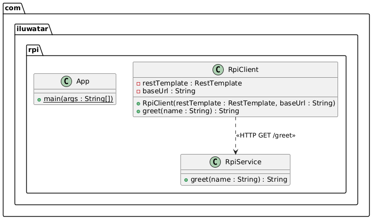

## Also Known As

* Remote Procedure Call (RPC)

## Intent of Remote Procedure Invocation Pattern

Enable synchronous communication between microservices using a request/reply protocol such as REST, where a client makes a direct call to a remote service and blocks until the response is received.

## Detailed Explanation of Remote Procedure Invocation Pattern with Real-World Examples

Real-world example

> Consider an e-commerce application where the checkout service needs to verify a customer's shipping address by calling the address-validation service. The checkout service sends an HTTP request with the address details and waits for the validation result before proceeding. This synchronous request/reply interaction is the essence of RPI — direct, blocking communication between two services without an intermediate message broker.

In plain words

> Remote Procedure Invocation lets one microservice call another over the network using a request/reply protocol (typically HTTP/REST) as if calling a local method, while both must be available at the time of the call.

## Programmatic Example of Remote Procedure Invocation Pattern in Java

This example demonstrates a simple RPI setup using Spring Boot. The `RpiService` exposes a REST endpoint, and the `RpiClient` uses `RestTemplate` to call it synchronously.

**The Service (Server Side)**

The `RpiService` is a Spring `@RestController` that exposes a `/greet` endpoint:

```java
@RestController
public class RpiService {

  @GetMapping("/greet")
  public String greet(@RequestParam(defaultValue = "World") String name) {
    return "Hello, " + name + "!";
  }
}
```
**The Client**

The `RpiClient` uses `RestTemplate` to make a synchronous HTTP GET request to the service:
```java
@Slf4j
public class RpiClient {

  private final RestTemplate restTemplate;
  private final String baseUrl;

  public RpiClient(RestTemplate restTemplate, String baseUrl) {
    this.restTemplate = restTemplate;
    this.baseUrl = baseUrl;
  }

  public String greet(String name) {
    var url = baseUrl + "/greet?name=" + name;
    LOGGER.info("Calling remote service: {}", url);
    var response = restTemplate.getForObject(url, String.class);
    LOGGER.info("Received response: {}", response);
    return response;
  }
}
```
**Running the example**

Start the application and then make a call:

```bash
curl http://localhost:8080/greet?name=Java
```
**Console Output**
```bash
Hello, Java!
```
## When to Use the Remote Procedure Invocation Pattern in Java

* When services need synchronous request/reply communication.
* When simplicity is preferred over asynchronous messaging infrastructure.
* When the client needs an immediate response from the service before proceeding.

## Remote Procedure Invocation Pattern Class Diagram



## Real-World Applications of Remote Procedure Invocation Pattern in Java

* RESTful API calls between microservices using `RestTemplate` or `WebClient`.
* gRPC-based service-to-service communication.
* Any HTTP-based synchronous inter-service call in a microservice architecture.

## Benefits and Trade-offs of Remote Procedure Invocation Pattern

Benefits:

* Simple and familiar programming model — similar to calling a local method.
* No need for intermediate message broker infrastructure.
* Easy to understand, debug, and trace.

Trade-offs:

* Tight runtime coupling — both client and service must be available simultaneously.
* Reduced availability — if the service is down, the client call fails.
* Potential for cascading failures without resilience patterns like Circuit Breaker.
* Synchronous blocking can limit throughput under high load.

## Related Java Design Patterns

* [Circuit Breaker](https://java-design-patterns.com/patterns/circuit-breaker/): Protects clients from cascading failures when a remote service is unavailable.
* [Ambassador](https://java-design-patterns.com/patterns/ambassador/): Can act as a proxy for remote service calls, adding retry, logging, or monitoring.
* [Gateway](https://java-design-patterns.com/patterns/gateway/): Provides a single entry point that routes RPI calls to the appropriate backend service.

## References and Credits

* [Microservices Patterns: With examples in Java](https://amzn.to/3UyWD5O)
* [Pattern: Remote Procedure Invocation (microservices.io)](https://microservices.io/patterns/communication-style/rpi.html)
* [Spring Boot Documentation](https://spring.io/projects/spring-boot)