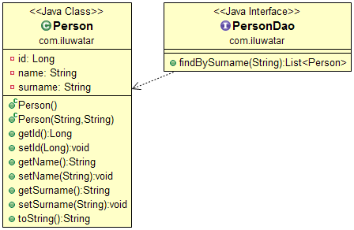

## Intent
Repository layer is added between the domain and data mapping
layers to isolate domain objects from details of the database access code and
to minimize scattering and duplication of query code. The Repository pattern is
especially useful in systems where number of domain classes is large or heavy
querying is utilized.

## Applicability
Use the Repository pattern when

* the number of domain objects is large
* you want to avoid duplication of query code
* you want to keep the database querying code in single place
* you have multiple data sources

## Real world examples

* [Spring Data](http://projects.spring.io/spring-data/)

## Credits

* [Don’t use DAO, use Repository](http://thinkinginobjects.com/2012/08/26/dont-use-dao-use-repository/)
* [Advanced Spring Data JPA - Specifications and Querydsl](https://spring.io/blog/2011/04/26/advanced-spring-data-jpa-specifications-and-querydsl/)
