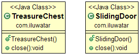

## Intent
Resource Acquisition Is Initialization pattern can be used to implement exception safe resource management.

## Explanation
Real-world example
> If you're renting a car, picking it up for use is initialising the object and once done, you would return the rental.
> If you forgot to return it or something happens, the rental service will ensure that the car is retrieved or 
> equivalent property loss is compensated for.

In plain words
> Resource Acquisition is Initialization allows for exception-safe resource handling and means that objects are able to
> manage themselves without other code to inform them that a clean-up is required after use.

Wikipedia says
> Resource acquisition is initialization (RAII) is a programming idiom used in several object-oriented, statically 
> typed programming languages to describe a particular language behavior. Resource allocation (or acquisition) is done 
> during object creation (specifically initialization), by the constructor, while resource deallocation (release) is 
> done during object destruction (specifically finalization), by the destructor.

**Programmatic Example**
Let us implement the car rental example with the RAII pattern. Here's our object class Car:

```java
import java.util.Date;

class Car {
    private String registrationNumber;
    private boolean isRented;

    public Car(String registrationNumber) {
        this.registrationNumber = registrationNumber;
        this.isRented = false;
    }

    public void rent() {
        if (!isRented) {
            isRented = true;
            System.out.println("Car " + registrationNumber + " has been rented.");
        } else {
            System.out.println("Car " + registrationNumber + " is already rented.");
        }
    }

    public void returnCar() {
        if (isRented) {
            isRented = false;
            System.out.println("Car " + registrationNumber + " has been returned.");
        } else {
            System.out.println("Car " + registrationNumber + " is not rented.");
        }
    }
}
```

We then implement the CarRental class that handles the Object's initialisation and return.

```java
class CarRental {
    private Car car;
    private Date rentalDate;

    public CarRental(Car car) {
        this.car = car;
        car.rent();
        rentalDate = new Date();
    }

    public void returnCar() {
        car.returnCar();
        rentalDate = null;
    }

    public void drive() {
        if (rentalDate != null) {
            System.out.println("Driving the rented car with registration number: " + car.registrationNumber);
        } else {
            System.out.println("Cannot drive. Car is not rented.");
        }
    }
}
```

If we run the following examples:
```
public static void main(String[] args) {
        Car car1 = new Car("XYZ-123");
        Car car2 = new Car("ABC-789");

        CarRental rental1 = new CarRental(car1);
        CarRental rental2 = new CarRental(car2);

        rental1.drive();
        rental2.drive();

        rental1.returnCar();
        rental2.returnCar();

        rental1.drive();
        rental2.drive();
    }
```

We can expect the following program outputs:
```
Car XYZ-123 has been rented.
Car ABC-789 has been rented.
Driving the rented car with registration number: XYZ-123
Driving the rented car with registration number: ABC-789
Car XYZ-123 has been returned.
Car ABC-789 has been returned.
Cannot drive. Car is not rented.
Cannot drive. Car is not rented.
```

## Class diagram


## Applicability
Use the Resource Acquisition Is Initialization pattern when

* You have resources that must be closed in every condition

## Credits
* [Resource acquisition is initialization] (https://en.wikipedia.org/wiki/Resource_acquisition_is_initialization)