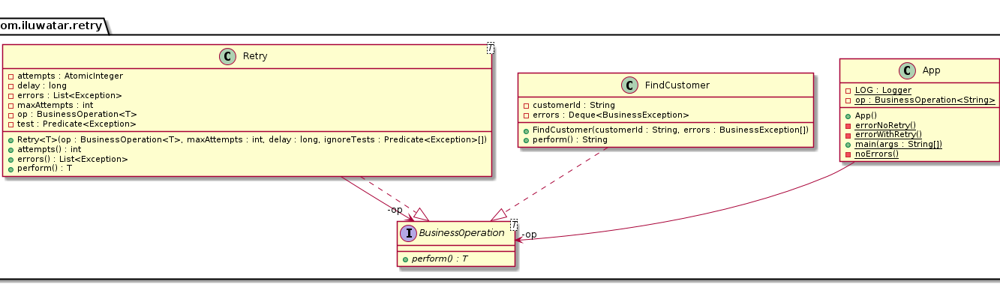

## Intent

Transparently retry certain operations that involve communication with external resources, 
particularly over the network, isolating calling code from the retry implementation details.

## Explanation

Retry pattern consists retrying operations on remote resources over the network a set number of 
times. It closely depends on both business and technical requirements: How much time will the 
business allow the end user to wait while the operation finishes? What are the performance 
characteristics of the remote resource during peak loads as well as our application as more threads
are waiting for the remote resource's availability? Among the errors returned by the remote service, 
which can be safely ignored in order to retry? Is the operation 
[idempotent](https://en.wikipedia.org/wiki/Idempotence)?

Another concern is the impact on the calling code by implementing the retry mechanism. The retry 
mechanics should ideally be completely transparent to the calling code (service interface remains 
unaltered). There are two general approaches to this problem: From an enterprise architecture 
standpoint (strategic), and a shared library standpoint (tactical).

From a strategic point of view, this would be solved by having requests redirected to a separate 
intermediary system, traditionally an [ESB](https://en.wikipedia.org/wiki/Enterprise_service_bus), 
but more recently a [Service Mesh](https://medium.com/microservices-in-practice/service-mesh-for-microservices-2953109a3c9a).

From a tactical point of view, this would be solved by reusing shared libraries like 
[Hystrix](https://github.com/Netflix/Hystrix) (please note that Hystrix is a complete implementation 
of the [Circuit Breaker](https://java-design-patterns.com/patterns/circuit-breaker/) pattern, of 
which the Retry pattern can be considered a subset of). This is the type of solution showcased in 
the simple example that accompanies this `README.md`.

Real world example

> Our application uses a service providing customer information. Once in a while the service seems 
> to be flaky and can return errors or sometimes it just times out. To circumvent these problems we 
> apply the retry pattern. 

In plain words

> Retry pattern transparently retries failed operations over network. 

[Microsoft documentation](https://docs.microsoft.com/en-us/azure/architecture/patterns/retry) says

> Enable an application to handle transient failures when it tries to connect to a service or 
> network resource, by transparently retrying a failed operation. This can improve the stability of 
> the application.

**Programmatic Example**

In our hypothetical application, we have a generic interface for all operations on remote 
interfaces.

```java
public interface BusinessOperation<T> {
  T perform() throws BusinessException;
}
```

And we have an implementation of this interface that finds our customers by looking up a database.

```java
public final class FindCustomer implements BusinessOperation<String> {
  @Override
  public String perform() throws BusinessException {
    ...
  }
}
```

Our `FindCustomer` implementation can be configured to throw `BusinessException`s before returning 
the customer's ID, thereby simulating a flaky service that intermittently fails. Some exceptions, 
like the `CustomerNotFoundException`, are deemed to be recoverable after some hypothetical analysis 
because the root cause of the error stems from "some database locking issue". However, the 
`DatabaseNotAvailableException` is considered to be a definite showstopper - the application should 
not attempt to recover from this error.

We can model a recoverable scenario by instantiating `FindCustomer` like this:

```java
final var op = new FindCustomer(
    "12345",
    new CustomerNotFoundException("not found"),
    new CustomerNotFoundException("still not found"),
    new CustomerNotFoundException("don't give up yet!")
);
```

In this configuration, `FindCustomer` will throw `CustomerNotFoundException` three times, after 
which it will consistently return the customer's ID (`12345`).

In our hypothetical scenario, our analysts indicate that this operation typically fails 2-4 times 
for a given input during peak hours, and that each worker thread in the database subsystem typically 
needs 50ms to "recover from an error". Applying these policies would yield something like this:

```java
final var op = new Retry<>(
    new FindCustomer(
        "1235",
        new CustomerNotFoundException("not found"),
        new CustomerNotFoundException("still not found"),
        new CustomerNotFoundException("don't give up yet!")
    ),
    5,
    100,
    e -> CustomerNotFoundException.class.isAssignableFrom(e.getClass())
);
```

Executing `op` once would automatically trigger at most 5 retry attempts, with a 100 millisecond 
delay between attempts, ignoring any `CustomerNotFoundException` thrown while trying. In this 
particular scenario, due to the configuration for `FindCustomer`, there will be 1 initial attempt 
and 3 additional retries before finally returning the desired result `12345`.

If our `FindCustomer` operation were instead to throw a fatal `DatabaseNotFoundException`, which we 
were instructed not to ignore, but more importantly we did not instruct our `Retry` to ignore, then 
the operation would have failed immediately upon receiving the error, not matter how many attempts 
were left.

## Class diagram



## Applicability

Whenever an application needs to communicate with an external resource, particularly in a cloud 
environment, and if the business requirements allow it.

## Consequences

**Pros:** 

* Resiliency
* Provides hard data on external failures

**Cons:** 

* Complexity
* Operations maintenance

## Related Patterns

* [Circuit Breaker](https://java-design-patterns.com/patterns/circuit-breaker/)

## Credits

* [Retry pattern](https://docs.microsoft.com/en-us/azure/architecture/patterns/retry)
* [Cloud Design Patterns: Prescriptive Architecture Guidance for Cloud Applications](https://www.amazon.com/gp/product/1621140369/ref=as_li_tl?ie=UTF8&tag=javadesignpat-20&camp=1789&creative=9325&linkCode=as2&creativeASIN=1621140369&linkId=3e3f686af5e60a7a453b48adb286797b)
