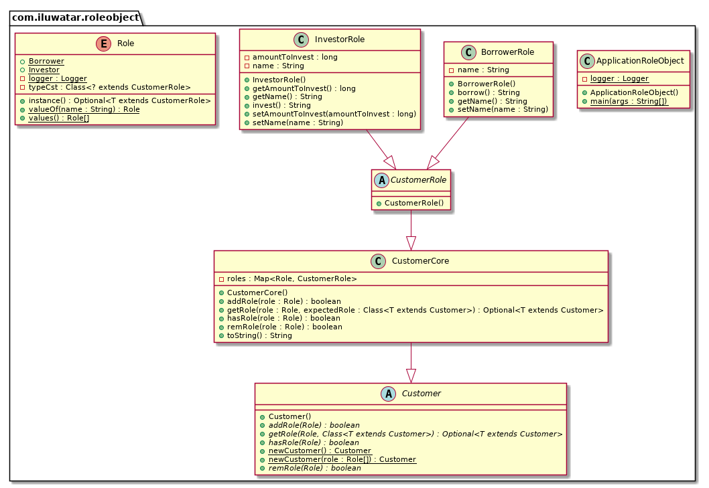

## Intent

To dynamically assign roles to objects, enabling them to change behavior and responsibilities at runtime.

## Explanation

Real-world example

> Imagine a restaurant where staff members can take on different roles based on the needs of the moment. For example, an employee could be a server, a cashier, or a kitchen helper depending on the situation. When the restaurant is busy, a server might also take on the role of a cashier to help process payments quickly. Later, the same employee might assist in the kitchen during a rush. This flexibility allows the restaurant to dynamically allocate responsibilities to meet real-time demands, enhancing efficiency and customer satisfaction. The Role Object pattern in software mimics this by allowing objects to assume different roles and behaviors at runtime, providing similar flexibility and adaptability.

In plain words

> The Role Object pattern suggests to model context-specific views of an object as separate role objects which are dynamically attached to and removed from the core object.

wiki.c2.com says

> Adapt an object to different client’s needs through transparently attached role objects, each one representing a role the object has to play in that client’s context. The object manages its role set dynamically. By representing roles as individual objects, different contexts are kept separate and system configuration is simplified.

**Programmatic Example**

The Role Object design pattern is a pattern that suggests modeling context-specific views of an object as separate role objects. These role objects are dynamically attached to and removed from the core object. The resulting composite object structure, consisting of the core and its role objects, is called a subject. A subject often plays several roles and the same role is likely to be played by different subjects.

In the provided code, we have a `Customer` object that can play different roles such as `Borrower` and `Investor`. These roles are represented by `BorrowerRole` and `InvestorRole` classes respectively, which extend the `CustomerRole` class.

Here is the `Customer` class:

```java
public abstract class Customer {

  public abstract boolean addRole(Role role);

  public abstract boolean hasRole(Role role);

  public abstract boolean remRole(Role role);

  public abstract <T extends Customer> Optional<T> getRole(Role role, Class<T> expectedRole);

  public static Customer newCustomer() {
    return new CustomerCore();
  }

  public static Customer newCustomer(Role... role) {
    var customer = newCustomer();
    Arrays.stream(role).forEach(customer::addRole);
    return customer;
  }
}
```

Here is the `BorrowerRole` class:

```java
@Getter
@Setter
public class BorrowerRole extends CustomerRole {

  private String name;

  public String borrow() {
    return String.format("Borrower %s wants to get some money.", name);
  }
}
```

In this class, the `borrow` method represents an operation specific to the `Borrower` role.

Similarly, the `InvestorRole` class represents the `Investor` role:

```java
@Getter
@Setter
public class InvestorRole extends CustomerRole {

  private String name;

  private long amountToInvest;

  public String invest() {
    return String.format("Investor %s has invested %d dollars", name, amountToInvest);
  }
}
```

In the `InvestorRole` class, the `invest` method represents an operation specific to the `Investor` role.

The `Customer` object can play either of these roles or both. This is demonstrated in the `main` function:

```java
public static void main(String[] args) {
    var customer = Customer.newCustomer(BORROWER, INVESTOR);

    LOGGER.info("New customer created : {}", customer);

    var hasBorrowerRole = customer.hasRole(BORROWER);
    LOGGER.info("Customer has a borrower role - {}", hasBorrowerRole);
    var hasInvestorRole = customer.hasRole(INVESTOR);
    LOGGER.info("Customer has an investor role - {}", hasInvestorRole);

    customer.getRole(INVESTOR, InvestorRole.class)
            .ifPresent(inv -> {
                inv.setAmountToInvest(1000);
                inv.setName("Billy");
            });
    customer.getRole(BORROWER, BorrowerRole.class)
            .ifPresent(inv -> inv.setName("Johny"));

    customer.getRole(INVESTOR, InvestorRole.class)
            .map(InvestorRole::invest)
            .ifPresent(LOGGER::info);

    customer.getRole(BORROWER, BorrowerRole.class)
            .map(BorrowerRole::borrow)
            .ifPresent(LOGGER::info);
}
```

In this class, a `Customer` object is created with both `Borrower` and `Investor` roles. The `hasRole` method is used to check if the `Customer` object has a specific role. The `getRole` method is used to get a reference to the role object, which is then used to perform role-specific operations.

Running the example outputs:

```
10:22:02.561 [main] INFO com.iluwatar.roleobject.ApplicationRoleObject -- New customer created : Customer{roles=[INVESTOR, BORROWER]}
10:22:02.564 [main] INFO com.iluwatar.roleobject.ApplicationRoleObject -- Customer has a borrower role - true
10:22:02.564 [main] INFO com.iluwatar.roleobject.ApplicationRoleObject -- Customer has an investor role - true
10:22:02.574 [main] INFO com.iluwatar.roleobject.ApplicationRoleObject -- Investor Billy has invested 1000 dollars
10:22:02.575 [main] INFO com.iluwatar.roleobject.ApplicationRoleObject -- Borrower Johny wants to get some money.
```

## Class diagram



## Applicability

* When an object needs to change its behavior dynamically based on its role.
* When multiple objects share common behaviors but should exhibit those behaviors differently based on their roles.
* In scenarios where roles can be added, removed, or changed at runtime.

## Known Uses

* User role management in applications where users can have different permissions and responsibilities.
* Game character roles where characters can take on different roles (e.g., healer, warrior, mage) dynamically.
* Workflow systems where tasks can be assigned different roles depending on the context.

## Consequences

Benefits:

* Promotes flexibility by allowing objects to change roles dynamically.
* Enhances code maintainability by decoupling role-specific behaviors from core object logic.
* Facilitates the addition of new roles without modifying existing code.

Trade-offs:

* Increases complexity due to the need for managing multiple role objects.
* Potential performance overhead due to the dynamic nature of role assignment and behavior switching.

## Related Patterns

* [Strategy](https://java-design-patterns.com/patterns/strategy/): Similar in dynamically changing an object's behavior, but Role Object focuses on roles that can be combined.
* [Decorator](https://java-design-patterns.com/patterns/decorator/): Both can add behaviors to objects, but Role Object allows for dynamic role switching rather than static enhancement.
* [State](https://java-design-patterns.com/patterns/state/): Manages state transitions similar to role changes, but Role Object deals more with behavioral roles rather than states.

## Credits

* [Design Patterns: Elements of Reusable Object-Oriented Software](https://amzn.to/3w0pvKI)
* [Pattern-Oriented Software Architecture Volume 1: A System of Patterns](https://amzn.to/3xZ1ELU)
* [Role-Based Access Control](https://amzn.to/3UJzL2l)
* [Dealing with Roles (Martin Fowler)](https://martinfowler.com/apsupp/roles.pdf)
* [Role Object (wiki.c2.com)](http://wiki.c2.com/?RoleObject)
* [The Role Object Pattern (Dirk Bäumer, Dirk Riehle, Wolf Siberski, and Martina Wulf)](https://hillside.net/plop/plop97/Proceedings/riehle.pdf)
