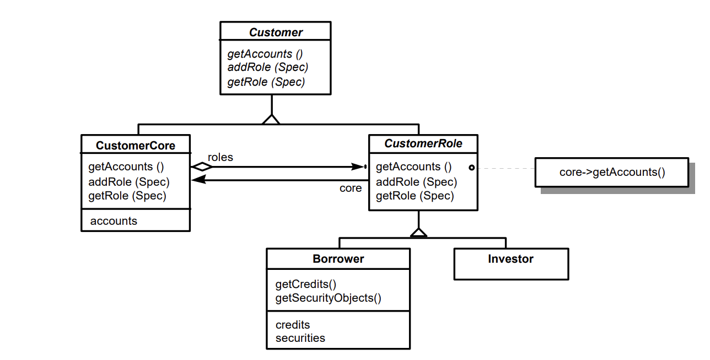
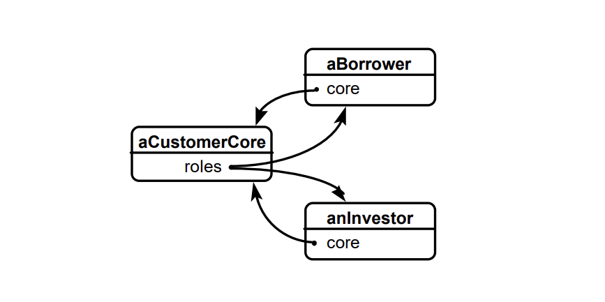
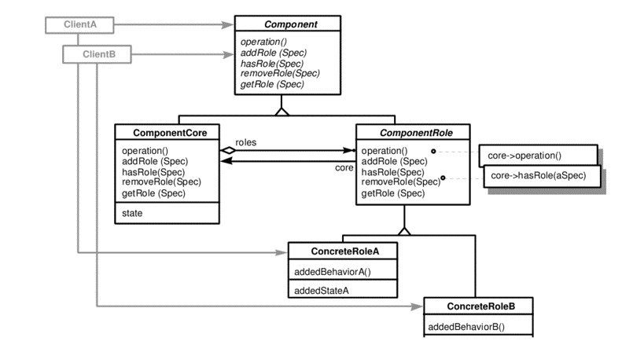

## Name
Role Object pattern

## Also known as
Post pattern, Extension Object pattern

## Intent
Adapt an object to different client’s needs through transparently attached role objects,
each one representing a role the object has to play in that client’s context.
The object manages its role set dynamically. By representing roles as individual objects,
different contexts are kept separate and system configuration is simplified.

## Explanation
An object-oriented system is typically based on a set of key abstractions. Each key abstraction is modeled by a corresponding class in terms of abstract state and behavior. This usually works fine for the design of smaller applications. However, once we want to scale up the system into an integrated suite of applications, we have to deal with different clients that need context-specific views on our key abstractions.

Suppose we are developing software support for the bank’s investment department. One of the key abstractions to be expressed is the concept of customer. Thus, our design model will include a Customer class. The class interface provides operations to manage properties like the customer’s name, address, savings and deposit accounts.

Let’s assume that the bank’s loan department also needs software support. It seems our class design is inadequate to deal with a customer acting as borrower. Obviously, we must provide further implementation state and operations to manage the customer’s loan accounts, credits, and securities.

Integrating several context-specific views in the same class will most likely lead to key abstractions with bloated interfaces. Such interfaces are difficult to understand and hard to maintain. Unanticipated changes cannot be handled gracefully and will trigger lots of recompilation. Changes to a client-specific part of the class interface are likely to affect clients in other subsystems or applications as well.

A simple solution might be to extend the Customer class by adding new Borrower and Investor subclasses which capture the borrower-specific and investor-specific aspects respectively. From an object identity point of view, subclassing implies that two objects of different subclasses are not identical. Thus, a customer acting both as investor and as borrower is represented by two different objects with distinct identities. Identity can only be simulated by an additional mechanism. If two objects are meant to be identical, their inherited attributes must constantly be checked for consistency. However, we will inevitably run into problems in case of polymorphic searches, for example when we want to make up the list of all customers in the system. The same Customer object will appear repeatedly unless we take care of eliminating “duplicates”.

The Role Object pattern suggests modeling context-specific views of an object as separate role objects which are dynamically attached to and removed from the core object. We call the resulting composite object structure, consisting of the core and its role objects, a subject. A subject often plays several roles and the same role is likely to be played by different subjects. As an example, consider two different customers playing the role of borrower and investor, respectively. Both roles could as well be played by a single Customer object.

A key abstraction such as Customer is defined as an abstract superclass. It serves as a pure interface which does not define any implementation state. The Customer class specifies operations to handle a customer’s address and accounts, and defines a minimal protocol for managing roles. The CustomerCore subclass implements the Customer interface. The common superclass for customer-specific roles is provided by CustomerRole, which also supports the Customer interface. The CustomerRole class is abstract and not meant to be instantiated. Concrete subclasses of CustomerRole, for example Borrower or Investor, define and implement the interface for specific roles. It is only these subclasses which are instantiated at runtime. The Borrower class defines the context-specific view of Customer objects as needed by the loan department. It defines additional operations to manage the customer’s credits and securities. Similarly, the Investor class adds operations specific to the investment department’s view of customers.

A client like the loan application may either work with objects of the CustomerCore class, using the interface class Customer, or with objects of concrete CustomerRole subclasses. Suppose the loan application knows a particular Customer instance through its Customer interface. The loan application may want to check whether the Customer object plays the role of Borrower. To this end it calls hasRole() with a suitable role specification. For the purpose of our example, let’s assume we can name roles with a simple string. If the Customer object can play the role named “Borrower,” the loan application will ask it to return a reference to the corresponding object. The loan application may now use this reference to call Borrower-specific operations.

## Class diagram

## Applicability

Use the Role Object pattern, if:
- You want to handle a key abstraction in different contexts, and you do not want to put the resulting context specific interfaces into the same class interface.
- You want to handle the available roles dynamically so that they can be attached and removed on demand, that is at runtime, rather than fixing them statically at compile-time.
- You want to treat the extensions transparently and need to preserve the logical object identity of the resulting object conglomerate.
- You want to keep role/client pairs independent of each other so that changes to a role do not affect clients that are not interested in that role.
  Don’t use this pattern:
- if your potential roles have strong interdependencies.

## Credits

- [The role object pattern](https://hillside.net/plop/plop97/Proceedings/riehle.pdf)
- [Framework Development for Large Systems](hhttps://www.researchgate.net/publication/220426149_Framework_Development_for_Large_Systems#pf6)
