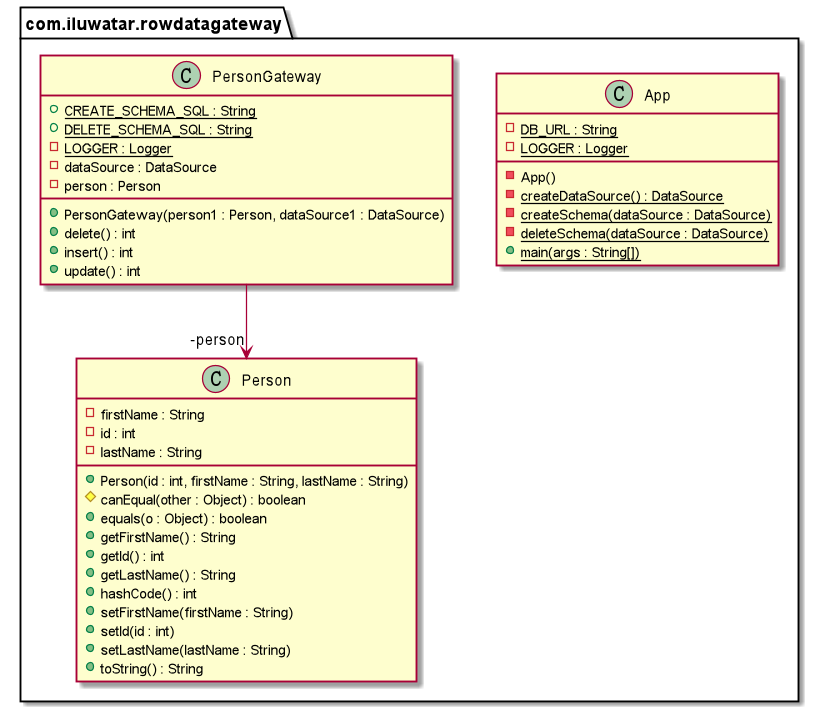

## Intent
An object that acts as a Gateway to a single record in a data source. There is one instance per row. Here Gateway means an object that encapsulates access to an external system or resource. This object does not contain domain logic methods. If you introduce other methods (in particular domain logic) the object becomes an Active Record Pattern.

## Explanation

In plain words

> A Row Data Gateway gives you objects that look exactly like the record in your record structure but can be accessed with the regular mechanisms of your programming language. All details of data source access are hidden behind this interface.

Programmatic Example

A Row Data Gateway acts as an object that exactly mimics a single record, such as one database row. For example, `Person` class has id, firstName and lastName fields. 

The `Person` class:

```java
@Setter
@Getter
@ToString
@EqualsAndHashCode
@AllArgsConstructor
public class Person {
  private int id;
  private String firstName;
  private String lastName;
}
```

This pattern holds the data about a row so that a client can then access the Row Data Gateway directly. The gateway acts as a good interface for each row of data. This approach works particularly well for Transaction Scripts.

The `PersonGateway` class:

```java
public class PersonGateway {
  private final DataSource dataSource;
  private final Person person;

  public PersonGateway(final Person person1, final DataSource dataSource1) {
    this.person = person1;
    this.dataSource = dataSource1;
  }

  public int insert() throws SQLException {
	...
  }
  
  public int update() throws SQLException {
	...
  }

  public int delete() throws SQLException {
 	...
  }
}
```

## Class diagram



## Applicability

This Row Data Gateway is widely used with Transaction Script pattern. In this case, it nicely factors out the database access code and allows it to be reused easily by different Transaction Scripts.

## Related patterns

- Active Record Pattern

- [Transaction Script](https://java-design-patterns.com/patterns/transaction-script/)


## Credits

* [Row Data Gateway Pattern](https://www.sourcecodeexamples.net/2018/04/row-data-gateway.html)
* [Patterns of Enterprise Application Architecture](https://www.amazon.com/gp/product/0321127420/ref=as_li_qf_asin_il_tl?ie=UTF8&tag=javadesignpat-20&creative=9325&linkCode=as2&creativeASIN=0321127420&linkId=18acc13ba60d66690009505577c45c04)