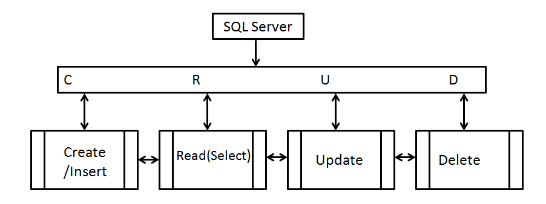
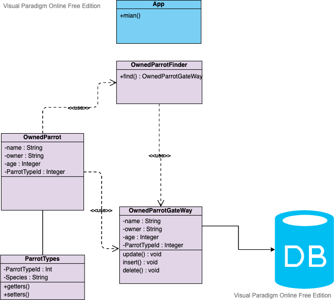

# Row Data Gateway pattern

## Intent

The **Row Data Gateway Pattern** provides programmers with an object to perform CRUD
(create, read, update and delete) operations for a single record (db row), 
hence referred to as a _gateway_. 

 
This pattern is normally used for **Transaction Scripts** because it provides reusable 
database operations with regular programing language methods.

However, this has a few drawbacks, most objects are created to satisfy business 
requirements, adding database logic to these objects increases the code complexity. 

## UML for this implementation of Row Data Gateway Pattern

## Database (MySQL)

### Database setup
**Note**
 Follow this tutorial to set up the database  https://dev.mysql.com/doc/mysql-getting-started/en/ 

After setting up the database create the following user, with username `admin` and password `admin123`.

`CREATE USER 'admin'@'localhost' IDENTIFIED BY 'admin123';`
### Tables 

**Note** these will be created at runtime of application, 
but db needs to be set up first.

 These scripts can be found in /src/main/resources/db-scripts 

- ParrotType.sql > Contains a list of different types of parrots
- OwnedParrot.sql > Owner's parrot(s) (name, age, color, tamed, reference to ParrotType, 
reference to ParrotOwner) and foreign key to Parrots table
for parrot specific species.

### References

#### Row Data Gateway Pattern
https://www.sqlshack.com/crud-operations-in-sql-server/#gallery-1
https://www.sourcecodeexamples.net/2018/04/row-data-gateway.html
https://www.martinfowler.com/eaaCatalog/rowDataGateway.html
https://github.com/richard-jp-leguen/glorified-typings/blob/master/ta-material/soen343-f2010/tut-71.implementing-row-data-gateway.md/

#### MySql User references

https://docs.rackspace.com/support/how-to/create-and-edit-users-in-mysql/