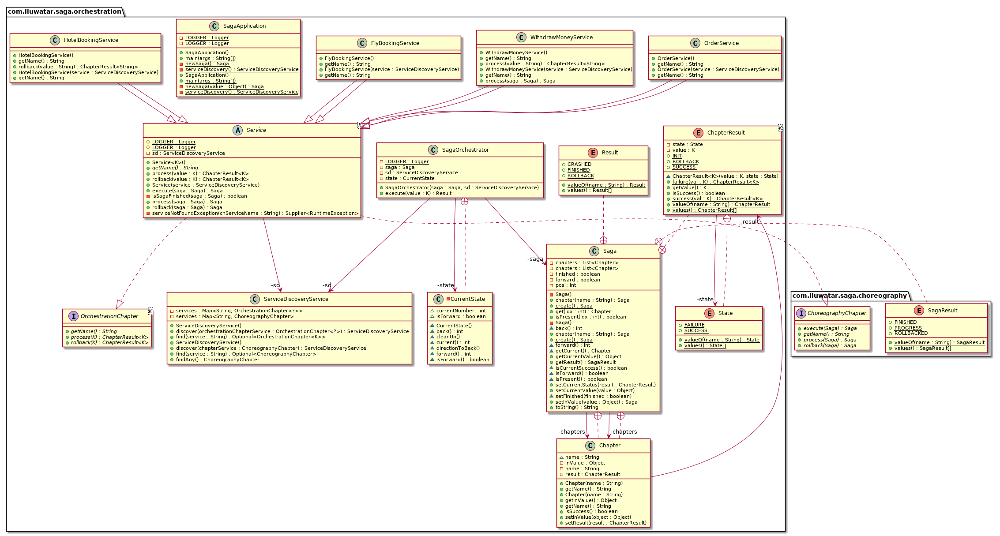

## Also known as
This pattern has a similar goal with two-phase commit (XA transaction)

## Intent
This pattern is used in distributed services to perform a group of operations atomically.
This is an analog of transaction in a database but in terms of microservices architecture this is executed 
in a distributed environment

## Explanation
A saga is a sequence of local transactions in a certain context. If one transaction fails for some reason, 
the saga executes compensating transactions(rollbacks) to undo the impact of the preceding transactions.
There are two types of Saga:

- Choreography-Based Saga. 
In this approach, there is no central orchestrator. 
Each service participating in the Saga performs their transaction and publish events. 
The other services act upon those events and perform their transactions. 
Also, they may or not publish other events based on the situation.

- Orchestration-Based Saga
In this approach, there is a Saga orchestrator that manages all the transactions and directs 
the participant services to execute local transactions based on events. 
This orchestrator can also be though of as a Saga Manager.

## Class diagram

## Applicability
Use the Saga pattern, if:

- you need to perform a group of operations related to different microservices atomically
- you need to rollback changes in different places in case of failure one of the operation
- you need to take care of data consistency in different places including different databases
- you can not use 2PC(two phase commit)

## Credits

- [Pattern: Saga](https://microservices.io/patterns/data/saga.html)
