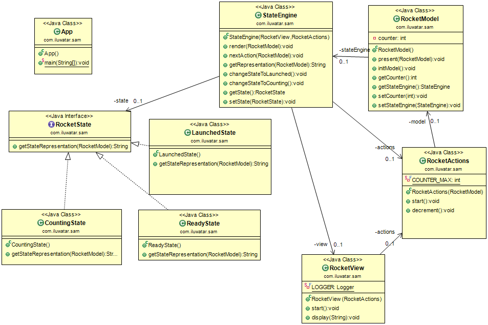

## Intent
SAM (State-Action-Model) is a new reactive/functional pattern that simplifies architectures by strictly decoupling the business logic from the view.

## Applicability
Use the SAM pattern in either of the following cases:

* when I want focus on "what's allowed", not subscriptions

* when I want decouple view components from the bussines logic

## Credits

* [The SAM Pattern](http://sam.js.org/)

