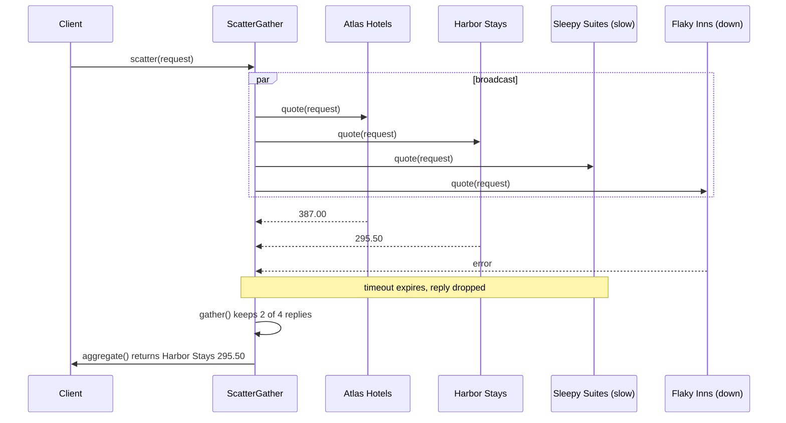
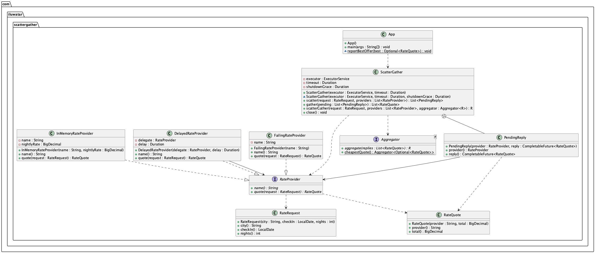

## Also known as

* Broadcast and Aggregate
* Request-Reply Broadcast

## Intent of Scatter-Gather Design Pattern

Send the same request to a number of independent recipients concurrently, collect the replies that arrive within a deadline, and combine them into one result. The caller pays roughly the latency of the slowest tolerated recipient instead of the sum of all latencies, and a single slow or failing recipient does not prevent an answer.

## Detailed Explanation of Scatter-Gather Pattern with Real-World Examples

Real-world example

> A travel site has to show the price of a hotel stay. It does not own a single price list; several rate providers each have their own. Asking them one after another would make the page as slow as all of them together, and one provider that is down would block the result. Instead the site scatters the same request to every provider at the same time, waits a few hundred milliseconds for their replies, drops the ones that did not answer in time, and shows the cheapest of the quotes it gathered.

In plain words

> Ask everybody the same question at once, wait a bounded time, and aggregate the answers you got.

Enterprise Integration Patterns says

> Use a Scatter-Gather that broadcasts a message to multiple recipients and re-aggregates the responses back into a single message.

How it differs from Fan-Out/Fan-In

> [Fan-Out/Fan-In](../fanout-fanin) splits one job into sub-tasks of the same kind and needs all of them back to build the result. Scatter-Gather sends the same message to different, independent services, expects heterogeneous replies, and is designed to produce a result even when some recipients are slow or unavailable.

Sequence diagram





## Programmatic Example of Scatter-Gather Pattern in Java

The request is a plain immutable value. Every recipient receives exactly the same instance.

```java
public record RateRequest(String city, LocalDate checkIn, int nights) {}

public record RateQuote(String provider, BigDecimal total) {}
```

Each recipient implements `RateProvider`. In a real system these would be remote services with their own latency and failure profile. The demo ships a fast in-memory provider, a decorator that delays any provider, and a provider that is down.

```java
public interface RateProvider {
  String name();

  RateQuote quote(RateRequest request);
}
```

The `Aggregator` reduces the gathered replies. Because it is a separate strategy the same coordinator can serve callers that want the cheapest quote, an average, or the full list.

```java
@FunctionalInterface
public interface Aggregator<R> {
  R aggregate(List<RateQuote> replies);

  static Aggregator<Optional<RateQuote>> cheapestQuote() {
    return replies -> replies.stream().min(Comparator.comparing(RateQuote::total));
  }
}
```

`ScatterGather` implements the three phases. The scatter phase submits one asynchronous call per provider and attaches the timeout to each future. Nothing is awaited yet.

```java
public List<PendingReply> scatter(RateRequest request, List<RateProvider> providers) {
  var pending = new ArrayList<PendingReply>();
  for (var provider : providers) {
    var reply = new CompletableFuture<RateQuote>();
    var task = executor.submit(() -> {
      try {
        reply.complete(provider.quote(request));
      } catch (RuntimeException e) {
        reply.completeExceptionally(e);
      }
    });
    // a reply that times out or is cancelled also cancels its task, interrupting the provider call
    reply.orTimeout(timeout.toMillis(), TimeUnit.MILLISECONDS)
        .whenComplete((quote, failure) -> {
          if (failure != null && !task.isDone()) {
            task.cancel(true);
          }
        });
    pending.add(new PendingReply(provider, reply));
  }
  return pending;
}
```

The gather phase waits until every future has settled, then keeps the successful replies. Timeouts and failures are logged and dropped, which is what allows the caller to get an answer from the providers that did respond.

```java
public List<RateQuote> gather(List<PendingReply> pending) {
  CompletableFuture.allOf(pending.stream().map(PendingReply::reply).toArray(CompletableFuture[]::new))
      .exceptionally(ex -> null)
      .join();
  var quotes = new ArrayList<RateQuote>();
  for (var entry : pending) {
    try {
      quotes.add(entry.reply().join());
    } catch (CompletionException e) {
      if (e.getCause() instanceof TimeoutException) {
        LOGGER.warn("Dropping {}: no reply within {} ms", entry.provider().name(), timeout.toMillis());
      } else {
        LOGGER.warn("Dropping {}: {}", entry.provider().name(), e.getCause().getMessage());
      }
    }
  }
  return quotes;
}
```

A convenience method chains the phases together.

```java
public <R> R scatterGather(
    RateRequest request, List<RateProvider> providers, Aggregator<R> aggregator) {
  return aggregator.aggregate(gather(scatter(request, providers)));
}
```

The demo application asks four providers for the same three-night stay. One provider needs two seconds while the gather timeout is 300 milliseconds, and one provider is down. The site still answers with the cheapest of the two quotes it gathered.

```java
var request = new RateRequest("Lisbon", LocalDate.of(2026, 10, 3), 3);
var providers =
    List.<RateProvider>of(
        new InMemoryRateProvider("Atlas Hotels", new BigDecimal("129.00")),
        new InMemoryRateProvider("Harbor Stays", new BigDecimal("98.50")),
        new DelayedRateProvider(
            new InMemoryRateProvider("Sleepy Suites", new BigDecimal("75.00")),
            Duration.ofSeconds(2)),
        new FailingRateProvider("Flaky Inns"));

try (var scatterGather =
    new ScatterGather(Executors.newFixedThreadPool(providers.size()), Duration.ofMillis(300))) {
  var pending = scatterGather.scatter(request, providers);
  var quotes = scatterGather.gather(pending);
  reportBestOffer(Aggregator.cheapestQuote().aggregate(quotes));
}
```

The result is reported by a small helper so the empty case is handled explicitly.

```java
static void reportBestOffer(Optional<RateQuote> best) {
  best.ifPresentOrElse(
      offer -> LOGGER.info("Best offer: {} at {}", offer.provider(), offer.total()),
      () -> LOGGER.info("No provider answered in time"));
}
```

Running the program produces output similar to the following.

```
Scatter phase: broadcasting the same request to every provider
Scattering request for 3 nights in Lisbon to 4 providers
Atlas Hotels quotes 387.00 for 3 nights in Lisbon
Harbor Stays quotes 295.50 for 3 nights in Lisbon
Gather phase: collecting replies that arrive within the timeout
Sleepy Suites is slow and will need 2000 ms to answer
Gathered quote 387.00 from Atlas Hotels
Gathered quote 295.50 from Harbor Stays
Dropping Sleepy Suites: no reply within 300 ms
Dropping Flaky Inns: Flaky Inns is unavailable
Gathered 2 of 4 replies
Aggregate phase: choosing the cheapest of 2 quotes
Best offer: Harbor Stays at 295.50
```

## When to Use the Scatter-Gather Pattern in Java

* The same question has to be answered by several independent services, such as price comparison, search federation, or quorum reads.
* The latency of asking recipients sequentially is unacceptable.
* A partial answer built from the recipients that replied in time is more valuable than no answer.
* The recipients are unknown or change at runtime, so the caller should only depend on a common contract.

## Real-World Applications of Scatter-Gather Pattern in Java

* Travel and shopping comparison sites that query many suppliers for the same product.
* Distributed search engines that broadcast a query to every index shard and merge the ranked results.
* Quorum reads in replicated data stores that ask several replicas and accept the first consistent majority.
* [Apache Camel Scatter-Gather EIP](https://camel.apache.org/components/latest/eips/scatter-gather.html)
* [Spring Integration Scatter-Gather](https://docs.spring.io/spring-integration/reference/scatter-gather.html)
* [Akka scatter-gather with `ask` and `Future.sequence`](https://doc.akka.io/docs/akka/current/futures.html)

## Benefits and Trade-offs of Scatter-Gather Pattern

Benefits:

* **Lower latency**: recipients are called concurrently, so the caller waits for the slowest tolerated reply rather than the sum of all replies.
* **Resilience**: a timeout bounds the wait and a failed recipient is simply left out of the aggregate.
* **Decoupling**: the caller depends only on the recipient contract and the aggregation strategy, not on the number or identity of recipients.

Trade-offs:

* **Partial results**: the caller must be able to live with an answer built from a subset of recipients, and the aggregator must handle an empty set.
* **Resource usage**: every request occupies one thread or connection per recipient; dropping a reply interrupts the local call, but a remote recipient may still finish computing an answer nobody reads.
* **Tuning**: the timeout is a compromise between completeness and responsiveness and usually needs measurement to get right.

## Related Java Design Patterns

* [Fan-Out/Fan-In](../fanout-fanin): splits one task into homogeneous sub-tasks and waits for all of them; Scatter-Gather broadcasts one request to heterogeneous recipients and tolerates missing replies.
* [Microservices Aggregator](../microservices-aggregrator): a service that composes the responses of several downstream services; Scatter-Gather is a way to fetch those responses concurrently.
* [Async Method Invocation](../async-method-invocation): the mechanism used to call each recipient without blocking the caller.
* [Promise](../promise): each pending reply is a promise that either completes with a quote or fails.
* Timeout: bounds how long after the scatter each reply has to arrive; the timer starts when the request is scattered, not when gather is called.

## References and Credits

* [Enterprise Integration Patterns](https://www.amazon.com/gp/product/0321200683) (Gregor Hohpe and Bobby Woolf)
* [Scatter-Gather at enterpriseintegrationpatterns.com](https://www.enterpriseintegrationpatterns.com/patterns/messaging/BroadcastAggregate.html)
* [Java Concurrency in Practice](https://www.amazon.com/gp/product/0321349601) (Brian Goetz)
