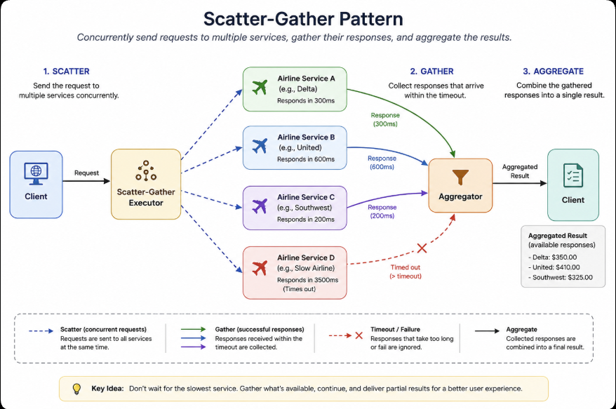

## Also known as

- Scatter/Gather

## Intent of Scatter-Gather Design Pattern

The Scatter-Gather pattern sends a request to multiple independent workers or services concurrently, gathers the responses that complete within a defined period, and combines them into a single result.

## Detailed Explanation of Scatter-Gather Pattern with Real-World Examples

### Real-world example

Imagine a travel website searching for flight prices. Instead of contacting airlines one after another, it sends requests to several airlines simultaneously.

Each airline responds independently. The system gathers the available responses and combines them for the user. If one airline is too slow, the system can continue with the responses that arrived before the timeout.

### In plain words

> Send the same kind of work to multiple places at once, gather the available answers, and combine them.

### Architecture


The Scatter-Gather flow consists of three main stages:

1. **Scatter** — submit multiple independent tasks concurrently.
2. **Gather** — collect responses that complete within the timeout.
3. **Aggregate** — combine the gathered responses into one result.

## Programmatic Example of Scatter-Gather Pattern in Java

Our example defines a `TaskSupplier` abstraction:

```java
@FunctionalInterface
public interface TaskSupplier {
  String execute();
}

## References and Credits

- [Enterprise Integration Patterns - Scatter-Gather](https://www.enterpriseintegrationpatterns.com/patterns/messaging/BroadcastAggregate.html)
- [Java SE 21 ExecutorService API](https://docs.oracle.com/en/java/javase/21/docs/api/java.base/java/util/concurrent/ExecutorService.html)