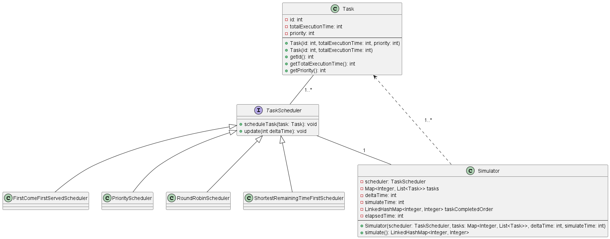

## Name
Scheduler Design Pattern

## Intent
The Scheduler Design Pattern is used to manage and coordinate the execution of tasks or jobs in a system. It provides a mechanism for scheduling and executing tasks at specific times, intervals, or in response to certain events. This pattern is especially useful when dealing with asynchronous operations, background processing, and resource allocation.

## Explanation

### Real-world example
> Think of a restaurant kitchen with various dishes to be prepared – the chef is like a scheduler who ensures that each dish is cooked at the right time and served to customers without letting the kitchen become chaotic or the food getting cold.

### In plain words
> The Scheduler Design Pattern ensures your tasks get done at the right time and order.

### Wikipedia says
> In computing, scheduling is the action of assigning resources to perform tasks. The resources may be processors, network links or expansion cards. The tasks may be threads, processes or data flows.

> The scheduling activity is carried out by a process called scheduler. Schedulers are often designed so as to keep all computer resources busy (as in load balancing), allow multiple users to share system resources effectively, or to achieve a target quality-of-service.

> Scheduling is fundamental to computation itself, and an intrinsic part of the execution model of a computer system; the concept of scheduling makes it possible to have computer multitasking with a single central processing unit (CPU).

### Programmatic example
In our demo, we will have a class `Task` with following attributes:
```java
public class Task {
  int id;
  int totalExecutionTime;
  int priority = 0;
}
```
And a `Scheduler` class which will be responsible for scheduling the tasks:
```java
public interface TaskScheduler {
  void scheduleTask(Task task);
}
```
Base on the strategy of the scheduler, we can have different implementations of `TaskScheduler` interface. For example, a `PriorityScheduler` which will schedule the tasks based on their priority:
```java
public class PriorityScheduler implements TaskScheduler {
  private final Queue<Task> taskQueue =
      new PriorityQueue<>(
          (task1, task2) -> {
            if (task2.priority != task1.priority) {
              return task2.priority - task1.priority;
            }
            return task1.id - task2.id;
          });

  @Override
  public void scheduleTask(Task task) {
    taskQueue.add(task);
  }
}
```

## Class diagram


## Applicability
The Scheduler Design Pattern is applicable in various scenarios, including but not limited to:

- **Task Queue Management**: When you need to manage a queue of tasks to be executed, ensuring tasks are executed in a specific order, on specific resources, or with certain priorities.

- **Background Processing**: In applications requiring background jobs, such as processing user requests asynchronously, sending emails, or performing periodic maintenance tasks.

- **Resource Allocation**: For managing shared resources, like database connections or thread pools, to ensure fair allocation among competing tasks.

- **Real-time Systems**: In systems where tasks need to be executed at precise times or in response to specific events, such as in real-time simulations or monitoring systems.

## Known uses
The Scheduler Design Pattern is used in various software applications and frameworks, including:

- Operating systems for managing processes.
- Java: The Java `ScheduledExecutorService` class is an implementation of the Scheduler Design Pattern, allowing the scheduling of tasks at fixed rate or with fixed delay.

## Consequences
The Scheduler Design Pattern offers several advantages:
- **Flexibility**: It allows for dynamic scheduling of tasks, making it adaptable to changing requirements.
- **Efficiency**: Tasks can be optimized for resource utilization, and parallel execution can be managed effectively.
- **Maintainability**: Separating scheduling logic from task execution simplifies maintenance and debugging.

However, it also has some potential drawbacks:
- **Complexity**: Implementing a scheduler can be complex, especially in systems with intricate scheduling requirements.
- **Overhead**: Maintaining a scheduler adds some overhead to the system.


## Related patterns
The Scheduler Design Pattern is related to other design patterns, including:
- **Observer Pattern**: When tasks need to be scheduled in response to specific events or changes in the system, the Observer Pattern can be used in conjunction with the Scheduler Pattern.
- **Command Pattern**: Tasks to be executed by the scheduler can often be encapsulated using the Command Pattern, allowing for easy parameterization and queuing.

## Credits
- [Wikipedia: Scheduling (computing)](https://en.wikipedia.org/wiki/Scheduling_(computing))
