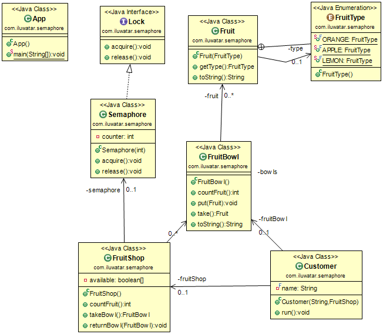

## Also known as
Counting Semaphore

## Intent
Create a lock which mediates access to a pool of resources. 
Only a limited number of threads, specified at the creation 
of the semaphore, can access the resources at any given time.
A semaphore which only allows one concurrent access to a resource
is called a binary semaphore.

## Class diagram

## Applicability
Use a Semaphore when 

* You have a pool of resources to allocate to different threads
* Concurrent access to a resource could lead to a race condition 

## Credits

* [Semaphore(programming)] (http://en.wikipedia.org/wiki/Semaphore_(programming))
* [Semaphores] (http://tutorials.jenkov.com/java-concurrency/semaphores.html)
