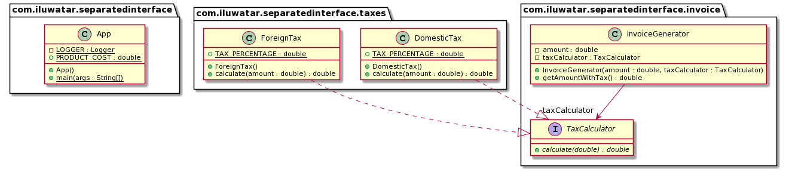

## Intent

Separate the interface definition and implementation in different packages. This allows the client 
to be completely unaware of the implementation.

## Explanation

Real world example

> An Invoice generator may be created with ability to use different Tax calculators that may be 
> added in the invoice depending upon type of purchase, region etc.         

In plain words

> Separated interface pattern encourages to keep the implementations of an interface decoupled from 
> the client and its definition, so the client is not dependent on the implementation.

A client code may abstract some specific functionality to an interface, and define the definition of 
the interface as an SPI ([Service Programming Interface](https://en.wikipedia.org/wiki/Service_provider_interface) 
is an API intended and open to be implemented or extended by a third party). Another package may 
implement this interface definition with a concrete logic, which will be injected into the client 
code at runtime (with a third class, injecting the implementation in the client) or at compile time 
(using Plugin pattern with some configurable file).

**Programmatic Example**

**Client** 

`InvoiceGenerator` class accepts the cost of the product and calculates the total 
amount payable inclusive of tax.

```java
public class InvoiceGenerator {

  private final TaxCalculator taxCalculator;

  private final double amount;

  public InvoiceGenerator(double amount, TaxCalculator taxCalculator) {
    this.amount = amount;
    this.taxCalculator = taxCalculator;
  }

  public double getAmountWithTax() {
    return amount + taxCalculator.calculate(amount);
  }

}
```

The tax calculation logic is delegated to the `TaxCalculator` interface.

```java
public interface TaxCalculator {

  double calculate(double amount);

}
```

**Implementation package**

In another package (which the client is completely unaware of) there exist multiple implementations 
of the `TaxCalculator` interface. `ForeignTaxCalculator` is one of them which levies 60% tax 
for international products.

```java
public class ForeignTaxCalculator implements TaxCalculator {

  public static final double TAX_PERCENTAGE = 60;

  @Override
  public double calculate(double amount) {
    return amount * TAX_PERCENTAGE / 100.0;
  }

}
```

Another is `DomesticTaxCalculator` which levies 20% tax for international products.

```java
public class DomesticTaxCalculator implements TaxCalculator {

  public static final double TAX_PERCENTAGE = 20;

  @Override
  public double calculate(double amount) {
    return amount * TAX_PERCENTAGE / 100.0;
  }

}
```

These both implementations are instantiated and injected in the client class by the ```App.java``` 
class.

```java
    var internationalProductInvoice = new InvoiceGenerator(PRODUCT_COST, new ForeignTaxCalculator());

    LOGGER.info("Foreign Tax applied: {}", "" + internationalProductInvoice.getAmountWithTax());

    var domesticProductInvoice = new InvoiceGenerator(PRODUCT_COST, new DomesticTaxCalculator());

    LOGGER.info("Domestic Tax applied: {}", "" + domesticProductInvoice.getAmountWithTax());
```

## Class diagram



## Applicability

Use the Separated interface pattern when

* You are developing a framework package, and your framework needs to call some application code through interfaces.
* You have separate packages implementing the functionalities which may be plugged in your client code at runtime or compile-time.
* Your code resides in a layer that is not allowed to call the interface implementation layer by rule. For example, a domain layer needs to call a data mapper.

## Tutorial 

* [Separated Interface Tutorial](https://www.youtube.com/watch?v=d3k-hOA7k2Y)

## Credits

* [Martin Fowler](https://www.martinfowler.com/eaaCatalog/separatedInterface.html)
* [Patterns of Enterprise Application Architecture](https://www.amazon.com/gp/product/0321127420/ref=as_li_qf_asin_il_tl?ie=UTF8&tag=javadesignpat-20&creative=9325&linkCode=as2&creativeASIN=0321127420&linkId=e08dfb7f2cf6153542ef1b5a00b10abc)
