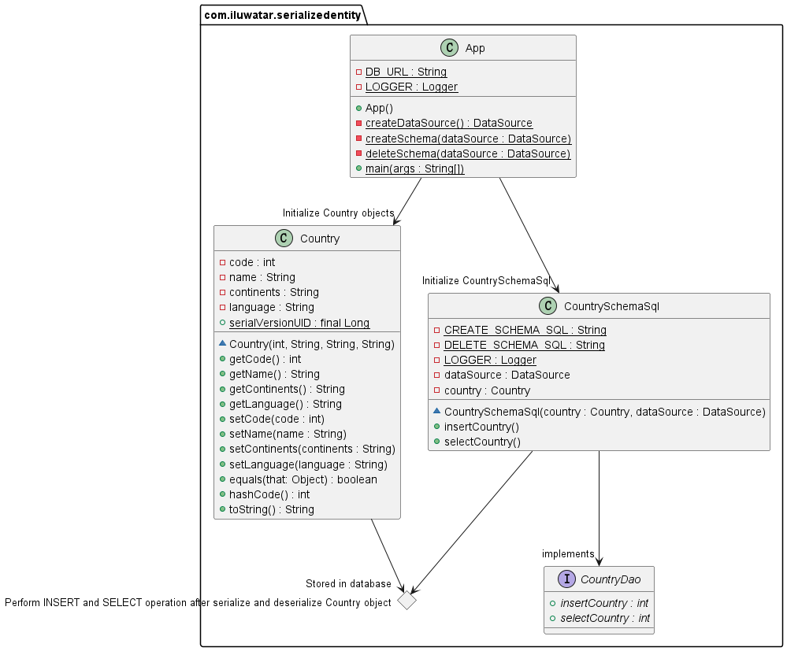

## Intent

To easily persist Java objects to the database.

## Explanation
Java serialization allow us to convert the object to a set of bytes. We can store these bytes into database as 
BLOB(binary long objects) and read them at any time and reconstruct them into Java objects.


**Programmatic Example**

Walking through our customers example, here's the basic `Customer` entity.

```java
@Getter
@Setter
@EqualsAndHashCode
@ToString
@AllArgsConstructor
public class Country implements Serializable {

    private int code;
    private String name;
    private String continents;
    private String language;
    public static final long serialVersionUID = 7149851;
    // Constructor ->
    // getters and setters -> 
}

```
Here is `CountrySchemaSql`, this class have method allow us to serialize `Country` object and insert it into the 
database, also have a method that read serialized data from the database and deserialize it to `Country` object. 

```java
@Slf4j
public class CountrySchemaSql {
  public static final String CREATE_SCHEMA_SQL = "CREATE TABLE IF NOT EXISTS WORLD (ID INT PRIMARY KEY, COUNTRY BLOB)";

  public static final String DELETE_SCHEMA_SQL = "DROP TABLE WORLD IF EXISTS";

  private Country country;
  private DataSource dataSource;

  /**
   * Public constructor.
   *
   * @param dataSource datasource
   * @param country country
   */
  public CountrySchemaSql(Country country, DataSource dataSource) {
    this.country = new Country(
            country.getCode(),
            country.getName(),
            country.getContinents(),
            country.getLanguage()
    );
    this.dataSource = dataSource;
  }

  /**
   * This method will serialize a Country object and store it to database.
   * @return int type, if successfully insert a serialized object to database then return country code, else return -1.
   * @throws IOException if any.
   */
  public int insertCountry() throws IOException {
    var sql = "INSERT INTO WORLD (ID, COUNTRY) VALUES (?, ?)";
    try (var connection = dataSource.getConnection();
         var preparedStatement = connection.prepareStatement(sql);
         ByteArrayOutputStream baos = new ByteArrayOutputStream();
         ObjectOutputStream oss = new ObjectOutputStream(baos)) {

      oss.writeObject(country);
      oss.flush();

      preparedStatement.setInt(1, country.getCode());
      preparedStatement.setBlob(2, new ByteArrayInputStream(baos.toByteArray()));
      preparedStatement.execute();
      return country.getCode();
    } catch (SQLException e) {
      LOGGER.info("Exception thrown " + e.getMessage());
    }
    return -1;
  }

  /**
   * This method will select a data item from database and deserialize it.
   * @return int type, if successfully select and deserialized object from database then return country code,
   *     else return -1.
   * @throws IOException if any.
   * @throws ClassNotFoundException if any.
   */
  public int selectCountry() throws IOException, ClassNotFoundException {
    var sql = "SELECT ID, COUNTRY FROM WORLD WHERE ID = ?";
    try (var connection = dataSource.getConnection();
         var preparedStatement = connection.prepareStatement(sql)) {

      preparedStatement.setInt(1, country.getCode());

      try (ResultSet rs = preparedStatement.executeQuery()) {
        if (rs.next()) {
          Blob countryBlob = rs.getBlob("country");
          ByteArrayInputStream baos = new ByteArrayInputStream(countryBlob.getBytes(1, (int) countryBlob.length()));
          ObjectInputStream ois = new ObjectInputStream(baos);
          country = (Country) ois.readObject();
          LOGGER.info("Country: " + country);
        }
        return rs.getInt("id");
      }
    } catch (SQLException e) {
      LOGGER.info("Exception thrown " + e.getMessage());
    }
    return -1;
  }

}
```

This `App.java` will first delete a World table from the h2 database(if there is one) and create a new table called 
`WORLD` to ensure we have a table we want. 
It will then create two `Country` objects called `China` and `UnitedArabEmirates`, then create two `CountrySchemaSql` 
objects and use objects `China` and  `UnitedArabEmirates` as arguments. 
Finally, call `SerializedChina.insertCountry()` and `serializedUnitedArabEmirates.insertCountry()` to serialize and 
store them to database, and call `SerializedChina.selectCountry()` and `serializedUnitedArabEmirates.selectCountry()`
methods to read and deserialize data items to `Country` objects.

```java
@Slf4j
public class App {
    private static final String DB_URL = "jdbc:h2:mem:testdb;DB_CLOSE_DELAY=-1";

    private App() {

    }

    /**
     * Program entry point.
     * @param args command line args.
     * @throws IOException if any
     * @throws ClassNotFoundException if any
     */
    public static void main(String[] args) throws IOException, ClassNotFoundException {
        final var dataSource = createDataSource();

        deleteSchema(dataSource);
        createSchema(dataSource);

        final var China = new Country(
                86,
                "China",
                "Asia",
                "Chinese"
        );

        final var UnitedArabEmirates = new Country(
                971,
                "United Arab Emirates",
                "Asia",
                "Arabic"
        );

        final var serializedChina = new CountrySchemaSql(China, dataSource);
        final var serializedUnitedArabEmirates = new CountrySchemaSql(UnitedArabEmirates, dataSource);
        serializedChina.insertCountry();
        serializedUnitedArabEmirates.insertCountry();

        serializedChina.selectCountry();
        serializedUnitedArabEmirates.selectCountry();
    }

    private static void deleteSchema(DataSource dataSource) {
        try (var connection = dataSource.getConnection();
             var statement = connection.createStatement()) {
            statement.execute(CountrySchemaSql.DELETE_SCHEMA_SQL);
        } catch (SQLException e) {
            LOGGER.info("Exception thrown " + e.getMessage());
        }
    }

    private static void createSchema(DataSource dataSource) {
        try (var connection = dataSource.getConnection();
             var statement = connection.createStatement()) {
            statement.execute(CountrySchemaSql.CREATE_SCHEMA_SQL);
        } catch (SQLException e) {
            LOGGER.info("Exception thrown " + e.getMessage());
        }
    }

    private static DataSource createDataSource() {
        var dataSource = new JdbcDataSource();
        dataSource.setURL(DB_URL);
        return dataSource;
    }
}
```

## Class diagram


## Applicability

Use the Serialized Entity pattern when

* You want to easily persist Java objects to the database.

## Related patterns
[Data Access Object](https://github.com/iluwatar/java-design-patterns/tree/master/dao)

## Credits

* [J2EE Design Patterns by William Crawford, Jonathan Kaplan](https://www.oreilly.com/library/view/j2ee-design-patterns/0596004273/re21.html)
* [komminen](https://github.com/komminen/java-design-patterns) (His attempts of serialized-entity inspired me and learned a lot from his code)
