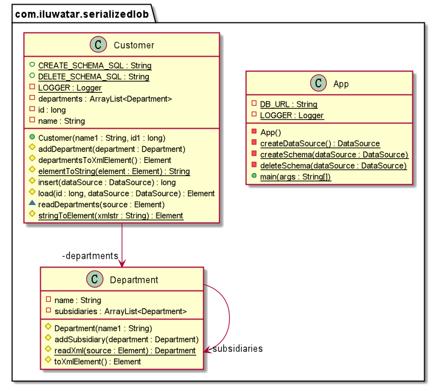

## Intent
Saves a graph of objects by serializing them into a single large object (LOB), which it stores in a database field.

## Explanation

In plain words

> Object models often contain complicated graphs of small objects. Much of the information in these structures is not the objects but the links between the objects. Consider storing the organization hierarchy for all your customers. An object model would quite naturally show the composition pattern to represent organizational hierarchies. You can easily add methods that allow you to get ancestors, siblings, descendents and other common relationships

## Class diagram

## Applicability

Serialized LOB works best when you can chop a piece of the object model out and represent the LOB. As such think of a LOB of a way to take a bunch of objects that aren't likely to be queried from any SQL route outside the application. This graph can then be hooked into the SQL schema.  

## Related patterns

- [memento](https://github.com/iluwatar/java-design-patterns/tree/master/memento)

## Credits

* [Serialized LOB](https://martinfowler.com/eaaCatalog/serializedLOB.html)
* [Patterns of Enterprise Application Architecture](https://www.amazon.com/gp/product/0321127420/ref=as_li_qf_asin_il_tl?ie=UTF8&tag=javadesignpat-20&creative=9325&linkCode=as2&creativeASIN=0321127420&linkId=18acc13ba60d66690009505577c45c04)