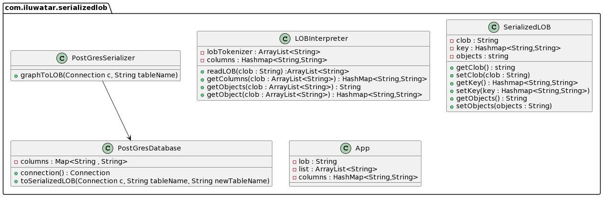

## Intent
Complicated graph of objects may have excessive information for links than actual objects themselves.
Serialized LOB removes those relationship and stores data in a single Large Object(LOB).

## Explanation
Saves a graph of objects by serializing them into a single large object (LOB), which it stores in a database field.

## Class diagram

## Credits
* [PostgreSQL - JAVA Interface](https://www.tutorialspoint.com/postgresql/postgresql_java.htm)
* [P of EAA Serialized LOB](https://martinfowler.com/eaaCatalog/serializedLOB.html)