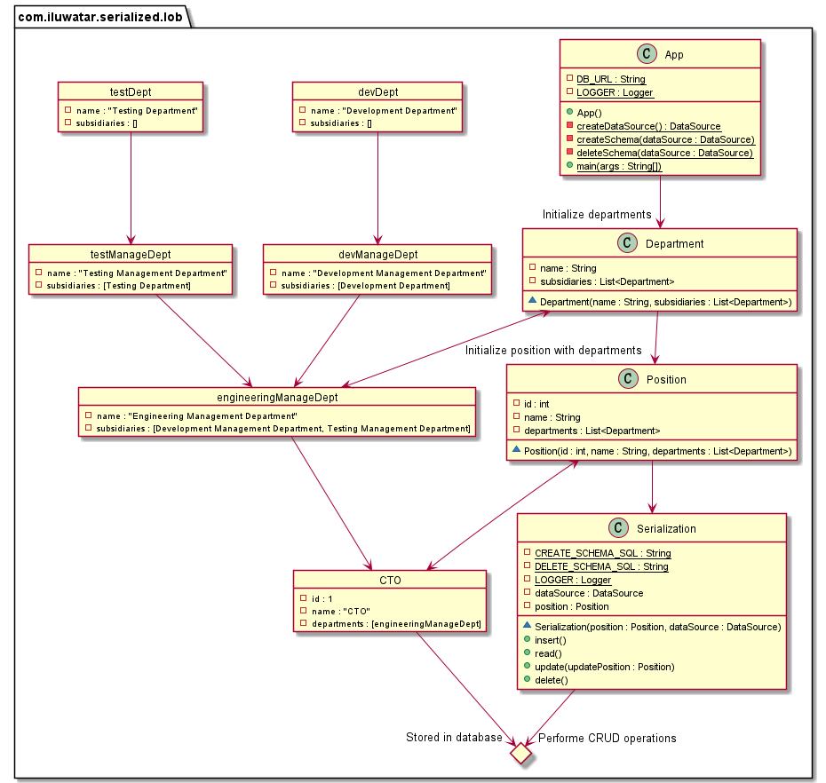

## Intent
Saves a graph of objects by serializing them into a single large object (LOB), which is then stored in a database field.

## Explanation
Objects might contain their relationships with other objects. This pattern allows the user to consolidate such relations 
represented by a graph into an object, which then could be stored in the database. Since all the database operations are 
based on unique identifiers (ID or GUID) and single large objects (SLOB), the complicated relations are fully captured 
and efficiently stored.


## Class Diagram


**Programmatic Example**
```java
@Setter
@Getter
@ToString
@EqualsAndHashCode
@AllArgsConstructor
public class Position implements Serializable {
    private int id;
    private String name;
    private List<Department> departments;
}
```

This pattern contains the data for a Position within an organization. It also captures the relations
of the Departments that the Position is associated to. The serialization works as the bridge between the 
object and database, and performance the basic database operations for the object.

The `Serialization` class:

```java
public class Serialization {
    private final DataSource dataSource;
    private final Position position;

    public Serialization(Position position, final DataSource dataSource) {
        this.position = position;
        this.dataSource = dataSource;
    }

    public void insert() throws SQLException, IOException {
        ...
    }

    public void read () throws SQLException, IOException, ClassNotFoundException {
        ...
    }

    public void update(Position updatePosition) throws SQLException, IOException {
        ...
    }

    public void delete() throws SQLException {
        ...
    }
}
```

## Related patterns
- [memento](https://github.com/iluwatar/java-design-patterns/tree/master/memento)

## Credits
* [Serialized LOB](https://martinfowler.com/eaaCatalog/serializedLOB.html)
* [A Different Implementation for the Same Pattern](https://github.com/iluwatar/java-design-patterns/pull/1765/files)
