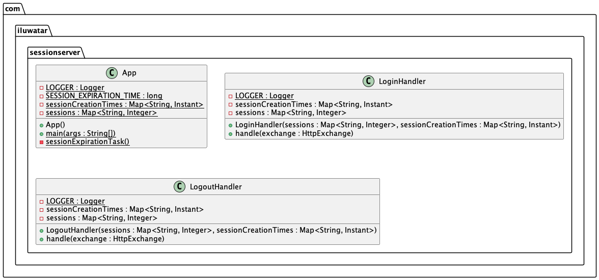

## Also known as

Server-side session state pattern

## Intent

Within the context of a client-server relationship, the server is responsible for storing session data in order to maintain state in an otherwise stateless environment.

## Explanation

Real-world example

> Consider a gaming website which stores user profile data such as username, password, high-score, hours played, etc. Since this website is accessed over the internet which uses the HTTP protocol, all requests sent to the server are stateless. In order for the page to display user relevant information without re-authenticating the user on every request a session must be created. Once the session is created the user can access the homescreen, statistics page, setting page, etc. and view profile specific data without needing to log in on every page request.

In plain words

> Session data is stored on the server, whether in a database, text file or any other form of persistent storage, rather than the client's browser.

Wikipedia says

> A session token is a unique identifier that is generated and sent from a server to a client to identify the current interaction session. The client usually stores and sends the token as an HTTP cookie and/or sends it as a parameter in GET or POST queries. The reason to use session tokens is that the client only has to handle the identifier—all session data is stored on the server (usually in a database, to which the client does not have direct access) linked to that identifier.

**Programmatic Example**

Consider a website in which a user can log in. Once logged in a session is created to maintain the specific user's data.

First, we have the LoginHandler class, which creates a session identifier and sends it to the client as cookie.
Notice that not all data is sent to the client, the session creation time and user number are stored on the server side and thus cannot be accessed by the client.

The user logs in by visiting localhost:8080/login

output:

Login successful!
Session ID: 26434a9c-e734-4a64-97ce-7802b8de46bb

```java
public class LoginHandler implements HttpHandler {

    private Map<String, Integer> sessions;
    private Map<String, Instant> sessionCreationTimes;

    public LoginHandler(Map<String, Integer> sessions, Map<String, Instant> sessionCreationTimes) {
        this.sessions = sessions;
        this.sessionCreationTimes = sessionCreationTimes;
    }

    @Override
    public void handle(HttpExchange exchange) {
        // Generate session ID
        String sessionID = UUID.randomUUID().toString();

        // Store session data (simulated)
        int newUser = sessions.size() + 1;
        sessions.put(sessionID, newUser);
        sessionCreationTimes.put(sessionID, Instant.now());
        LOGGER.info("User " + newUser + " created at time " + sessionCreationTimes.get(sessionID));

        // Set session ID as cookie
        exchange.getResponseHeaders().add("Set-Cookie", "sessionID=" + sessionID);

        // Send response
        String response = "Login successful!\n" +
                "Session ID: " + sessionID;
        try {
            exchange.sendResponseHeaders(200, response.length());
        } catch (IOException e) {
            LOGGER.error("An error occurred: ", e);
        }
        try(OutputStream os = exchange.getResponseBody()) {
            os.write(response.getBytes());
        } catch(IOException e) {
            LOGGER.error("An error occurred: ", e);
        }
    }
}
```

When the user logs out the session data is removed from storage using the LogoutHandler class.

The user logs out by visiting localhost:8080/logout

output:

Logout successful!
Session ID: 26434a9c-e734-4a64-97ce-7802b8de46bb

```java
public class LogoutHandler implements HttpHandler {

    private Map<String, Integer> sessions;
    private Map<String, Instant> sessionCreationTimes;

    public LogoutHandler(Map<String, Integer> sessions, Map<String, Instant> sessionCreationTimes) {
        this.sessions = sessions;
        this.sessionCreationTimes = sessionCreationTimes;
    }

    @Override
    public void handle(HttpExchange exchange) {
        // Get session ID from cookie
        String sessionID = exchange.getRequestHeaders().getFirst("Cookie").replace("sessionID=", "");
        String currentSessionID = sessions.get(sessionID) == null ? null : sessionID;

        // Send response

        String response = "";
        if(currentSessionID == null) {
            response += "Session has already expired!";
        } else {
            response = "Logout successful!\n" +
                    "Session ID: " + currentSessionID;
        }

        //Remove session
        if(currentSessionID != null)
            LOGGER.info("User " + sessions.get(currentSessionID) + " deleted!");
        else
            LOGGER.info("User already deleted!");
        sessions.remove(sessionID);
        sessionCreationTimes.remove(sessionID);

        try {
            exchange.sendResponseHeaders(200, response.length());
        } catch(IOException e) {
            LOGGER.error("An error has occurred: ", e);
        }

        try(OutputStream os = exchange.getResponseBody()) {
            os.write(response.getBytes());
        } catch(IOException e) {
            LOGGER.error("An error has occurred: ", e);
        }
    }
}
```

Sessions are often given a maximum time in which they will be maintained. The sessionExpirationTask() creates a thread which runs every 1 minute to check for sessions that have exceeded the maximum amount of time, in this case 1 minute and removes the session data from the server's storage.

```java
    private static void sessionExpirationTask() {
    new Thread(() -> {
        while (true) {
            try {
                LOGGER.info("Session expiration checker started...");
                Thread.sleep(SESSION_EXPIRATION_TIME); // Sleep for expiration time
                Instant currentTime = Instant.now();
                synchronized (sessions) {
                    synchronized (sessionCreationTimes) {
                        Iterator<Map.Entry<String, Instant>> iterator = sessionCreationTimes.entrySet().iterator();
                        while (iterator.hasNext()) {
                            Map.Entry<String, Instant> entry = iterator.next();
                            if (entry.getValue().plusMillis(SESSION_EXPIRATION_TIME).isBefore(currentTime)) {
                                sessions.remove(entry.getKey());
                                iterator.remove();
                            }
                        }
                    }
                }
                LOGGER.info("Session expiration checker finished!");
            } catch (InterruptedException e) {
                LOGGER.error("An error occurred: ", e);
                Thread.currentThread().interrupt();
            }
        }
    }).start();
}
```

## Class diagram



## Applicability

Use the Adapter pattern when

* When a user logs into a website or web application, and you want to keep track of their authentication status.
* In e-commerce websites when you want to maintain the contents of a user's shopping cart across different pages and visits.
* When you want to store user preferences and settings, such as language preferences, theme choices, or any other customizable options. 
* When you want to keep track of user activity and behavior on a website for the sake of analytics purposes.

## Tutorials

* [Web Dev Simplified](https://www.youtube.com/watch?v=GihQAC1I39Q&pp=ygUMaHR0cCBzZXNzaW9u)
* [Hackersploit](https://www.youtube.com/watch?v=zHBpJA5XfDk)

## Consequences

Pros

* HTTP sessions are typically not implemented using one thread per session, but by means of a database with information about the state of each session. The advantage with multiple processes or threads is relaxed complexity of the software, since each thread is an instance with its own history and encapsulated variables.
* Server-side session management is generally more secure than client-side alternatives like storing session data in cookies.
* Server-side session management can scale more easily, especially when using distributed caching systems or databases.

Cons

* Large overhead in terms of system resources, and that the session may be interrupted if the system is restarted.
* Can become difficult to handle in conjunction with load-balancing/high-availability systems and are not usable at all in some embedded systems with no storage.
* If the server hosting the session data goes down or experiences issues, it can disrupt the entire application's functionality, potentially leading to session data loss and user inconvenience.

## Real-world examples

* Express.js Session Middleware
* Spring Session in Spring Boot
* Django Session Framework
* Java Servlet Session Management

## Credits

* [Session(Computer Science)](https://en.wikipedia.org/wiki/Session_(computer_science)