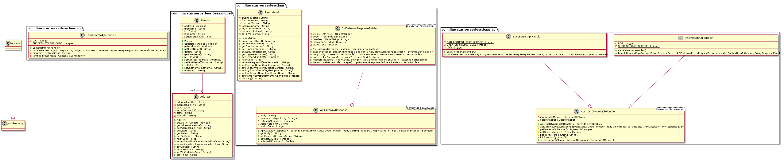

## Serverless

Serverless eliminates the need to plan for infrastructure and let's you focus on your 
application. 

Following are optimization katas you should be aware of while building a serverless 
applications

* The Lean function
    * Concise logic - Use functions to transform, not transport (utilize some of the 
    integration available from the provider to transport), and make sure you read only
     what you need
    * Efficient/single purpose code - avoid conditional/routing logic and break down 
    into individual functions, avoid "fat"/monolithic functions and control the 
    dependencies in the function deployment package to reduce the load time for your 
    function
    * ephemeral environment - Utilize container start for expensive initializations
* Eventful Invocations
    * Succinct payloads - Scrutinize the event as much as possible, and watch for 
    payload constraints (async - 128K)
    * resilient routing - Understand retry policies and leverage dead letter queues 
    (SQS or SNS for replays) and remember retries count as invocations
    * concurrent execution - lambda thinks of it's scale in terms of concurrency and 
    its not request based/duration based. Lambda will spin up the number of instances 
    based on the request. 
* Coordinated calls
    * Decoupled via APIs - best practice to setup your application is to have API's as
     contracts that ensures separation of concerns
    * scale-matched downstream - make sure when Lambda is calling downstream 
    components, you are matching scale configuration to it (by specifying max 
    concurrency based on downstream services)
    * secured - Always ask a question, do I need a VPC?
* Serviceful operations
    * Automated - use automated tools to manage and maintain the stack 
    * monitored applications - use monitoring services to get holistic view of your 
    serverless applications

## Intent

Whether to reduce your infrastructure costs, shrink the time you spend on ops tasks, 
simplify your deployment processes, reach infinite scalability, serverless cuts time 
to market in half.
 
## Explanation

Serverless computing is a cloud computing execution model in which the cloud provider 
dynamically manages the allocation of machine resources. Pricing is based on the 
actual amount of resources consumed by an application, rather than on pre-purchased 
units of capacity. 

## Class diagram


## Serverless framework

[Serverless](https://serverless.com/) is a toolkit for deploying and operating serverless architectures. 

## (Function as a Service or "FaaS")

The term ‘Serverless’ is confusing since with such applications there are both server 
hardware and server processes running somewhere, but the difference to normal 
approaches is that the organization building and supporting a ‘Serverless’ application
 is not looking after the hardware or the processes - they are outsourcing this to a vendor.

Some of the Serverless Cloud Providers are 


...

Anything that triggers an Lambda Function to execute is regarded by the Framework as 
an Event. Most of the Serverless Cloud Providers support following Events
- Http
- PubSub Events
- scheduled

AWS supports processing event generated from AWS Services (S3/Cloudwatch/etc) and 
using aws as a compute engine is our first choice.

## (Backend as a Service or "BaaS")
This example creates a backend for ‘persons’ collection which uses DynamoDB NoSQL 
database service also provided by Amazon. 

## AWS lambda function implementation

[AWS Lambda SDK](https://aws.amazon.com/sdk-for-java/) provides pre-defined interface 
`com.amazonaws.services.lambda.runtime
.RequestHandler` to implement our lambda function. 

```java
public class LambdaInfoApiHandler implements RequestHandler<Map<String, Object>, ApiGatewayResponse> {

  private static final Logger LOG = Logger.getLogger(LambdaInfoApiHandler.class);
  private static final Integer SUCCESS_STATUS_CODE = 200;


  @Override
  public ApiGatewayResponse handleRequest(Map<String, Object> input, Context context) {
    
  }
}
```
handleRequest method is where the function code is implemented. Context provides 
useful information about Lambda execution environment. AWS Lambda function needs a 
deployment package. This package is either a .zip or .jar file that contains all the 
dependencies of the function.

`serverless.yml` contains configuration to manage deployments for your functions.

## Run example in local

# Pre-requisites

* Node.js v6.5.0 or later.
* Serverless CLI v1.9.0 or later. You can run npm install -g serverless to install it.
* An AWS account. If you don't already have one, you can sign up for a free trial that includes 1 million free Lambda requests per month.
* [Set-up](https://serverless.com/framework/docs/providers/aws/guide/credentials/) your Provider Credentials. Watch the video on setting up credentials

# build and deploy

* `cd serverless`
* `mvn clean package`
* `serverless deploy --stage=dev --verbose`

Based on the configuration in `serverless.yml` serverless framework creates following 
resources

* CloudFormation stack for S3 (ServerlessDeploymentBucket)
* IAM Role (IamRoleLambdaExecution)
* CloudWatch (log groups)
* API Gateway (ApiGatewayRestApi) 
* Lambda function
* DynamoDB collection

The command will print out Stack Outputs which looks something like this

```yaml
endpoints:
  GET - https://xxxxxxxxx.execute-api.us-east-1.amazonaws.com/dev/info
  POST - https://xxxxxxxxx.execute-api.us-east-1.amazonaws.com/dev/api/person
  GET - https://xxxxxxxxx.execute-api.us-east-1.amazonaws.com/dev/api/person/{id}
  
```

```yaml
CurrentTimeLambdaFunctionQualifiedArn: arn:aws:lambda:us-east-1:xxxxxxxxxxx:function:lambda-info-http-endpoint-dev-currentTime:4
ServiceEndpoint: https://xxxxxxxxx.execute-api.us-east-1.amazonaws.com/dev
ServerlessDeploymentBucketName: lambda-info-http-endpoin-serverlessdeploymentbuck-2u8uz2i7cap2
```
access the endpoint to invoke the function.

Use the following cURL commands to test the endpoints

```cURL
curl -X GET \
  https://xxxxxxxxx.execute-api.us-east-1.amazonaws.com/dev/info \
  -H 'cache-control: no-cache'
```

```cURL
curl -X POST \
  https://xxxxxxxxx.execute-api.us-east-1.amazonaws.com/dev/api/person \
  -H 'cache-control: no-cache' \
  -H 'content-type: application/json' \
  -d '{
	"firstName": "Thor",
	"lastName": "Odinson",
	"address": {
		"addressLineOne": "1 Odin ln",
		"addressLineTwo": "100",
		"city": "Asgard",
		"state": "country of the Gods",
		"zipCode": "00001"
	}
}'
```

```cURL
curl -X GET \
  https://xxxxxxxxx.execute-api.us-east-1.amazonaws.com/dev/api/person/{id} \
  -H 'cache-control: no-cache'
```

## Credits

* [serverless docs](https://serverless.com/framework/docs/)
* [Serverless Architectures](https://martinfowler.com/articles/serverless.html)
* [Serverless Black Belt](https://youtu.be/oQFORsso2go)
