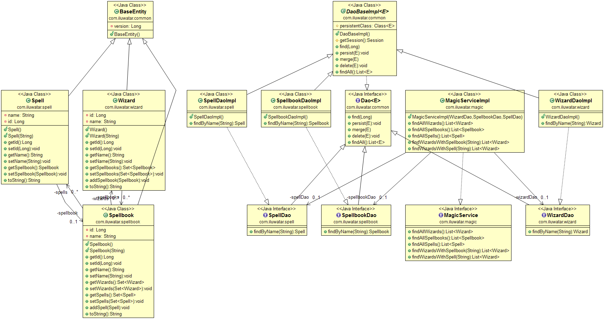

## Intent
Service Layer is an abstraction over domain logic. Typically
applications require multiple kinds of interfaces to the data they store and
logic they implement: data loaders, user interfaces, integration gateways, and
others. Despite their different purposes, these interfaces often need common
interactions with the application to access and manipulate its data and invoke
its business logic. The Service Layer fulfills this role.

## Class diagram

## Applicability
Use the Service Layer pattern when

* You want to encapsulate domain logic under API
* You need to implement multiple interfaces with common logic and data

## Credits

* [Martin Fowler - Service Layer](http://martinfowler.com/eaaCatalog/serviceLayer.html)
* [Patterns of Enterprise Application Architecture](http://www.amazon.com/Patterns-Enterprise-Application-Architecture-Martin/dp/0321127420)
