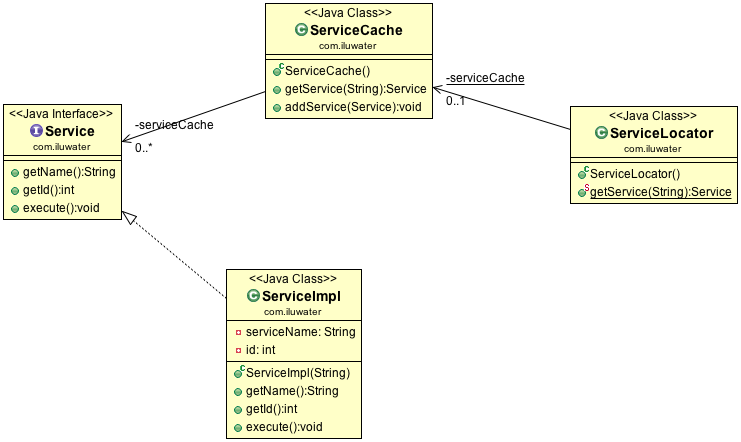

## Intent
Encapsulate the processes involved in obtaining a service with a
strong abstraction layer.

## Class diagram

## Applicability
The service locator pattern is applicable whenever we want
to locate/fetch various services using JNDI which, typically, is a redundant
and expensive lookup. The service Locator pattern addresses this expensive
lookup by making use of caching techniques ie. for the very first time a
particular service is requested, the service Locator looks up in JNDI, fetched
the relevant service and then finally caches this service object. Now, further
lookups of the same service via Service Locator is done in its cache which
improves the performance of application to great extent.

## Typical Use Case

* When network hits are expensive and time consuming
* Lookups of services are done quite frequently
* Large number of services are being used

## Consequences

* Violates Interface Segregation Principle (ISP) by providing pattern consumers with an access 
to a number of services that they don't potentially need.
* Creates hidden dependencies that can break the clients at runtime.

## Credits

* [J2EE Design Patterns](http://www.amazon.com/J2EE-Design-Patterns-William-Crawford/dp/0596004273/ref=sr_1_2)
