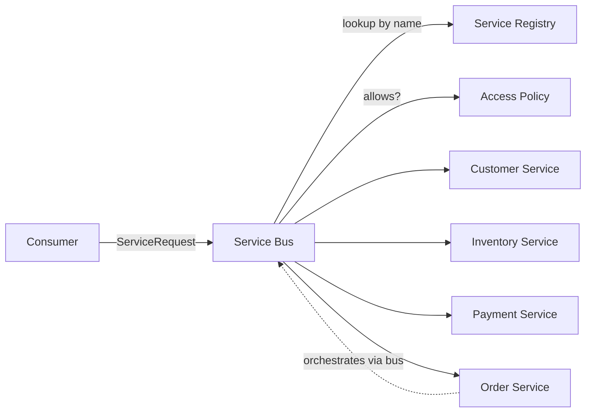
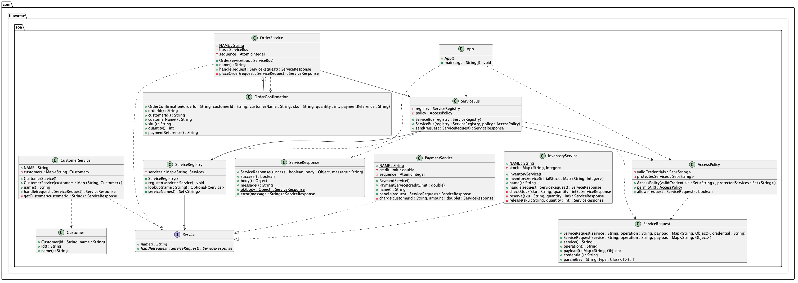

## Also known as

* SOA

## Intent of Service-Oriented Architecture Design Pattern

Structure an application as a collection of loosely coupled, reusable services that expose coarse-grained contracts and communicate through a shared bus, so that business capabilities can be discovered, composed and replaced independently of each other.

## Detailed Explanation of Service-Oriented Architecture Pattern with Real-World Examples

Real-world example

> A bank runs separate departments for customer records, accounts and payments. A branch employee who opens a savings account does not walk to each department; the request goes to a central desk that knows which department handles what, forwards the paperwork, and collects the answers. Each department can change its internal procedures, or be relocated, without the branch employees noticing.

In plain words

> Business capabilities are packaged as independent services with published contracts, and consumers reach them through a common bus instead of calling implementations directly.

Wikipedia says

> Service-oriented architecture (SOA) is an architectural style that focuses on discrete services instead of a monolithic design. By consequence, it is also applied in the field of software design where services are provided to the other components by application components, through a communication protocol over a network. A service is a discrete unit of functionality that can be accessed remotely and acted upon and updated independently, such as retrieving a credit card statement online.

Architecture diagram



Because no service keeps per-conversation session state, each one can be scaled independently; the state a service does own is shared between all its callers and guarded for concurrent access. In the example the in-memory maps stand in for each service's own datastore, and the bus stands in for the network protocol (SOAP, REST or messaging) that would carry the messages in a deployed system.



## Programmatic Example of Service-Oriented Architecture Pattern in Java

The example builds a small order management system out of four services. It uses no framework so that the architectural roles stay visible.

Every provider implements the same contract. The only things a consumer knows about a service are its name and the message formats.

```java
public interface Service {
  String name();
  ServiceResponse handle(ServiceRequest request);
}
```

Messages are coarse-grained and self-describing. The request payload is plain data, which is what makes the contract interoperable: the same request could travel as SOAP, JSON or any other wire format. Responses in this demo carry typed Java objects for brevity; a deployed system would describe them as plain data too.

```java
public record ServiceRequest(
    String service, String operation, Map<String, Object> payload, String credential) {
  public ServiceRequest(String service, String operation, Map<String, Object> payload) {
    this(service, operation, payload, null); // anonymous caller
  }
  public <T> T param(String key, Class<T> type) { ... }
}

public record ServiceResponse(boolean success, Object body, String message) {
  public static ServiceResponse ok(Object body) { ... }
  public static ServiceResponse error(String message) { ... }
}
```

The registry provides discovery. Services publish themselves under a name and are located at runtime, so no consumer is wired to a concrete class.

```java
@Slf4j
public class ServiceRegistry {
  private final Map<String, Service> services = new ConcurrentHashMap<>();

  public void register(Service service) {
    var previous = services.putIfAbsent(service.name(), service);
    if (previous != null) {
      throw new IllegalStateException("Service already registered: " + service.name());
    }
    LOGGER.info("Registered service '{}' ({})", service.name(), service.getClass().getSimpleName());
  }

  public Optional<Service> lookup(String name) {
    return Optional.ofNullable(services.get(name));
  }
}
```

The bus is the communication backbone. It applies cross-cutting concerns in a single place (access control, tracing, timing), resolves the target through the registry and turns provider failures into error responses so that consumers never see provider exceptions. The access check runs before the lookup, so a caller that may not reach a service learns nothing about what the registry holds.

```java
@Slf4j
public class ServiceBus {
  private final ServiceRegistry registry;
  private final AccessPolicy policy;

  public ServiceBus(ServiceRegistry registry, AccessPolicy policy) { ... }

  public ServiceResponse send(ServiceRequest request) {
    if (!policy.allows(request)) {
      LOGGER.warn("Access denied to {}.{} for {} caller", request.service(), request.operation(),
          request.credential() == null ? "anonymous" : "credentialed");
      return ServiceResponse.error("Access denied to " + request.service());
    }
    var service = registry.lookup(request.service());
    if (service.isEmpty()) {
      return ServiceResponse.error("No such service: " + request.service());
    }
    LOGGER.info("-> {}.{} payload={}", request.service(), request.operation(), request.payload());
    var start = System.nanoTime();
    try {
      var response = service.get().handle(request);
      LOGGER.info("<- {}.{} success={} in {} ms", request.service(), request.operation(),
          response.success(), TimeUnit.NANOSECONDS.toMillis(System.nanoTime() - start));
      return response;
    } catch (RuntimeException e) {
      return ServiceResponse.error("Service " + request.service() + " failed: " + e.getMessage());
    }
  }
}
```

Securing services on the bus. Security is another cross-cutting concern, so it lives in the bus rather than in the services. An `AccessPolicy` names the protected services and the credentials that unlock them; a request for a protected service without a valid credential is denied before it reaches the provider, and the provider never has to know.

```java
public class AccessPolicy {
  private final Set<String> validCredentials;
  private final Set<String> protectedServices;

  public boolean allows(ServiceRequest request) {
    if (!protectedServices.contains(request.service())) {
      return true;
    }
    return request.credential() != null && validCredentials.contains(request.credential());
  }
}

var policy = new AccessPolicy(Set.of("checkout-service-key"), Set.of("payment"));
var bus = new ServiceBus(registry, policy);

// anonymous call to the protected payment service
var denied = bus.send(new ServiceRequest("payment", "charge",
    Map.of("customerId", "C-1", "amount", 10.0)));
// denied = ServiceResponse[success=false, body=null, message=Access denied to payment]
```

Each enterprise service owns exactly one business capability and keeps no per-conversation session state; the state it does own is private to it and guarded for concurrent access. Operations are dispatched with a switch expression on the operation name.

```java
public class CustomerService implements Service {
  public static final String NAME = "customer";
  private final Map<String, Customer> customers;

  @Override
  public ServiceResponse handle(ServiceRequest request) {
    return switch (request.operation()) {
      case "getCustomer" -> getCustomer(request.param("customerId", String.class));
      default -> ServiceResponse.error("Unknown operation: " + request.operation());
    };
  }
}
```

`InventoryService` answers `checkStock`, `reserve` and `release`, and `PaymentService` answers `charge` in the same style. Both reject a non-positive quantity or amount, because a service validates its own input rather than trusting its callers.

The composite `OrderService` is where SOA shows its strength. It implements the same contract as the others, but delivers a higher level capability by orchestrating the lower level services through the bus. It depends only on service names and message contracts, never on the provider classes, and it forwards the caller's credential so the bus can authorise every downstream call.

No transaction spans the services, so the order service compensates instead: it reserves the stock before it charges the customer, and releases the reservation again when the charge fails. Doing it the other way round would leave a customer charged for an order that was never reserved.

```java
@RequiredArgsConstructor
public class OrderService implements Service {
  public static final String NAME = "order";
  private static final String CUSTOMER_SERVICE = "customer";
  private static final String INVENTORY_SERVICE = "inventory";
  private static final String PAYMENT_SERVICE = "payment";
  private final ServiceBus bus;

  private ServiceResponse placeOrder(ServiceRequest request) {
    var credential = request.credential();
    var customer = bus.send(new ServiceRequest(CUSTOMER_SERVICE, "getCustomer",
        Map.of("customerId", customerId), credential));
    if (!customer.success()) {
      return ServiceResponse.error("Order rejected: " + customer.message());
    }
    var stock = bus.send(new ServiceRequest(INVENTORY_SERVICE, "checkStock",
        Map.of("sku", sku, "quantity", quantity), credential));
    if (!stock.success()) {
      return ServiceResponse.error("Order rejected: " + stock.message());
    }
    if (!Boolean.TRUE.equals(stock.body())) {
      return ServiceResponse.error("Order rejected: insufficient stock for " + sku);
    }
    var reservation = bus.send(new ServiceRequest(INVENTORY_SERVICE, "reserve",
        Map.of("sku", sku, "quantity", quantity), credential));
    if (!reservation.success()) {
      return ServiceResponse.error("Order rejected: " + reservation.message());
    }
    var payment = bus.send(new ServiceRequest(PAYMENT_SERVICE, "charge",
        Map.of("customerId", customerId, "amount", amount), credential));
    if (!payment.success()) {
      bus.send(new ServiceRequest(INVENTORY_SERVICE, "release", // compensate the reservation
          Map.of("sku", sku, "quantity", quantity), credential));
      return ServiceResponse.error("Order rejected: " + payment.message());
    }
    return ServiceResponse.ok(new OrderConfirmation(...));
  }
}
```

The application wires everything together behind a bus that protects the payment service and sends four requests: an order with a valid credential that succeeds, an order that fails because of stock, a request for a service nobody registered, and an anonymous order that the bus stops at the payment step, after which the order service releases the stock it had already reserved.

```java
var registry = new ServiceRegistry();
var policy = new AccessPolicy(Set.of("checkout-service-key"), Set.of(PaymentService.NAME));
var bus = new ServiceBus(registry, policy);
registry.register(new CustomerService());
registry.register(new InventoryService());
registry.register(new PaymentService());
registry.register(new OrderService(bus));

var accepted = bus.send(new ServiceRequest(OrderService.NAME, "placeOrder",
    Map.of("customerId", "C-1", "sku", "LAPTOP", "quantity", 2, "amount", 899.0),
    "checkout-service-key"));
var rejected = bus.send(new ServiceRequest(OrderService.NAME, "placeOrder",
    Map.of("customerId", "C-2", "sku", "PHONE", "quantity", 50, "amount", 499.0),
    "checkout-service-key"));
var unknown = bus.send(new ServiceRequest("shipping", "ship", Map.of("orderId", "ORD-1")));
var denied = bus.send(new ServiceRequest(OrderService.NAME, "placeOrder",
    Map.of("customerId", "C-1", "sku", "LAPTOP", "quantity", 1, "amount", 899.0)));
```

Running the program produces output similar to this:

```
Bootstrapping the service registry and the service bus
Registered service 'customer' (CustomerService)
Registered service 'inventory' (InventoryService)
Registered service 'payment' (PaymentService)
Registered service 'order' (OrderService)
Available services: [customer, order, inventory, payment]
Placing an order with a valid credential, it should succeed
-> order.placeOrder payload={amount=899.0, customerId=C-1, quantity=2, sku=LAPTOP}
-> customer.getCustomer payload={customerId=C-1}
<- customer.getCustomer success=true in 0 ms
-> inventory.checkStock payload={sku=LAPTOP, quantity=2}
<- inventory.checkStock success=true in 0 ms
-> inventory.reserve payload={sku=LAPTOP, quantity=2}
<- inventory.reserve success=true in 0 ms
-> payment.charge payload={amount=899.0, customerId=C-1}
<- payment.charge success=true in 0 ms
<- order.placeOrder success=true in 1 ms
Order outcome: ServiceResponse[success=true, body=OrderConfirmation[orderId=ORD-1, customerId=C-1, customerName=Alice Smith, sku=LAPTOP, quantity=2, paymentReference=PAY-1], message=]
Placing an order that should be rejected because of stock
-> order.placeOrder payload={amount=499.0, customerId=C-2, quantity=50, sku=PHONE}
-> customer.getCustomer payload={customerId=C-2}
<- customer.getCustomer success=true in 0 ms
-> inventory.checkStock payload={sku=PHONE, quantity=50}
<- inventory.checkStock success=true in 0 ms
<- order.placeOrder success=false in 0 ms
Order outcome: ServiceResponse[success=false, body=null, message=Order rejected: insufficient stock for PHONE]
Addressing a service that is not registered
No service registered under 'shipping'
Bus outcome: ServiceResponse[success=false, body=null, message=No such service: shipping]
Placing an order anonymously, the bus should deny access to payment
-> order.placeOrder payload={amount=899.0, customerId=C-1, quantity=1, sku=LAPTOP}
-> customer.getCustomer payload={customerId=C-1}
<- customer.getCustomer success=true in 0 ms
-> inventory.checkStock payload={sku=LAPTOP, quantity=1}
<- inventory.checkStock success=true in 0 ms
-> inventory.reserve payload={sku=LAPTOP, quantity=1}
<- inventory.reserve success=true in 0 ms
Access denied to payment.charge for anonymous caller
-> inventory.release payload={sku=LAPTOP, quantity=1}
<- inventory.release success=true in 0 ms
<- order.placeOrder success=false in 0 ms
Order outcome: ServiceResponse[success=false, body=null, message=Order rejected: Access denied to payment]
```

## When to Use the Service-Oriented Architecture Pattern in Java

* Several applications or departments need to share the same business capabilities, such as customer, billing or inventory functions.
* Systems built on different technologies must interoperate through standard, contract-first interfaces.
* Business processes are composed from existing capabilities and the composition changes more often than the capabilities themselves.
* Cross-cutting concerns such as logging, security, auditing or routing should be applied centrally rather than in every consumer.
* Providers must be replaceable or relocatable without redeploying their consumers.

## Real-World Applications of Service-Oriented Architecture Pattern in Java

* Enterprise service buses such as Mule ESB, Apache ServiceMix and Apache Camel that route, transform and monitor messages between services.
* SOAP web services described with WSDL and discovered through UDDI registries, the classic SOA technology stack.
* Core banking, insurance and telecom platforms that expose account, policy and billing capabilities to many channel applications.
* Java EE and Jakarta EE application servers, where JAX-WS and JAX-RS endpoints publish enterprise services.

## Benefits and Trade-offs of Service-Oriented Architecture Pattern

Benefits:

* Loose coupling: consumers depend on contracts and a bus, not on implementations.
* Reusability: one service serves many consumers and many composite processes.
* Interoperability: coarse-grained, data-only messages cross language and platform boundaries.
* Central governance: discovery, routing, monitoring and security policy enforcement live in one place, so services stay free of infrastructure code.
* Independent evolution: a service can be upgraded, scaled or moved on its own.

Trade-offs:

* The bus and the registry are shared infrastructure that must be highly available and can become a bottleneck.
* Contract-first design adds up-front effort and message overhead compared to in-process calls.
* Coarse-grained services and centralized orchestration make individual services larger and slower to change than fine-grained microservices.
* Distributed error handling, versioning and transaction management become explicit concerns.

## Related Java Design Patterns

* [Microservices API Gateway](../microservices-api-gateway): a single entry point for clients; SOA differs in that its services share a common bus and are coarse-grained enterprise services, whereas microservices are fine-grained and independently deployable with no shared middleware.
* [Microservices Aggregator](../microservices-aggregrator): composes responses from several services, similar to the composite order service here.
* [Service Locator](../service-locator): the registry in this example plays the same discovery role.
* [Service Layer](../service-layer): defines an application's boundary with coarse-grained operations, the same granularity SOA services expose.
* [Business Delegate](../business-delegate): hides remote service lookup and invocation from presentation code, much like the service bus hides providers from consumers.
* [Hexagonal Architecture](../hexagonal-architecture): keeps the domain independent of its adapters; each SOA service can be structured this way internally.

## References and Credits

* [SOA: Principles of Service Design](https://amzn.to/3P3aHFf) by Thomas Erl
* [Service-Oriented Architecture: Analysis and Design for Services and Microservices](https://amzn.to/3RW1Z0k) by Thomas Erl
* [Service-oriented architecture (Wikipedia)](https://en.wikipedia.org/wiki/Service-oriented_architecture)
* [Pattern: Monolithic Architecture and Microservices (microservices.io)](https://microservices.io/patterns/index.html)
* [Enterprise Service Bus (Wikipedia)](https://en.wikipedia.org/wiki/Enterprise_service_bus)
