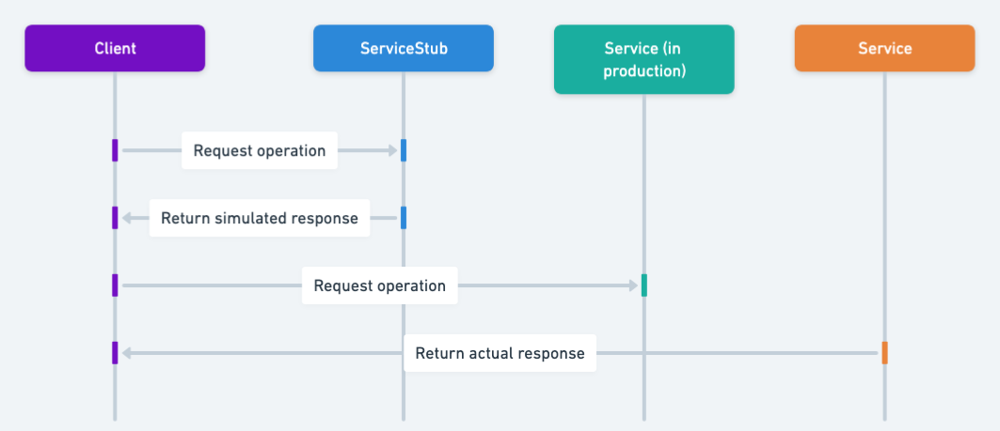

## Also known as

* Service Mock
* Test Double

## Intent of Service Stub Pattern

Provide a lightweight, simplified implementation of a remote or external service to facilitate testing in isolation.

## Detailed Explanation of Service Stub Pattern with Real-World Example

Real-world example

> A real-world analogy for the Service Stub pattern could be a flight simulator used to train pilots. Instead of learning to fly directly using a real airplane—which would be costly, dangerous, and often impractical—pilots initially practice within a simulator. This simulator provides predefined, realistic scenarios and reactions, enabling pilots to train safely, repeatedly, and predictably without the complexities and risks associated with actual flight operations. Similarly, a Service Stub provides controlled, predictable responses for external services during testing, simplifying and accelerating software development and testing processes.

In plain words

> Use a fake service to return predictable results without relying on external systems.

Wikipedia says

> A test stub is a dummy component used during testing to isolate behavior.

Sequence diagram



## Programmatic Example of Service Stub Pattern in Java

We demonstrate the Service Stub pattern using a simple sentiment analysis example. To illustrate this clearly, we define a common interface `SentimentAnalysisServer` and create two separate implementations:

**RealSentimentAnalysisServer**: Represents a slow, realistic sentiment analysis service, returning random sentiment results to simulate external complexity and latency.

**StubSentimentAnalysisServer**: Provides fast, deterministic results based on simple keyword matching, suitable for isolated testing without external dependencies.

### Step-by-step Example Implementation

First, define a common interface that both implementations will use:

```java
public interface SentimentAnalysisServer {
    String analyzeSentiment(String text);
}
```

Next, we create a realistic implementation that simulates a slow, external service. It introduces a delay of 5 seconds and returns random sentiment results (`Positive`, `Negative`, or `Neutral`). For flexibility and easier testing, it allows injecting a custom sentiment supplier:

```java
public class RealSentimentAnalysisServer implements SentimentAnalysisServer {
    
    private final Supplier<Integer> sentimentSupplier;

    public RealSentimentAnalysisServer(Supplier<Integer> sentimentSupplier) {
        this.sentimentSupplier = sentimentSupplier;
    }

    public RealSentimentAnalysisServer() {
        this(() -> new Random().nextInt(3));
    }

    @Override
    public String analyzeSentiment(String text) {
        int sentiment = sentimentSupplier.get();
        try {
            Thread.sleep(5000);
        } catch (InterruptedException e) {
            Thread.currentThread().interrupt();
        }
        return sentiment == 0 ? "Positive" : sentiment == 1 ? "Negative" : "Neutral";
    }
}
```

Then, we provide a simplified stub implementation designed specifically for testing purposes. It returns immediate and predictable results based on simple keyword detection. This enables tests to run quickly and consistently without relying on external factors:

```java
public class StubSentimentAnalysisServer implements SentimentAnalysisServer {

  @Override
  public String analyzeSentiment(String text) {
    if (text.toLowerCase().contains("good")) {
      return "Positive";
    }
    else if (text.toLowerCase().contains("bad")) {
      return "Negative";
    }
    else {
      return "Neutral";
    }
  }
}
```

Finally, here's the main application logic illustrating how to use both implementations in practice. Notice the significant performance difference between the real and stub implementations:

```java
@Slf4j
  public static void main(String[] args) {
  LOGGER.info("Setting up the real sentiment analysis server.");
  RealSentimentAnalysisServer realSentimentAnalysisServer = new RealSentimentAnalysisServer();
  String text = "This movie is soso";
  LOGGER.info("Analyzing input: {}", text);
  String sentiment = realSentimentAnalysisServer.analyzeSentiment(text);
  LOGGER.info("The sentiment is: {}", sentiment);

    LOGGER.info("Setting up the stub sentiment analysis server.");
    StubSentimentAnalysisServer stubSentimentAnalysisServer = new StubSentimentAnalysisServer();
    text = "This movie is so bad";
    LOGGER.info("Analyzing input: {}", text);
    sentiment = stubSentimentAnalysisServer.analyzeSentiment(text);
    LOGGER.info("The sentiment is: {}", sentiment);
  }
```

In summary, implementing a Service Stub involves creating a simplified substitute (`StubSentimentAnalysisServer`) for an actual external service (`RealSentimentAnalysisServer`). This approach allows your tests to run quickly and consistently by isolating them from external complexity and unpredictability.

## When to Use the Service Stub Pattern in Java

* When testing systems with external or third-party service dependencies.
* In integration tests to isolate the service being tested from network or external dependencies.
* During development when the actual services are unavailable or unreliable.
* To speed up tests by avoiding calls to slower external systems.

## Real-World Applications of Service Stub Pattern in Java

* WireMock: Widely used in Java testing to stub HTTP-based external services.
* Mockito: Allows creating lightweight stubs for dependencies in unit testing.
* Spring Cloud Contract: Provides contracts and stub servers for services in microservices architectures.

## Benefits and Trade-offs of Service Stub Pattern

Benefits:

* Simplifies testing by eliminating dependencies on external systems.
* Speeds up testing processes by removing latency from external network calls.
* Allows consistent, repeatable, and predictable testing scenarios.
* Enables parallel test execution, improving overall development productivity.

Trade-offs:

* Stubs need to be regularly updated to reflect changes in the actual external services.
* May introduce false confidence if stubs do not accurately represent external system behavior.
* Can lead to additional overhead and maintenance of stub configurations.

## Related Java Design Patterns

* [Adapter](https://java-design-patterns.com/patterns/adapter/): Service Stub may sometimes implement Adapter interfaces to mimic external dependencies in a test environment.
* Mock Object: Similar to Service Stub, but Mock Objects usually verify interactions explicitly, while Service Stubs primarily provide predefined responses without verification.
* [Proxy](https://java-design-patterns.com/patterns/proxy/): Both Service Stub and Proxy introduce intermediate objects to control access or communication with actual components, though Proxy typically manages access control and communication, while Service Stub specifically aims to isolate for testing.

## References and Credits

* [Continuous Delivery: Reliable Software Releases through Build, Test, and Deployment Automation](https://amzn.to/4bjhTSK)
* [Growing Object-Oriented Software, Guided by Tests](https://amzn.to/4dGfIuk)
* [Mocks Aren't Stubs (Martin Fowler)](https://martinfowler.com/articles/mocksArentStubs.html)
* [xUnit Test Patterns: Refactoring Test Code](https://amzn.to/4dHGDpm)
