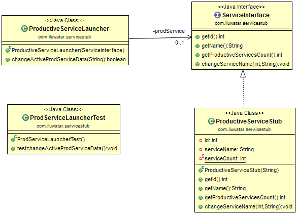

## Intent

## Applicability
The service stub pattern is applicable whenever we want to replace
third-party services such as credit scoring, tax rate lookups, and pricing engines
which are beyond our control. By using service stub we can test the software and
components independently from each other. 
Service stub is generally implemented with the help of Gateway.
The Gateway is a  Separated Interface rather than a  class so we can have 
one implementation that calls the real service and at least one that's only a Service Stub. 
The desired implementation of the Gateway should be loaded using a Plugin.

## Typical Use Case

* for parallel programming, for protecting the data of productive system,
* testing of malfunctions such as network interruption,
* simulation of physical processes etc. 

## Credits

* [J2EE Design Patterns](http://www.amazon.com/J2EE-Design-Patterns-William-Crawford/dp/0596004273/ref=sr_1_2)
