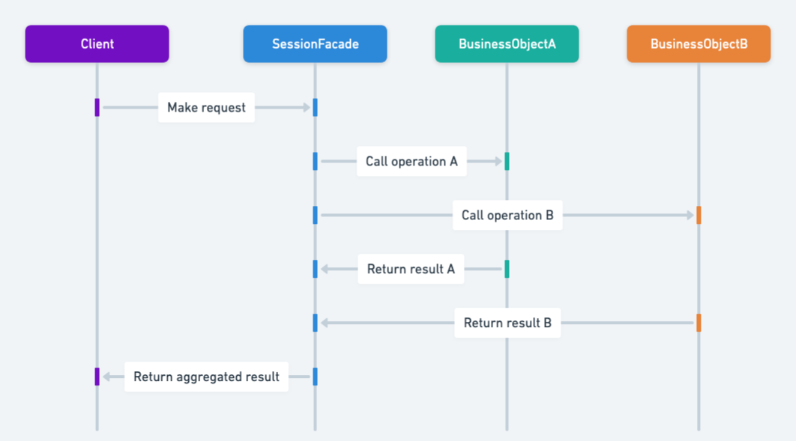

## Also known as

* Remote Facade

## Intent of Session Facade Design Pattern

Provide a simplified interface to a complex subsystem, reducing complexity and coupling between client and business logic in enterprise Java applications.

## Detailed Explanation of Session Facade Pattern with Real-World Examples

Real-world example

> A real-world analogy for the Session Facade pattern is a hotel concierge service. Guests (clients) don't directly interact with various departments like housekeeping, kitchen, transport services, or maintenance. Instead, they interact with the concierge (the facade), who simplifies these interactions. When a guest requests services like room cleaning, dinner reservations, or taxi bookings, the concierge handles communication with multiple hotel departments behind the scenes, providing a simplified and unified interface to the guest, reducing complexity and enhancing guest satisfaction.

In plain words

> Session Facade provides a simplified interface to complex business logic in Java applications, reducing client complexity and minimizing network overhead by encapsulating interactions within a single session component.

Sequence diagram



## Programmatic Example of Session Facade Pattern in Java

The Session Facade pattern is a structural design pattern that provides a simplified interface to complex subsystems, making the system easier for clients to interact with. It is especially useful when a client needs access to multiple underlying services without needing to understand their internal complexities.

In the context of an e-commerce website, consider a scenario where users browse products, manage their shopping carts, place orders, and process payments. Rather than directly interacting with each subsystem individually (such as the cart, order, and payment systems), a client can communicate through a single unified Session Facade interface.

### Example Scenario:

In this example, the `ShoppingFacade` class simplifies client interactions with three services: the `CartService`, `OrderService`, and `PaymentService`. The client uses the facade to perform high-level operations like adding products to the cart, placing an order, and choosing a payment method, without needing to know the underlying details.

Here's a simplified Java program demonstrating this pattern:

```java
public class App {
    public static void main(String[] args) {
        ShoppingFacade shoppingFacade = new ShoppingFacade();
        shoppingFacade.addToCart(1);
        shoppingFacade.order();
        shoppingFacade.selectPaymentMethod("cash");
    }
}
```

The `ShoppingFacade` serves as a centralized point of interaction for various shopping-related operations, thereby reducing direct coupling between client code and individual subsystem services:

```java
public class ShoppingFacade {

    private final CartService cartService;
    private final OrderService orderService;
    private final PaymentService paymentService;

    public ShoppingFacade() {
        Map<Integer, Product> productCatalog = new HashMap<>();
        productCatalog.put(1, new Product(1, "Wireless Mouse", 25.99, "Ergonomic wireless mouse with USB receiver."));
        productCatalog.put(2, new Product(2, "Gaming Keyboard", 79.99, "RGB mechanical gaming keyboard with programmable keys."));
        Map<Integer, Product> cart = new HashMap<>();
        cartService = new CartService(cart, productCatalog);
        orderService = new OrderService(cart);
        paymentService = new PaymentService();
    }

    public Map<Integer, Product> getCart() {
        return this.cartService.getCart();
    }

    public void addToCart(int productId) {
        this.cartService.addToCart(productId);
    }


    public void removeFromCart(int productId) {
        this.cartService.removeFromCart(productId);
    }

    public void order() {
        this.orderService.order();
    }

    public Boolean isPaymentRequired() {
        double total = this.orderService.getTotal();
        if (total==0.0) {
            LOGGER.info("No payment required");
            return false;
        }
        return true;
    }

    public void processPayment(String method) {
        Boolean isPaymentRequired = isPaymentRequired();
        if (Boolean.TRUE.equals(isPaymentRequired)) {
            paymentService.selectPaymentMethod(method);
        }
    }
}
```

### Console Output

When running the provided example (App.main()), the output might look similar to:

```
19:43:17.883 [main] INFO com.iluwatar.sessionfacade.CartService -- ID: 1
Name: Wireless Mouse
Price: $25.99
Description: Ergonomic wireless mouse with USB receiver. successfully added to the cart
19:43:17.910 [main] INFO com.iluwatar.sessionfacade.OrderService -- Client has chosen to order [ID: 1
```

This simplified example demonstrates the essence of the Session Facade pattern. Your actual implementation may vary based on the specific needs of your application.

## When to Use the Session Facade Pattern in Java

* When dealing with complex enterprise applications containing multiple business objects.
* To provide simplified API calls to clients, hiding the underlying complexity.
* When seeking improved performance and reduced network calls between clients and servers.

## Real-World Applications of Server Session Pattern in Java

* Java EE applications utilizing Enterprise JavaBeans (EJB) as session facades to encapsulate business logic.
* Spring-based applications using services as session facades to simplify interactions between controllers and repositories.

## Benefits and Trade-offs of Server Session Pattern

Benefits:

* Reduces complexity by providing a simpler interface to a subsystem.
* Improves performance by minimizing network traffic and reducing remote calls.
* Enhances modularity and maintainability by clearly separating business logic and client interactions.

Trade-offs:

* Can introduce additional layers that might increase initial complexity.
* Risk of creating overly broad facades that violate single responsibility principles.

## Related Java Design Patterns

* [Data Transfer Object (DTO)](https://java-design-patterns.com/patterns/data-transfer-object/): Often used together, Session Facade simplifies data transfer by utilizing DTOs to encapsulate data passed between client and server.
* [Facade](https://java-design-patterns.com/patterns/facade/): Session Facade is a specialized version of the Facade pattern, applied specifically in enterprise systems to manage business logic and remote interactions.

## References and Credits

* [Core J2EE Patterns: Best Practices and Design Strategies](https://amzn.to/4cAbDap)
* [Patterns of Enterprise Application Architecture](https://amzn.to/3WfKBPR)
* [Real World Java EE Patterns-Rethinking Best Practices](https://amzn.to/3EvkzS8)
* [Remote Facade (Martin Fowler)](https://martinfowler.com/eaaCatalog/remoteFacade.html)
